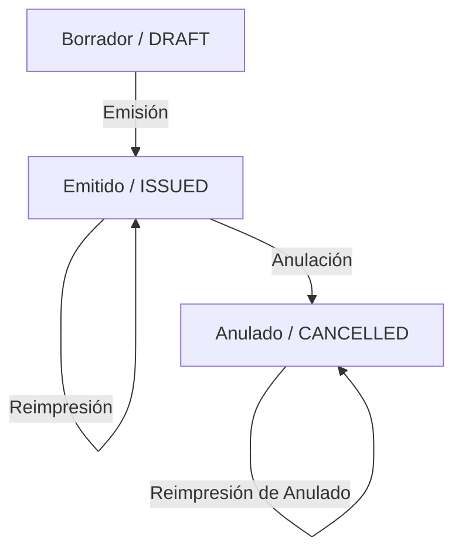

# 01. Auditoría del Ciclo Documental

El ciclo de vida de todo documento emitido en la plataforma logística está sujeto a un registro de auditoría estricto e inmutable. 

Cada transición de estado es registrada utilizando el servicio centralizado de auditoría, vinculando:
- El identificador del actor.
- La IP del dispositivo.
- El nivel de autenticación.
- El hash de verificación del evento.

