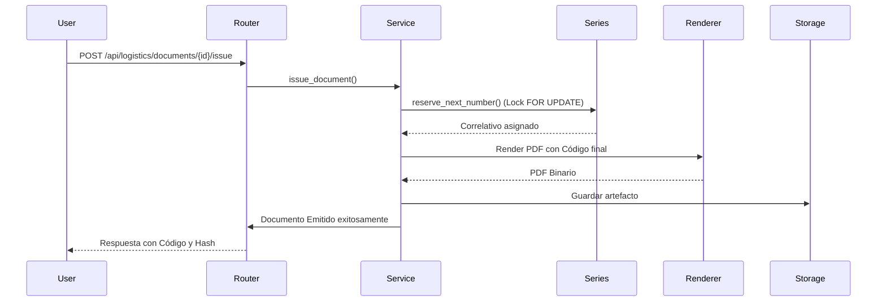

# 05. Flujo de Emisión

El proceso de emisión transforma un borrador editable en un documento oficial numerado y sellado electrónicamente.

```mermaid
sequenceDiagram
    participant User
    participant Router
    participant Service
    participant Series
    participant Renderer
    participant Storage

    User->>Router: POST /api/logistics/documents/{id}/issue
    Router->>Service: issue_document()
    Service->>Series: reserve_next_number() (Lock FOR UPDATE)
    Series-->>Service: Correlativo asignado
    Service->>Renderer: Render PDF con Código final
    Renderer-->>Service: PDF Binario
    Service->>Storage: Guardar artefacto
    Service->>Router: Documento Emitido exitosamente
    Router-->>User: Respuesta con Código y Hash
```
