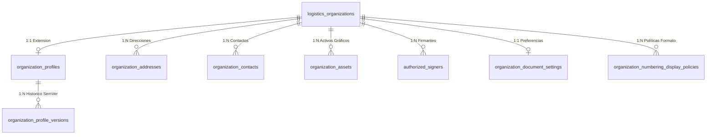

# 01. Auditoría de Modelos Previos y Justificación de la Ficha Institucional

## 🎯 Propósito y Contexto de Auditoría

Antes de la Fase 021, el sistema contaba con las tablas principales `logistics_organizations` y `logistics_branches`. Estas entidades fueron diseñadas en la **Fase 003 / Fase 011** como estructuras organizacionales livianas orientadas al aislamiento multitenant y a la delimitación de fronteras de acceso (scopes RBAC).

Sin embargo, al implementar el **Ciclo de Vida Documental (Fase 020)**, surgió la necesidad de contar con atributos legales, fiscales, identidades de marca, reglas de presentación y firma autorizada de documentos.

---

## 🔍 Análisis de Entidades Existentes

### 1. `logistics_organizations` (Tabla Previa)
* **Atributos existentes**: `id`, `code`, `name`, `country_code`, `timezone`, `status`, `created_at`, `updated_at`.
* **Rol en el sistema**: Representa el Tenant técnico. Se utiliza para el aislamiento de datos a nivel de base de datos y validación de tokens JWT.
* **Deficiencia para el negocio**: Carece de campos legales tributarios (RUC, Razón Social vs Nombre Comercial, Tipo de Sociedad, Actividad Económica CIIU, Representantes Legales, Idioma Documental por defecto).

### 2. `logistics_branches` (Tabla Previa)
* **Atributos existentes**: `id`, `organization_id`, `code`, `name`, `status`, `created_at`, `updated_at`.
* **Rol en el sistema**: Representa la Sede u Oficina operativa para asignaciones de usuario y control de accesos por sede.
* **Deficiencia para el negocio**: No almacena la dirección legal/fiscal oficial con ubigeo o coordenadas GPS, ni contactos de despacho, ni políticas de visualización de numeración específicas por sede.

---

## 🛡️ Principio de Diseño: No Duplicación y Desacoplamiento

Modificar las tablas `logistics_organizations` y `logistics_branches` agregando 30+ columnas adicionales habría violado el **Principio de Responsabilidad Única (SRP)** y roto la compatibilidad con las fases previas (003, 004, 011, 018).

Por lo tanto, la arquitectura de la **Fase 021** adopta el patrón de **Ficha Institucional Extendida (Extension Table Pattern)** mediante 8 nuevas tablas dedicadas bajo el namespace de datos institucionales.

---

## 📊 Justificación Técnica de las 8 Nuevas Tablas

| # | Nombre de la Tabla | Objeto de Dominio | Razón de Existencia Técnica |
|---|---|---|---|
| 1 | `organization_profiles` | `OrganizationProfileModel` | Contiene los datos legales, fiscales (RUC), moneda, locale e idioma documental sin alterar el modelo Tenant de la Fase 003. |
| 2 | `organization_profile_versions` | `OrganizationProfileVersionModel` | Almacena los snapshots SemVer (`1.0.0`, `1.0.1`...) inmutables en JSONB con hashes SHA-256 para auditoría jurídica. |
| 3 | `organization_addresses` | `OrganizationAddressModel` | Permite N direcciones por organización/sede (Fiscal, Comercial, Operativa, Cobranza) con control de dirección principal (`is_primary`). |
| 4 | `organization_contacts` | `OrganizationContactModel` | Almacena directorios de contactos institucionales (Compras, Despacho, Facturación) y filtra su aparición en documentos PDF. |
| 5 | `organization_assets` | `OrganizationAssetModel` | Almacena metadatos y hashes de activos visuales (Logotipos, Firmas Digitales/Visuales, Sellos) previamente sanitizados. |
| 6 | `authorized_signers` | `AuthorizedSignerModel` | Mantiene el registro legal de apoderados y firmantes autorizados con alcance por sede, familia documental y tope de monto. |
| 7 | `organization_document_settings` | `OrganizationDocumentSettingsModel` | Configuración visual de encabezado, pie de página, banderas de visibilidad (RUC, logo, QR, hash) para el renderizador PDF. |
| 8 | `organization_numbering_display_policies` | `OrganizationNumberingDisplayPolicyModel` | Formateo estético del código visible de documentos (`PED-LIM-2026-000123`) sin alterar la secuencia pura en DB. |

---

## 🔒 Conclusión de Auditoría

La solución respeta estrictamente la integridad referencial (`Foreign Key CASCADE` hacia `logistics_organizations`) y asegura que la eliminación o consulta de la organización no afecte los esquemas previos, ofreciendo un desacoplamiento limpio y extensible hacia las futuras Fases 022 (Almacenes) y 026 (SUNAT).
