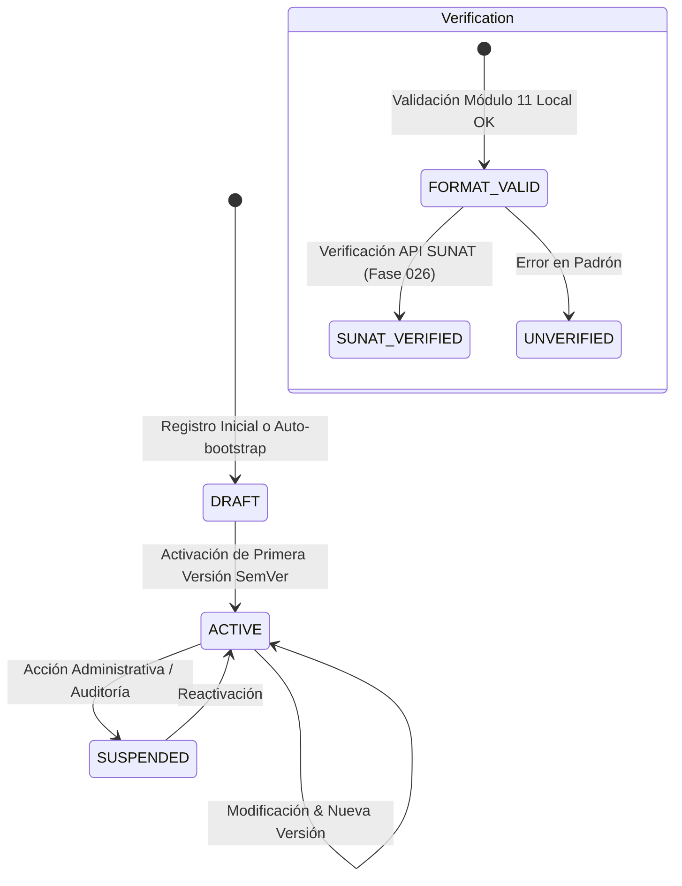

# 02. Modelo OrganizationProfileModel y Validación de RUC Peruano (Módulo 11)

## 🏛️ Definición del Modelo OrganizationProfileModel

El modelo `OrganizationProfileModel` (`organization_profiles`) encapsula la información legal, tributaria y de configuración regional primaria de la empresa.

```python
class OrganizationProfileModel(Base):
    __tablename__ = "organization_profiles"

    id: Mapped[uuid.UUID] = mapped_column(UUID(as_uuid=True), primary_key=True, default=uuid.uuid4)
    organization_id: Mapped[uuid.UUID] = mapped_column(
        UUID(as_uuid=True), ForeignKey("logistics_organizations.id", ondelete="CASCADE"), nullable=False, unique=True, index=True
    )
    legal_name: Mapped[str] = mapped_column(String(256), nullable=False)
    trade_name: Mapped[str | None] = mapped_column(String(256), nullable=True)
    ruc: Mapped[str] = mapped_column(String(11), nullable=False, unique=True, index=True)

    legal_entity_type: Mapped[str | None] = mapped_column(String(64), nullable=True)
    economic_activity: Mapped[str | None] = mapped_column(String(256), nullable=True)
    website: Mapped[str | None] = mapped_column(String(256), nullable=True)
    primary_email: Mapped[str | None] = mapped_column(String(128), nullable=True)
    primary_phone: Mapped[str | None] = mapped_column(String(32), nullable=True)

    country_code: Mapped[str] = mapped_column(String(2), default="PE", server_default=text("'PE'"), nullable=False)
    locale: Mapped[str] = mapped_column(String(10), default="es-PE", server_default=text("'es-PE'"), nullable=False)
    timezone: Mapped[str] = mapped_column(String(50), default="America/Lima", server_default=text("'America/Lima'"), nullable=False)
    default_currency: Mapped[str] = mapped_column(String(3), default="PEN", server_default=text("'PEN'"), nullable=False)
    document_language: Mapped[str] = mapped_column(String(10), default="es", server_default=text("'es'"), nullable=False)

    profile_status: Mapped[str] = mapped_column(String(32), default="DRAFT", server_default=text("'DRAFT'"), nullable=False)
    active_version_id: Mapped[uuid.UUID | None] = mapped_column(
        UUID(as_uuid=True), ForeignKey("organization_profile_versions.id", ondelete="SET NULL", use_alter=True, name="fk_org_profile_active_version"), nullable=True
    )

    verification_status: Mapped[str] = mapped_column(String(32), default="FORMAT_VALID", server_default=text("'FORMAT_VALID'"), nullable=False)
    verification_source: Mapped[str | None] = mapped_column(String(64), nullable=True)
    verified_at: Mapped[datetime | None] = mapped_column(DateTime(timezone=True), nullable=True)

    created_by: Mapped[uuid.UUID | None] = mapped_column(UUID(as_uuid=True), nullable=True)
    updated_by: Mapped[uuid.UUID | None] = mapped_column(UUID(as_uuid=True), nullable=True)
    created_at: Mapped[datetime] = mapped_column(DateTime(timezone=True), default=utc_now, nullable=False)
    updated_at: Mapped[datetime] = mapped_column(DateTime(timezone=True), default=utc_now, onupdate=utc_now, nullable=False)
```

---

## 🧮 Algoritmo de Validación de RUC Peruano (Módulo 11) Local

Para garantizar la validez sintáctica e integridad del número de RUC peruano sin incurrir en llamadas HTTP externas bloqueantes o de alta latencia, se implementó el algoritmo estricto de comprobación del **Dígito Verificador Módulo 11** en `app/modules/logistics/company_profile/validators.py`.

### Reglas de Validación:
1. **Longitud**: Debe contener exactamente 11 caracteres numéricos.
2. **Prefijos Válidos**: Debe iniciar con uno de los prefijos oficiales reconocidos por SUNAT:
   - `10`: Persona Natural con Negocio.
   - `15`: Persona Natural sin Negocio / Carnet de Extranjería.
   - `17`: Intendencia General de Aduanas / Entidades Especiales.
   - `20`: Persona Jurídica (S.A., S.A.C., S.R.L., E.I.R.L., etc.).
3. **Ponderación del Módulo 11**:
   Los primeros 10 dígitos se multiplican individualmente por los factores `[5, 4, 3, 2, 7, 6, 5, 4, 3, 2]`.
   
   $$\text{Suma} = \sum_{i=0}^{9} \text{RUC}[i] \times \text{Factor}[i]$$

   $$\text{Residuo} = \text{Suma} \pmod{11}$$

   $$\text{Dígito Esperado} = 11 - \text{Residuo}$$

   * Si $\text{Dígito Esperado} = 10 \implies \text{Dígito Esperado} = 0$
   * Si $\text{Dígito Esperado} = 11 \implies \text{Dígito Esperado} = 1$

### Código de Validación en Python:
```python
def validate_peruvian_ruc(ruc: str) -> tuple[bool, str]:
    if not ruc or not isinstance(ruc, str):
        return False, "El RUC no puede estar vacío."

    ruc = ruc.strip()
    if not ruc.isdigit() or len(ruc) != 11:
        return False, "El RUC debe tener exactamente 11 dígitos numéricos."

    prefix = ruc[:2]
    if prefix not in {"10", "15", "17", "20"}:
        return False, f"Prefijo de RUC inválido '{prefix}'. Debe iniciar con 10, 15, 17 o 20."

    multipliers = [5, 4, 3, 2, 7, 6, 5, 4, 3, 2]
    sum_product = sum(int(ruc[i]) * multipliers[i] for i in range(10))
    remainder = sum_product % 11
    expected_check_digit = 11 - remainder

    if expected_check_digit == 10:
        expected_check_digit = 0
    elif expected_check_digit == 11:
        expected_check_digit = 1

    actual_check_digit = int(ruc[10])
    if actual_check_digit != expected_check_digit:
        return False, f"El RUC '{ruc}' tiene un dígito de verificación inválido."

    return True, "RUC válido."
```

---

## 🔄 Estados del Perfil (`profile_status` y `verification_status`)



* `profile_status`: `DRAFT` | `ACTIVE` | `SUSPENDED`
* `verification_status`: `FORMAT_VALID` (Local Módulo 11) | `SUNAT_VERIFIED` (Futuro Fase 026) | `UNVERIFIED`
