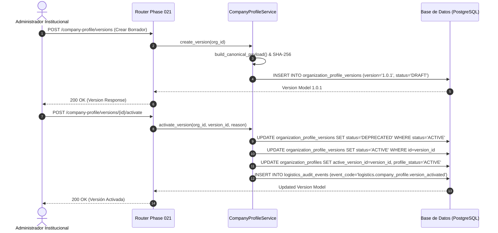

# 03. Estrategia de Versionado SemVer y Payloads SHA-256

## 🎯 Objetivo de la Estrategia de Versionado

La información de la empresa (Razón Social, Dirección Fiscal, Representantes Legales, Logotipos) cambia con el tiempo por reorganizaciones empresariales, traslados o cambios de marca.

Si un documento legal o logístico (ej. Guía de Remisión o Pedido) se emitió en el año 2025 bajo la Razón Social *"Empresa Modelo S.A."*, no debe verse afectado ni alterado retroactivamente si en el año 2026 la empresa cambia su Razón Social a *"Empresa Modelo Logística S.A.C."*.

Para resolver este desafío, la Fase 021 implementa una estrategia de **Versionado Inmutable Basado en SemVer y Payloads JSONB Determinísticos**.

---

## 🏗️ Modelo OrganizationProfileVersionModel

```python
class OrganizationProfileVersionModel(Base):
    __tablename__ = "organization_profile_versions"

    id: Mapped[uuid.UUID] = mapped_column(UUID(as_uuid=True), primary_key=True, default=uuid.uuid4)
    organization_profile_id: Mapped[uuid.UUID] = mapped_column(
        UUID(as_uuid=True), ForeignKey("organization_profiles.id", ondelete="CASCADE"), nullable=False, index=True
    )
    version: Mapped[str] = mapped_column(String(32), nullable=False)  # "1.0.0", "1.0.1", etc.
    status: Mapped[str] = mapped_column(String(32), default="DRAFT", server_default=text("'DRAFT'"), nullable=False)  # DRAFT, ACTIVE, DEPRECATED

    legal_name: Mapped[str] = mapped_column(String(256), nullable=False)
    trade_name: Mapped[str | None] = mapped_column(String(256), nullable=True)
    ruc: Mapped[str] = mapped_column(String(11), nullable=False)

    institutional_payload: Mapped[dict[str, Any]] = mapped_column(JSONB, nullable=False)
    content_hash: Mapped[str] = mapped_column(String(64), nullable=False)  # SHA-256 hexadecimal

    effective_from: Mapped[datetime] = mapped_column(DateTime(timezone=True), default=utc_now, nullable=False)
    effective_to: Mapped[datetime | None] = mapped_column(DateTime(timezone=True), nullable=True)

    approved_by: Mapped[uuid.UUID | None] = mapped_column(UUID(as_uuid=True), nullable=True)
    approved_at: Mapped[datetime | None] = mapped_column(DateTime(timezone=True), nullable=True)
    created_by: Mapped[uuid.UUID | None] = mapped_column(UUID(as_uuid=True), nullable=True)
    created_at: Mapped[datetime] = mapped_column(DateTime(timezone=True), default=utc_now, nullable=False)
```

---

## ⚙️ Reglas de Incremento SemVer

El servicio `CompanyProfileService.create_version` calcula el número de versión automáticamente inspeccionando el historial de versiones asociadas al perfil:

1. **Primera Versión**: Si no existen versiones registradas, la versión inicial asignada es `1.0.0`.
2. **Incremento de Parche (Patch)**: Cada nueva versión borrador que consolida el estado actual incrementa el dígito de parche: `1.0.0` $\implies$ `1.0.1` $\implies$ `1.0.2`.
3. **Immutabilidad del Histórico**: Una vez que una versión pasa al estado `ACTIVE`, su `institutional_payload` y su `content_hash` quedan completamente congelados y nunca se modifican en base de datos.
4. **Depreciación**: Al activar una nueva versión (ej. `1.0.1`), la versión anteriormente activa (`1.0.0`) pasa a estado `DEPRECATED` registrando `effective_to = now()`.

---

## 🔐 Construcción del Payload Canónico Determinístico y Hash SHA-256

Para garantizar que el hash `content_hash` sea idéntico independientemente del motor o del orden de inserción de registros en Python o PostgreSQL, `CompanyProfileService.build_canonical_payload` aplica ordenamiento explícito de llaves (`sort_keys=True`) y serialización determinística:

```python
def build_canonical_payload(self, organization_id: UUID) -> tuple[dict[str, Any], str]:
    profile = self.get_profile_or_create_default(organization_id)
    addresses = sorted(self.list_active_addresses(organization_id), key=lambda x: str(x.id))
    contacts = sorted(self.list_active_contacts(organization_id), key=lambda x: str(x.id))
    settings = self.get_document_settings(organization_id)

    payload = {
        "organization_id": str(profile.organization_id),
        "legal_name": profile.legal_name,
        "trade_name": profile.trade_name,
        "ruc": profile.ruc,
        "legal_entity_type": profile.legal_entity_type,
        "country_code": profile.country_code,
        "locale": profile.locale,
        "timezone": profile.timezone,
        "default_currency": profile.default_currency,
        "document_language": profile.document_language,
        "addresses": [
            {
                "id": str(a.id),
                "address_type": a.address_type,
                "label": a.label,
                "address_line": a.address_line,
                "district": a.district,
                "province": a.province,
                "department": a.department,
                "is_primary": a.is_primary,
                "is_document_address": a.is_document_address,
            } for a in addresses
        ],
        "contacts": [
            {
                "id": str(c.id),
                "contact_type": c.contact_type,
                "label": c.label,
                "full_name": c.full_name,
                "email": c.email,
                "phone": c.phone,
                "is_primary": c.is_primary,
                "show_in_documents": c.show_in_documents,
            } for c in contacts
        ],
        "document_settings": {
            "show_ruc": settings.show_ruc if settings else True,
            "show_trade_name": settings.show_trade_name if settings else True,
            "show_legal_name": settings.show_legal_name if settings else True,
            "show_address": settings.show_address if settings else True,
            "show_contact": settings.show_contact if settings else True,
            "confidentiality_text": settings.confidentiality_text if settings else None,
            "footer_text": settings.footer_text if settings else None,
            "logo": doc_logo,
        },
    }

    # Serialización JSON Canónica Determinística
    canonical_json = json.dumps(payload, sort_keys=True, default=str)
    content_hash = hashlib.sha256(canonical_json.encode("utf-8")).hexdigest()
    return payload, content_hash
```

---

## 📈 Diagrama de Secuencia: Activación de Versión


