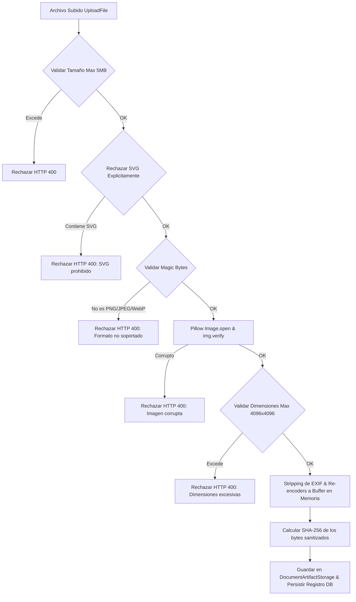

# 06. Sanitización de Imágenes y Almacenamiento de Activos Gráficos

## 🎨 Modelo OrganizationAssetModel

El modelo `OrganizationAssetModel` (`organization_assets`) administra los recursos gráficos oficiales de la organización, como logotipos principales, versiones monocromáticas, firmas visuales escaneadas y sellos institucionales.

```python
class OrganizationAssetModel(Base):
    __tablename__ = "organization_assets"

    id: Mapped[uuid.UUID] = mapped_column(UUID(as_uuid=True), primary_key=True, default=uuid.uuid4)
    organization_id: Mapped[uuid.UUID] = mapped_column(
        UUID(as_uuid=True), ForeignKey("logistics_organizations.id", ondelete="CASCADE"), nullable=False, index=True
    )
    asset_type: Mapped[str] = mapped_column(String(32), nullable=False)  # PRIMARY_LOGO, MONOCHROME_LOGO, DOCUMENT_LOGO, VISUAL_SIGNATURE, STAMP
    filename: Mapped[str] = mapped_column(String(256), nullable=False)
    mime_type: Mapped[str] = mapped_column(String(64), nullable=False)  # image/png, image/jpeg, image/webp
    size_bytes: Mapped[int] = mapped_column(Integer, nullable=False)
    width: Mapped[int | None] = mapped_column(Integer, nullable=True)
    height: Mapped[int | None] = mapped_column(Integer, nullable=True)

    file_hash: Mapped[str] = mapped_column(String(64), nullable=False)  # SHA-256
    storage_provider: Mapped[str] = mapped_column(String(32), default="local", server_default=text("'local'"), nullable=False)
    storage_key: Mapped[str] = mapped_column(String(512), nullable=False)

    status: Mapped[str] = mapped_column(String(32), default="ACTIVE", server_default=text("'ACTIVE'"), nullable=False)
    version: Mapped[int] = mapped_column(Integer, default=1, server_default=text("1"), nullable=False)

    uploaded_by: Mapped[uuid.UUID | None] = mapped_column(UUID(as_uuid=True), nullable=True)
    uploaded_at: Mapped[datetime] = mapped_column(DateTime(timezone=True), default=utc_now, nullable=False)
    approved_by: Mapped[uuid.UUID | None] = mapped_column(UUID(as_uuid=True), nullable=True)
    approved_at: Mapped[datetime | None] = mapped_column(DateTime(timezone=True), nullable=True)
    revoked_at: Mapped[datetime | None] = mapped_column(DateTime(timezone=True), nullable=True)

    asset_metadata: Mapped[dict[str, Any]] = mapped_column(JSONB, default=dict, server_default=text("'{}'"), nullable=False)
```

---

## 🛡️ Pipeline de Sanitización y Seguridad de Imágenes

La carga de firmas visuales y logotipos representa un vector de ataque potencial (esteganografía, inyección de malware en bloques EXIF/metadata, bombas descompresivas de imagen o scripts SVG embebidos). Para mitigar este riesgo, la Fase 021 incluye un pipeline estricto en `app/modules/logistics/company_profile/validators.py`:



### Reglas de Sanitización Aplicadas:
1. **Descarte de SVG**: El formato SVG está prohibido por razones de seguridad de renderizado (evita vulnerabilidades XSS / Script Injection en motores PDF).
2. **Inspección de firmas binarias (Magic Bytes)**:
   * PNG: `\x89PNG\r\n\x1a\n`
   * JPEG: `\xff\xd8\xff`
   * WebP: `RIFF` ... `WEBP`
3. **Stripping de Metadatos EXIF**: La imagen se re-procesa mediante Pillow (`PIL.Image`) y se vuelve a guardar a un buffer de memoria sin transferir bloques EXIF, metadatos GPS o comentarios del dispositivo capturador.
4. **Calculo de SHA-256**: Se genera el hash sobre la imagen sanitizada final, garantizando que el hash persistido coincida exactamente con los bytes almacenados.

---

## 💾 Integración con DocumentArtifactStorage

El servicio `AssetService.upload_asset` utiliza la abstracción de almacenamiento `DocumentArtifactStorage` (desarrollada en la Fase 020) para escribir los bytes sanitizados en el directorio protegido de artefactos:

```python
storage_key = f"company_profile/{organization_id}/{asset_type.lower()}_{file_hash[:12]}.{extension}"
artifact_storage.write_artifact(storage_key, sanitized_bytes)
```

Esto garantiza la portabilidad del almacenamiento (soporte transparente para Filesystem local, MinIO o AWS S3).
