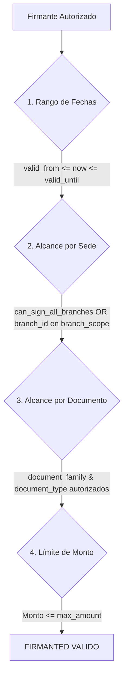

# 07. Registro de Firmantes Autorizados

## ✍️ Modelo AuthorizedSignerModel

El modelo `AuthorizedSignerModel` (`authorized_signers`) gestiona el registro de apoderados, gerentes y personal operativo facultado para suscribir legal o normativamente documentos institucionales.

```python
class AuthorizedSignerModel(Base):
    __tablename__ = "authorized_signers"

    id: Mapped[uuid.UUID] = mapped_column(UUID(as_uuid=True), primary_key=True, default=uuid.uuid4)
    organization_id: Mapped[uuid.UUID] = mapped_column(
        UUID(as_uuid=True), ForeignKey("logistics_organizations.id", ondelete="CASCADE"), nullable=False, index=True
    )
    user_id: Mapped[uuid.UUID | None] = mapped_column(
        UUID(as_uuid=True), ForeignKey("users.id", ondelete="SET NULL"), nullable=True
    )
    full_name: Mapped[str] = mapped_column(String(256), nullable=False)
    position_title: Mapped[str] = mapped_column(String(128), nullable=False)
    department: Mapped[str | None] = mapped_column(String(128), nullable=True)
    document_number_masked: Mapped[str | None] = mapped_column(String(32), nullable=True)  # ej. "DNI ***4567"
    authorization_reference: Mapped[str | None] = mapped_column(String(128), nullable=True)  # ej. "Poder Notarial Partida 12345"
    authorization_type: Mapped[str] = mapped_column(String(64), default="LEGAL_REPRESENTATIVE", server_default=text("'LEGAL_REPRESENTATIVE'"), nullable=False)

    valid_from: Mapped[datetime] = mapped_column(DateTime(timezone=True), default=utc_now, nullable=False)
    valid_until: Mapped[datetime | None] = mapped_column(DateTime(timezone=True), nullable=True)
    status: Mapped[str] = mapped_column(String(32), default="ACTIVE", server_default=text("'ACTIVE'"), nullable=False)  # ACTIVE, SUSPENDED, REVOKED

    signature_asset_id: Mapped[uuid.UUID | None] = mapped_column(
        UUID(as_uuid=True), ForeignKey("organization_assets.id", ondelete="SET NULL"), nullable=True
    )
    stamp_asset_id: Mapped[uuid.UUID | None] = mapped_column(
        UUID(as_uuid=True), ForeignKey("organization_assets.id", ondelete="SET NULL"), nullable=True
    )

    can_sign_all_branches: Mapped[bool] = mapped_column(Boolean, default=True, server_default=text("true"), nullable=False)
    branch_scope: Mapped[list[str] | None] = mapped_column(JSONB, nullable=True)  # UUIDs de sedes autorizadas
    document_family_scope: Mapped[list[str] | None] = mapped_column(JSONB, nullable=True)  # ["OUTBOUND", "INBOUND"]
    document_type_scope: Mapped[list[str] | None] = mapped_column(JSONB, nullable=True)  # ["PED", "GRE"]

    max_amount: Mapped[Decimal | None] = mapped_column(Numeric(precision=14, scale=2), nullable=True)
    currency_code: Mapped[str | None] = mapped_column(String(3), nullable=True)
    notes: Mapped[str | None] = mapped_column(Text, nullable=True)

    created_by: Mapped[uuid.UUID | None] = mapped_column(UUID(as_uuid=True), nullable=True)
    updated_by: Mapped[uuid.UUID | None] = mapped_column(UUID(as_uuid=True), nullable=True)
    approved_by: Mapped[uuid.UUID | None] = mapped_column(UUID(as_uuid=True), nullable=True)
    approved_at: Mapped[datetime | None] = mapped_column(DateTime(timezone=True), nullable=True)
    revoked_by: Mapped[uuid.UUID | None] = mapped_column(UUID(as_uuid=True), nullable=True)
    revoked_at: Mapped[datetime | None] = mapped_column(DateTime(timezone=True), nullable=True)
    revocation_reason: Mapped[str | None] = mapped_column(String(256), nullable=True)

    created_at: Mapped[datetime] = mapped_column(DateTime(timezone=True), default=utc_now, nullable=False)
    updated_at: Mapped[datetime] = mapped_column(DateTime(timezone=True), default=utc_now, onupdate=utc_now, nullable=False)
```

---

## 🎯 Alcances de Autorización (Scoping Rules)

El modelo de firmantes implementa 4 dimensiones de alcance complementarias:



1. **Alcance Geográfico por Sedes (`branch_scope`)**:
   Si `can_sign_all_branches = True`, el firmante puede facultar documentos emitidos en cualquier sede. Si es `False`, el campo `branch_scope` (JSONB conteniendo IDs de sedes) restringe su alcance únicamente a las sedes listadas.
2. **Alcance por Familia Documental (`document_family_scope`)**:
   Arreglo JSONB con las familias permitidas (ej. `["OUTBOUND", "TRANSPORT"]`).
3. **Alcance por Tipo Específico (`document_type_scope`)**:
   Arreglo JSONB con los códigos de documento específicos (ej. `["PED", "GRE"]`).
4. **Límite Monetario Máximo (`max_amount` & `currency_code`)**:
   Establece el tope presupuestal autorizado para la firma del documento (ej. hasta `50,000.00 PEN`). Si el documento excede dicho monto, el firmante es descartado automáticamente.

---

## 🛑 Ciclo de Vida y Revocación de Firmantes

* `ACTIVE`: Firmante facultado y elegible.
* `SUSPENDED`: Suspensión temporal (licencia, vacaciones, auditoría interna).
* `REVOKED`: Revocación definitiva de poderes legalmente registrada. Requiere especificar obligatoriamente un motivo de revocación (`revocation_reason`) mediante `SignerService.set_signer_status`.
