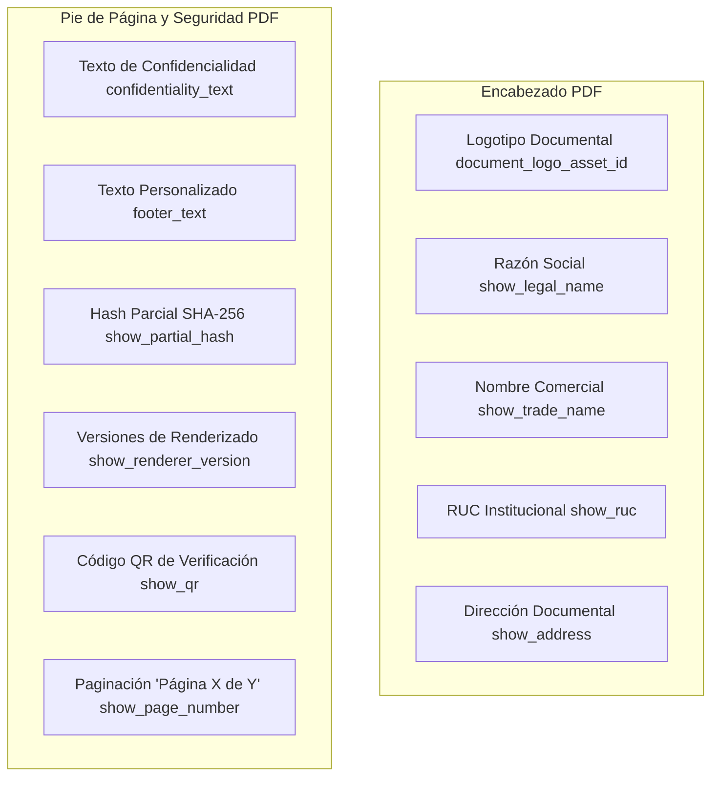

# 09. Configuraciones Documentales e Identidad Visual

## 📄 Modelo OrganizationDocumentSettingsModel

El modelo `OrganizationDocumentSettingsModel` (`organization_document_settings`) centraliza las reglas de presentación visual, encabezados, pies de página y banderas de visualización de información institucional en todos los documentos emitidos por la empresa.

```python
class OrganizationDocumentSettingsModel(Base):
    __tablename__ = "organization_document_settings"

    id: Mapped[uuid.UUID] = mapped_column(UUID(as_uuid=True), primary_key=True, default=uuid.uuid4)
    organization_id: Mapped[uuid.UUID] = mapped_column(
        UUID(as_uuid=True), ForeignKey("logistics_organizations.id", ondelete="CASCADE"), nullable=False, unique=True, index=True
    )
    profile_version_id: Mapped[uuid.UUID | None] = mapped_column(
        UUID(as_uuid=True), ForeignKey("organization_profile_versions.id", ondelete="SET NULL"), nullable=True
    )
    document_logo_asset_id: Mapped[uuid.UUID | None] = mapped_column(
        UUID(as_uuid=True), ForeignKey("organization_assets.id", ondelete="SET NULL"), nullable=True
    )
    default_address_id: Mapped[uuid.UUID | None] = mapped_column(
        UUID(as_uuid=True), ForeignKey("organization_addresses.id", ondelete="SET NULL"), nullable=True
    )
    default_contact_id: Mapped[uuid.UUID | None] = mapped_column(
        UUID(as_uuid=True), ForeignKey("organization_contacts.id", ondelete="SET NULL"), nullable=True
    )

    show_ruc: Mapped[bool] = mapped_column(Boolean, default=True, server_default=text("true"), nullable=False)
    show_trade_name: Mapped[bool] = mapped_column(Boolean, default=True, server_default=text("true"), nullable=False)
    show_legal_name: Mapped[bool] = mapped_column(Boolean, default=True, server_default=text("true"), nullable=False)
    show_address: Mapped[bool] = mapped_column(Boolean, default=True, server_default=text("true"), nullable=False)
    show_contact: Mapped[bool] = mapped_column(Boolean, default=True, server_default=text("true"), nullable=False)
    show_template_version: Mapped[bool] = mapped_column(Boolean, default=True, server_default=text("true"), nullable=False)
    show_renderer_version: Mapped[bool] = mapped_column(Boolean, default=True, server_default=text("true"), nullable=False)
    show_partial_hash: Mapped[bool] = mapped_column(Boolean, default=True, server_default=text("true"), nullable=False)
    show_qr: Mapped[bool] = mapped_column(Boolean, default=True, server_default=text("true"), nullable=False)
    show_page_number: Mapped[bool] = mapped_column(Boolean, default=True, server_default=text("true"), nullable=False)

    confidentiality_text: Mapped[str | None] = mapped_column(String(512), nullable=True)
    footer_text: Mapped[str | None] = mapped_column(String(512), nullable=True)

    default_locale: Mapped[str] = mapped_column(String(10), default="es-PE", server_default=text("'es-PE'"), nullable=False)
    default_timezone: Mapped[str] = mapped_column(String(50), default="America/Lima", server_default=text("'America/Lima'"), nullable=False)
    default_currency: Mapped[str] = mapped_column(String(3), default="PEN", server_default=text("'PEN'"), nullable=False)

    status: Mapped[str] = mapped_column(String(32), default="ACTIVE", server_default=text("'ACTIVE'"), nullable=False)
    created_at: Mapped[datetime] = mapped_column(DateTime(timezone=True), default=utc_now, nullable=False)
    updated_at: Mapped[datetime] = mapped_column(DateTime(timezone=True), default=utc_now, onupdate=utc_now, nullable=False)
```

---

## 🎛️ Banderas de Presentación Visual y Layout



### Banderas Principales:
* `show_ruc`: Controla si el número de RUC se destaca en la cabecera del documento.
* `show_trade_name` / `show_legal_name`: Permite mostrar el Nombre Comercial prominentemente o priorizar la Razón Social Legal.
* `show_partial_hash`: Muestra los primeros 12 caracteres del SHA-256 del documento en el margen inferior para verificación visual rápida.
* `show_qr`: Activa la inclusión del código QR de validación en la esquina inferior.
* `confidentiality_text`: Leyenda legal (ej. *"Este documento contiene información confidencial y de propiedad exclusiva de la empresa..."*).
* `footer_text`: Pie de página informativo o comercial personalizado.
