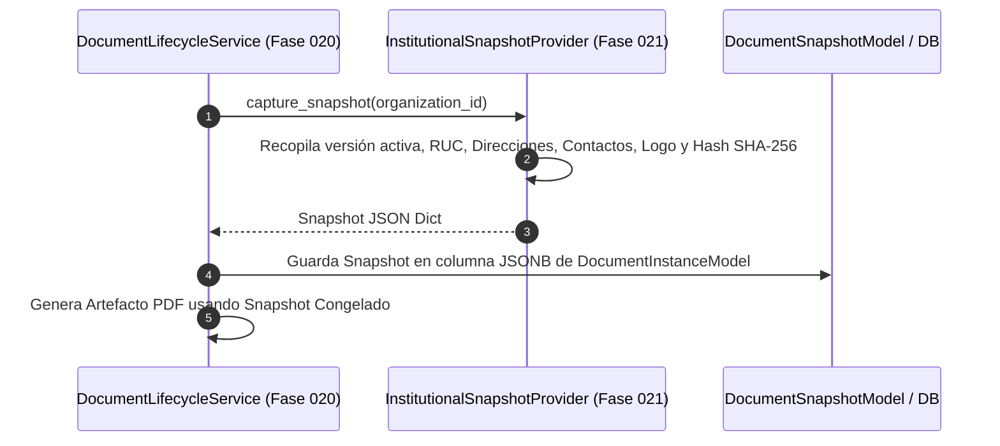

# 11. Provider de Snapshot Institucional e Inmutabilidad en Emisión Documental

## 📸 Componente InstitutionalSnapshotProvider

El componente `InstitutionalSnapshotProvider` (`app/modules/logistics/company_profile/snapshot_provider.py`) actúa como el puente oficial entre la Fase 021 (Configuración Institucional) y la Fase 020 (Ciclo de Vida Documental).

Su responsabilidad es **capturar una instantánea completa, determinística e inmutable de la ficha institucional** en el instante exacto en que un documento logístico es emitido.

```python
class InstitutionalSnapshotProvider:
    """Captures active institutional state to store inside DocumentSnapshot (Phase 021)."""

    def __init__(self, db: Session):
        self.db = db
        self.profile_srv = CompanyProfileService(db)

    def capture_snapshot(self, organization_id: UUID) -> dict[str, Any]:
        profile = self.profile_srv.get_profile_or_create_default(organization_id)
        payload, content_hash = self.profile_srv.build_canonical_payload(organization_id)

        snapshot = {
            "organization_id": str(organization_id),
            "profile_id": str(profile.id),
            "active_version_id": str(profile.active_version_id) if profile.active_version_id else None,
            "legal_name": profile.legal_name,
            "trade_name": profile.trade_name,
            "ruc": profile.ruc,
            "country_code": profile.country_code,
            "locale": profile.locale,
            "timezone": profile.timezone,
            "currency": profile.default_currency,
            "verification_status": profile.verification_status,
            "institutional_payload": payload,
            "content_hash": content_hash,
            "captured_at": utc_now().isoformat(),
        }

        return snapshot
```

---

## 🔒 Garantía de Inmutabilidad al Emitir Documentos

Cuando `DocumentLifecycleService.issue_document` (Fase 020) procesa la emisión de una Guía de Remisión o Pedido:



### Principios de la Congelación Institucional:
1. **Desacoplamiento Futuro**: Si en el futuro se actualiza la dirección fiscal, la razón social o se cambia el logotipo de la empresa en la Fase 021, los documentos previamente emitidos conservan su snapshot original intacto.
2. **Firmado Hash SHA-256**: La columna `content_hash` congelada dentro del snapshot del documento permite auditar legalmente si la ficha utilizada al emitir correspondía a la versión SemVer aprobada por la empresa en esa fecha.
3. **Impresión y Reimpresión Consistente**: Las operaciones de reimpresión de documentos (Fase 020) leen directamente los datos del snapshot inmutable congelado, evitando que un documento reimpreso muestre un logotipo o dirección distintos a los que se imprimieron originalmente.
