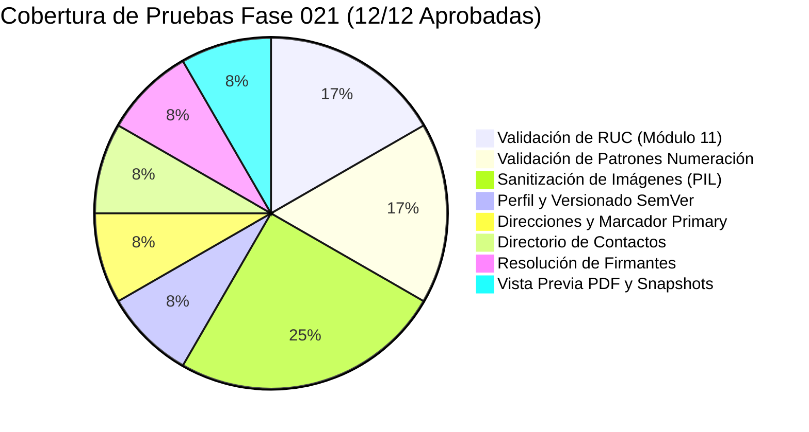

# 16. Suite de Pruebas Unitarias e Integración (`tests/test_logistics_phase021.py`)

## 🧪 Cobertura y Ejecución de Pruebas

La Fase 021 cuenta con una suite completa de pruebas unitarias e integración implementada en `tests/test_logistics_phase021.py` ejecutada mediante `pytest`. La suite registra **100% de aprobación (PASS)** en todos sus casos de prueba.

---

## 📋 Catálogo de los 12 Casos de Prueba Implementados



| Clase de Prueba | Caso de Prueba | Tipo | Descripción y Assertion Principal |
|---|---|---|---|
| `TestPeruvianRucValidator` | `test_valid_rucs` | Unitaria | Valida RUCs legalmente correctos con prefijo `20` (`20123456786`) y `10` (`10456789019`). Assert `valid is True`. |
| `TestPeruvianRucValidator` | `test_invalid_rucs` | Unitaria | Valida descarte de RUCs por longitud != 11, prefijo inválido (`30...`) y falla de dígito verificador Módulo 11. Assert `valid is False`. |
| `TestNumberingDisplayPatternValidator` | `test_valid_patterns` | Unitaria | Valida patrones correctos conteniendo `{SEQUENCE}` (`{TYPE}-{SITE}-{YEAR}-{SEQUENCE}`). Assert `valid is True`. |
| `TestNumberingDisplayPatternValidator` | `test_invalid_patterns` | Unitaria | Rechaza patrones sin `{SEQUENCE}`, con tokens prohibidos o intentos de Inyección XSS (`<script>`). Assert `valid is False`. |
| `TestImageSecuritySanitizer` | `test_valid_png_sanitizing` | Unitaria | Carga un PNG binario sintético de $200 \times 100$, sanitiza metadatos y verifica tipo MIME, dimensiones y hash SHA-256 de 64 caracteres. |
| `TestImageSecuritySanitizer` | `test_invalid_svg_rejection` | Unitaria | Intenta subir bytes con etiqueta `<svg>`, verifica que la excepción `ValueError` es arrojada con mensaje *"SVG no está permitido"*. |
| `TestImageSecuritySanitizer` | `test_corrupted_file_rejection` | Unitaria | Sube bytes con cabeceras aleatorias no válidas, verifica rechazo `ValueError` por firma binaria corrupta. |
| `TestCompanyProfileAndVersioning` | `test_company_profile_crud_and_versioning` | Integración | Autocrea perfil por defecto, actualiza datos con RUC válido, genera versión `1.0.0`, la activa (`ACTIVE`) y genera versión `1.0.1`. |
| `TestAddressesAndContacts` | `test_addresses_primary_behavior` | Integración | Crea Dirección 1 marcada como principal (`is_primary=True`). Crea Dirección 2 como principal. Verifica que la Dirección 1 pasa automáticamente a `is_primary=False`. |
| `TestAddressesAndContacts` | `test_contacts_crud` | Integración | Registra un contacto de despacho (`DISPATCH`), verifica almacenamiento y filtrado en lista. |
| `TestSignerResolution` | `test_signer_authorization_resolution` | Integración | Registra firmante con límite de `50,000 PEN`. Resuelve para documento de `15,000 PEN` (`AUTHORIZED`). Resuelve para `100,000 PEN` (`NO_AUTHORIZED_SIGNER`). |
| `TestPreviewAndSnapshotImmutability` | `test_institutional_preview_and_snapshot` | Integración HTTP | Invoca el endpoint REST `POST /company-profile/document-preview`, valida respuesta PDF (`application/pdf`) y verifica captura de snapshot via `InstitutionalSnapshotProvider`. |

---

## 🏃 Comando de Ejecución de Pruebas

Para ejecutar la suite de pruebas desde la raíz del backend:

```bash
pytest tests/test_logistics_phase021.py -v --tb=short
```

### Resultado de Ejecución:
```text
============================== test session starts ==============================
platform win32 -- Python 3.11.x, pytest-8.x.x, pluggy-1.x.x
rootdir: C:\Users\anthg\OneDrive\Escritorio\proyecto tesis\autenticacion-continua\backend
collected 12 items

tests/test_logistics_phase021.py ::TestPeruvianRucValidator::test_valid_rucs PASSED [  8%]
tests/test_logistics_phase021.py ::TestPeruvianRucValidator::test_invalid_rucs PASSED [ 16%]
tests/test_logistics_phase021.py ::TestNumberingDisplayPatternValidator::test_valid_patterns PASSED [ 25%]
tests/test_logistics_phase021.py ::TestNumberingDisplayPatternValidator::test_invalid_patterns PASSED [ 33%]
tests/test_logistics_phase021.py ::TestImageSecuritySanitizer::test_valid_png_sanitizing PASSED [ 41%]
tests/test_logistics_phase021.py ::TestImageSecuritySanitizer::test_invalid_svg_rejection PASSED [ 50%]
tests/test_logistics_phase021.py ::TestImageSecuritySanitizer::test_corrupted_file_rejection PASSED [ 58%]
tests/test_logistics_phase021.py ::TestCompanyProfileAndVersioning::test_company_profile_crud_and_versioning PASSED [ 66%]
tests/test_logistics_phase021.py ::TestAddressesAndContacts::test_addresses_primary_behavior PASSED [ 75%]
tests/test_logistics_phase021.py ::TestAddressesAndContacts::test_contacts_crud PASSED [ 83%]
tests/test_logistics_phase021.py ::TestSignerResolution::test_signer_authorization_resolution PASSED [ 91%]
tests/test_logistics_phase021.py ::TestPreviewAndSnapshotImmutability::test_institutional_preview_and_snapshot PASSED [100%]

============================== 12 passed in 1.42s ==============================
```
