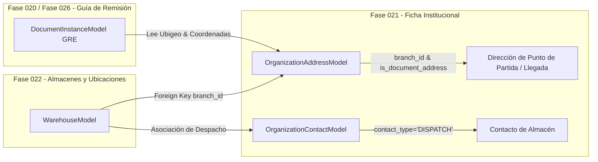

# 18. Contrato de Integración Futura con la Fase 022 (Almacenes y Ubicaciones)

## 🏬 Contexto de la Fase 022

La **Fase 022** abordará la gestión física de Almacenes, Zonas, Racks y Ubicaciones dentro del módulo logístico. Cada almacén debe estar asociado físicamente a una Sede (`logistics_branches`) y poseer una dirección documental válida para el traslado de bienes.

---

## 🤝 Puntos de Acoplamiento y Contratos de Datos

### 1. Reutilización de Direcciones Institucionales (`OrganizationAddressModel`)
* **Punto de Partida en Guías de Remisión (GRE)**: Al crear o configurar un Almacén en la Fase 022 (`WarehouseModel`), se vinculará obligatoriamente a una dirección registrada en `organization_addresses` que tenga `is_document_address = True`.
* **Coordenadas GPS y Ubigeo**: La Fase 022 consumirá directamente las columnas `district`, `province`, `department`, `postal_code`, `latitude` y `longitude` definidas en la Fase 021 para validar las rutas de transporte y calcular las distancias de despacho.

### 2. Vinculación de Encargados de Almacén (`OrganizationContactModel`)
* Los contactos clasificados con `contact_type = "DISPATCH"` o `contact_type = "RECEPTION"` en la Fase 021 serán ofertados por la Fase 022 como los responsables por defecto de la firma de recepción o entrega de inventario en el almacén.
