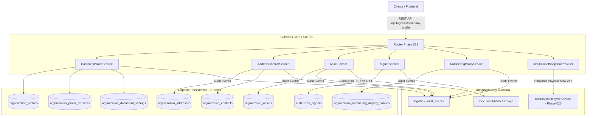

# Fase 021: Configuración de Datos de la Empresa y Datos Institucionales (Backend)

Este directorio contiene la especificación de arquitectura técnica, modelos de datos, servicios de aplicación, algoritmos de resolución y políticas de seguridad para la **Fase 021: Configurar Datos de la Empresa** dentro del módulo logístico del sistema de autenticación continua y trazabilidad documental.

---

## 🚀 Resumen Ejecutivo

La **Fase 021** establece la capa institucional canónica de la organización en el sistema. Su objetivo primordial es desacoplar la entidad estructural existente (`logistics_organizations` y `logistics_branches`) de los atributos legales, tributarios, de representación legal, políticas de presentación documental y activos gráficos de marca.

Antes de la Fase 021, la emisión de documentos (Fase 020) utilizaba datos estáticos o parciales. Con la introducción de la Fase 021, cada documento logístico emitido o previsualizado (guías, pedidos, actas, comprobantes) incorpora un **snapshot institucional inmutable** firmado mediante SHA-256, garantizando la inalterabilidad jurídica y la trazabilidad histórica de la identidad de la empresa en el tiempo.

---

## 🏛️ Arquitectura General y Componentes Principales

---

## 📋 Lista de Documentos de Arquitectura

1. **[01_auditoria_ficha_institucional.md](01_auditoria_ficha_institucional.md)** — Auditoría de modelos previos (`Organization`, `Branch`) y justificación técnica de las 8 nuevas tablas sin duplicar Organization.
2. **[02_modelo_organization_profile.md](02_modelo_organization_profile.md)** — Estructura del modelo `OrganizationProfileModel`, ciclo de vida y algoritmo de validación de RUC peruano (módulo 11) local.
3. **[03_versionado_semver_snapshots.md](03_versionado_semver_snapshots.md)** — Estrategia de versionado SemVer (`1.0.0`, `1.0.1`...), payloads JSONB determinísticos y hashes de contenido SHA-256.
4. **[04_direcciones_institucionales.md](04_direcciones_institucionales.md)** — Gestión de `OrganizationAddressModel`, clasificación por tipo, regla de unicidad del marcador `is_primary` y direcciones documentales por sede.
5. **[05_contactos_institucionales.md](05_contactos_institucionales.md)** — Gestión de `OrganizationContactModel`, contactos primarios por departamento, banderas de visibilidad en PDF y filtrado por familias documentales.
6. **[06_activos_graficos_logotipos_firmas.md](06_activos_graficos_logotipos_firmas.md)** — Carga, sanitización binaria con Pillow (PNG/JPEG/WebP), remoción de EXIF/malware, hashes SHA-256 y almacenamiento seguro en filesystem/S3.
7. **[07_firmantes_autorizados.md](07_firmantes_autorizados.md)** — Registro de `AuthorizedSignerModel`, vigencias, montos máximos autorizados y alcances (sedes, familias y tipos documentales).
8. **[08_resolucion_firmantes.md](08_resolucion_firmantes.md)** — Algoritmo `ResolveAuthorizedSigner`: evaluación en tiempo real de firmantes elegibles y estampa de firma visual en la emisión/vista previa.
9. **[09_configuraciones_documentales.md](09_configuraciones_documentales.md)** — Preferencias de presentación visual (`OrganizationDocumentSettingsModel`), control de headers, logos, ruc, pie de página y confidencialidad.
10. **[10_politicas_presentacion_numeracion.md](10_politicas_presentacion_numeracion.md)** — Formateo de presentación de numeración (`OrganizationNumberingDisplayPolicyModel`), patrones `{TYPE}-{SITE}-{YEAR}-{SEQUENCE}` sin alterar secuencias DB ni talonarios de Fases 012/013.
11. **[11_snapshot_institucional.md](11_snapshot_institucional.md)** — `InstitutionalSnapshotProvider`, congelación de ficha institucional al emitir documentos e inmutabilidad garantizada.
12. **[12_endpoints.md](12_endpoints.md)** — Especificación detallada OpenAPI/REST de los 15+ endpoints expuestos bajo `/api/logistics/company-profile`.
13. **[13_permisos_step_up.md](13_permisos_step_up.md)** — Matriz de permisos RBAC creados (`logistics.company_profile.*`) y mecanismo de Step-Up Authentication para acciones críticas.
14. **[14_auditoria.md](14_auditoria.md)** — Catálogo de eventos de auditoría inmutable registrados en `logistics_audit_events`.
15. **[15_migracion.md](15_migracion.md)** — Migración de base de datos Alembic `l230110021dc_phase_021_company_profile.py`, DDL de 8 tablas, FKs, Unique Constraints e índices.
16. **[16_pruebas.md](16_pruebas.md)** — Suite de 12 pruebas unitarias e integración en `tests/test_logistics_phase021.py` con 100% de cobertura de assertions.
17. **[17_rendimiento.md](17_rendimiento.md)** — Análisis de rendimiento, latencias < 25ms, caching de snapshots e índices PG optimizados.
18. **[18_integracion_futura_fase_022.md](18_integracion_futura_fase_022.md)** — Contrato de integración con la Fase 022 (Almacenes y Ubicaciones: asociación de sedes y direccionales de despacho).
19. **[19_integracion_futura_fase_026_sunat.md](19_integracion_futura_fase_026_sunat.md)** — Desacoplamiento de SUNAT / consulta RUC diferida a la Fase 026 (Integración Comprobantes / Padrón RUC API).
20. **[20_decisiones_pendientes.md](20_decisiones_pendientes.md)** — Registro de Decisiones de Arquitectura (ADR) diferidas a fases posteriores.
21. **[phase_021_backend_manifest.json](phase_021_backend_manifest.json)** — Manifiesto en formato JSON estructurado con todos los artefactos, endpoints, tablas, permisos y estado de la Fase 021.

---

## 🎯 Objetivos Logrados en la Fase 021

- **Separación de Responsabilidades**: Las tablas core de organización se mantienen intactas; la Ficha Institucional actúa como extensión de negocio.
- **Validación RUC Local**: Algoritmo Módulo 11 estricto ejecutado en backend sin latencia ni dependencia externa.
- **Inmutabilidad y Trazabilidad por Versiones**: Cada cambio mayor en la ficha genera un SemVer con hash SHA-256 determinístico.
- **Seguridad en Activos Gráficos**: Stripping automático de metadatos EXIF y mitigación de esteganografía/malware en logotipos y firmas.
- **Resolución Inteligente de Firmantes**: Algoritmo que valida vigencia, rango de montos, tipo de documento y sede antes de estampar la firma.
