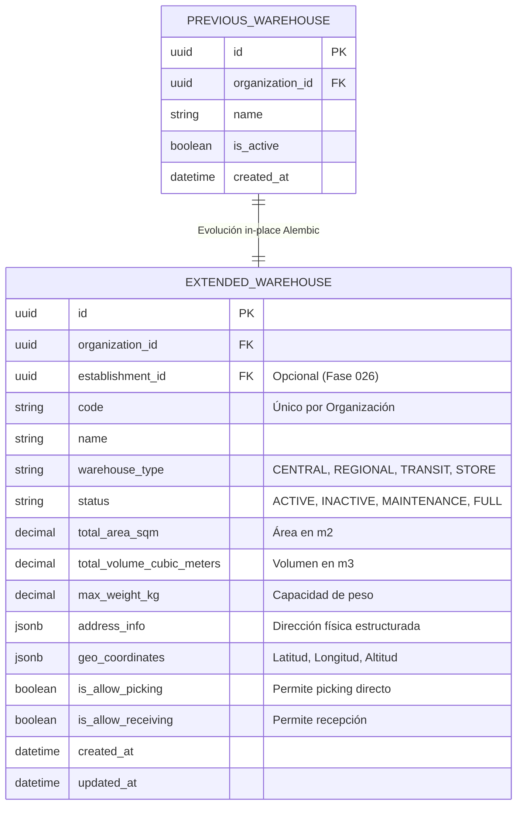

# 01. Auditoría de Entidades de Almacén Preexistentes y Extensión Modular

## Contexto y Diagnóstico Previo

Antes del desarrollo de la Fase 022, el sistema contaba con una entidad básica `WarehouseModel` mapeada a la tabla `warehouses`. Dicha estructura permitía registrar únicamente datos primarios de almacenes (nombre, organización, estado general), resultando insuficiente para la gestión logística avanzada, trazabilidad por ubicaciones físicas, control de capacidades y geolocalización.

### Principio de Diseño: Extensión In-Place vs. Reduplicación (`WarehouseV2`)

Se descartó enfáticamente la creación de una tabla redundante o paralela como `warehouses_v2` o `warehouses_extended`. Dicha práctica introduce fragmentación de esquemas, duplicidad de llaves foráneas y riesgo de inconsistencia operativa. En su lugar, se ejecutó una **extensión modular in-place** mediante migraciones DDL inmutables de Alembic (`m240110022dc_phase_022_warehouses_locations.py`), garantizando la preservación de todos los registros históricos preexistentes.

---

## Comparativa de Esquema DDL

---

## Modificaciones de Campos e Índices en `warehouses`

| Campo Agregado / Modificado | Tipo de Dato | Restricción / Índice | Descripción / Razón Técnica |
| :--- | :--- | :--- | :--- |
| `code` | `VARCHAR(32)` | `NOT NULL`, `UNIQUE(organization_id, code)` | Código mnemónico del almacén (Ej: `ALM-CENTRAL-01`). Normalizado a mayúsculas. |
| `establishment_id` | `UUID` | `NULLABLE`, `FK -> organization_establishments(id)` | Vinculación a sede/establecimiento anexo SUNAT (preparado para Fase 026). |
| `warehouse_type` | `VARCHAR(32)` | `DEFAULT 'CENTRAL'` | Categorización operativa: `CENTRAL`, `REGIONAL`, `TRANSIT`, `STORE`, `DARK_STORE`. |
| `status` | `VARCHAR(32)` | `DEFAULT 'ACTIVE'` | Estado operativo: `ACTIVE`, `INACTIVE`, `MAINTENANCE`, `FULL`, `QUARANTINE_ONLY`. |
| `total_area_sqm` | `NUMERIC(12, 2)` | `CHECK >= 0` | Área física en metros cuadrados del almacén. |
| `total_volume_cubic_meters` | `NUMERIC(12, 2)` | `CHECK >= 0` | Volumen total de almacenamiento disponible. |
| `max_weight_kg` | `NUMERIC(14, 2)` | `CHECK >= 0` | Capacidad máxima de carga en peso global. |
| `address_info` | `JSONB` | `DEFAULT '{}'` | Estructura JSON con calle, ciudad, departamento, ubigeo y referencias. |
| `geo_coordinates` | `JSONB` | `DEFAULT '{}'` | Coordenadas GPS `{ latitude, longitude, altitude }`. |
| `is_allow_picking` | `BOOLEAN` | `DEFAULT TRUE` | Flag de habilitación para algoritmos de picking. |
| `is_allow_receiving` | `BOOLEAN` | `DEFAULT TRUE` | Flag de habilitación para recepción de mercadería. |

---

## Compatibilidad de Datos Existentes

Durante la ejecución de la migración de la Fase 022:
1. **Backfill Automático de Códigos:** A los registros preexistentes sin `code` se les asignó un código correlativo sintético basado en su ID (`ALM-PREV-{ROW_NUMBER}`).
2. **Preservación de Lógica Previa:** Todas las consultas previas sobre `warehouses` filtrando por `organization_id` e `is_active` continúan funcionando sin modificación.
3. **Foreign Keys Hacia `warehouses`:** Las tablas dependientes existentes no requirieron actualización de constraints.
