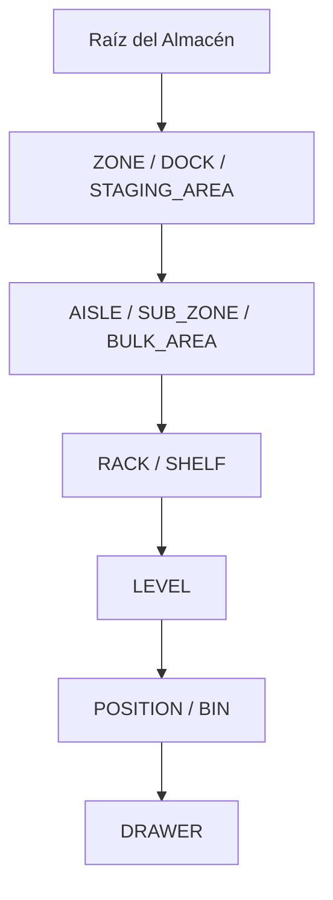
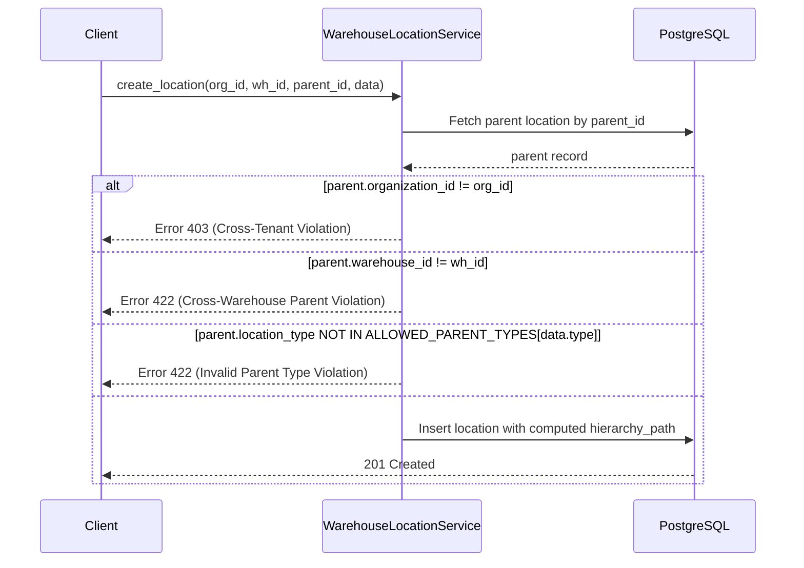

# 03. Jerarquía de Políticas de Padres y Validación Topológica

## Matriz de Padres Permitidos (`WarehouseLocationHierarchyPolicy`)

Para impedir configuraciones físicas o lógicas ilógicas (por ejemplo, ubicar un `RACK` dentro de una `POSITION` o un `DOCK` dentro de un `LEVEL`), el sistema implementa una matriz declarativa de compatibilidad de tipos de ubicaciones:

```python
# app/services/logistics/hierarchy_policy.py

ALLOWED_PARENT_TYPES = {
    "ZONE": [None],  # Nodo Raíz directo del Almacén
    "DOCK": [None],
    "STAGING_AREA": [None],
    "SUB_ZONE": ["ZONE"],
    "AISLE": ["ZONE", "SUB_ZONE"],
    "RACK": ["ZONE", "SUB_ZONE", "AISLE"],
    "SHELF": ["ZONE", "SUB_ZONE", "AISLE"],
    "BULK_AREA": ["ZONE", "SUB_ZONE"],
    "LEVEL": ["RACK", "SHELF"],
    "POSITION": ["LEVEL", "RACK", "SHELF"],
    "BIN": ["LEVEL", "RACK", "SHELF", "POSITION"],
    "DRAWER": ["POSITION", "BIN"],
}
```

### Tabla Resumen de Relaciones Validadas



---

## Prevención de Ciclos y Control de Profundidad

### 1. Límite Absoluto de Profundidad (`MAX_DEPTH = 10`)
Ningún árbol de ubicaciones puede exceder 10 niveles de profundidad (índices `0` a `9`). Si un intento de inserción o movimiento resultara en un nodo con `depth >= 10`, el servicio arroja inmediatamente `HierarchyDepthExceededError (HTTP 422)`.

### 2. Detección Rigurosa de Ciclos Topológicos
Durante la asignación o actualización de un `parent_id`, se verifica que el nuevo padre **no sea el propio nodo ni ninguno de sus descendientes actuales**.

```python
def validate_no_cycles(location_id: UUID, new_parent_path: str):
    """
    Verifica que new_parent_path no contenga el str(location_id).
    Si new_parent_path incluye location_id, se intentaría mover
    un nodo dentro de su propio subárbol, generando un ciclo.
    """
    if location_id and str(location_id) in new_parent_path.split("/"):
        raise HierarchyCycleDetectedError(
            f"No se puede asignar la ubicación {location_id} como descendiente de sí misma."
        )
```

---

## Aislamiento Multi-Organización y Multi-Almacén

Para mantener la integridad tenant y la coherencia de datos, el servicio valida tres reglas inviolables:



### Reglas de Aislamiento
1. **Misma Organización (`organization_id`):** El nodo padre debe pertenecer estrictamente a la misma organización del nodo hijo.
2. **Mismo Almacén (`warehouse_id`):** El nodo padre debe residir en el mismo almacén. No se permiten ubicaciones cuyo padre sea de otro almacén.
3. **Coherencia de Ruta (`hierarchy_path`):** La ruta del hijo se calcula concatenando `/` + `str(hijo.id)` a la `hierarchy_path` del padre.
