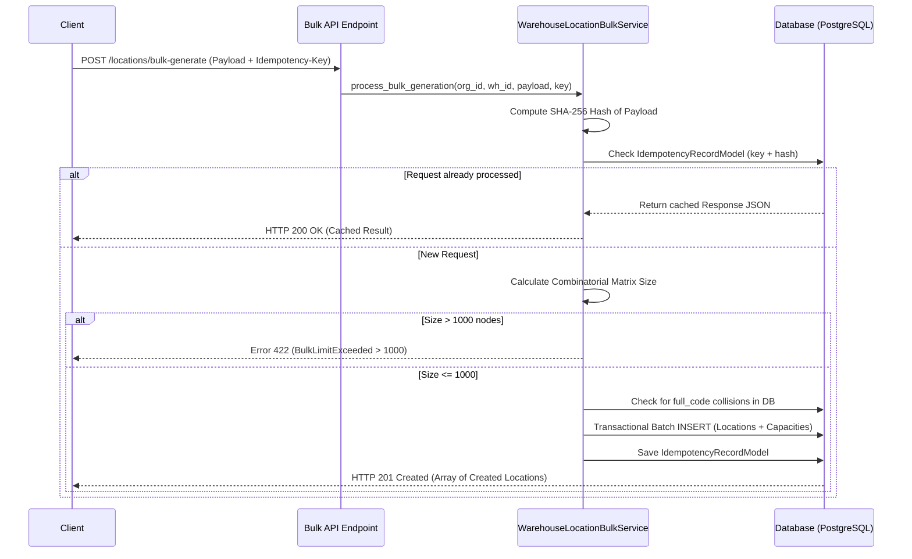

# 05. Generación Masiva de Ubicaciones e Idempotencia Transaccional

## Servicio `WarehouseLocationBulkService`

Para optimizar la puesta en marcha de almacenes con miles de casilleros (ej. 10 pasillos $\times$ 5 racks $\times$ 4 niveles $\times$ 6 posiciones = 1,200 ubicaciones), la Fase 022 incluye el servicio `WarehouseLocationBulkService`. Permite la generación matricial combinatoria con vista previa en tiempo de ejecución, control de límites y protección contra ejecuciones duplicadas.

---

## Flujo del Proceso Combinatorio e Idempotencia



---

## Especificación del Payload Combinatorio

La API acepta la especificación de patrones de rangos (numéricos o alfabéticos) para generar las dimensiones de la matriz.

```json
{
  "parent_id": "c3a9d2e1-4567-89ab-cdef-0123456789ab",
  "pattern": {
    "aisle": {"prefix": "A", "start": 1, "end": 2, "padding": 2},
    "rack": {"prefix": "R", "start": 1, "end": 3, "padding": 2},
    "level": {"prefix": "N", "start": 1, "end": 2, "padding": 2},
    "position": {"prefix": "P", "start": 1, "end": 4, "padding": 2}
  },
  "default_status": "ACTIVE",
  "default_capacity": {
    "max_weight_kg": 500.0,
    "max_volume_cubic_meters": 1.2,
    "max_pallets": 1
  }
}
```

### Cálculo Combinatorio de Tamaño
$$\text{Total Nodos} = (2 - 1 + 1) \times (3 - 1 + 1) \times (2 - 1 + 1) \times (4 - 1 + 1) = 2 \times 3 \times 2 \times 4 = 48 \text{ ubicaciones.}$$

---

## Límite de Protección (`MAX_BULK_NODES = 1000`)

Para garantizar la capacidad de respuesta en tiempo real y evitar *locks* prolongados en la base de datos o agotamiento de memoria, la generación masiva limita estrictamente a **1,000 nodos por ejecución individual**. Si el cálculo combinatorio excede este umbral, la solicitud es rechazada en la fase de validación rápida sin abrir transacción DML.

---

## Estructura del Registro de Idempotencia (`IdempotencyRecordModel`)

```python
# app/models/common/idempotency_record.py

class IdempotencyRecordModel(Base):
    __tablename__ = "idempotency_records"

    id = Column(UUID(as_uuid=True), primary_key=True, default=uuid.uuid4)
    idempotency_key = Column(String(128), nullable=False, index=True)
    request_hash = Column(String(64), nullable=False) # Hash SHA-256 del payload
    resource_type = Column(String(64), nullable=False, default="LOCATION_BULK")
    response_body = Column(JSONB, nullable=False)
    status_code = Column(Integer, nullable=False)
    created_at = Column(DateTime, nullable=False, default=datetime.utcnow)
```

### Modo Vista Previa (`preview_only = True`)
El endpoint `/api/logistics/warehouses/{id}/locations/bulk-preview` permite simular la ejecución sin persistir cambios en la base de datos. Devuelve la lista completa de `full_code` construidos, alertas de colisión existentes y métricas de capacidad resultantes.
