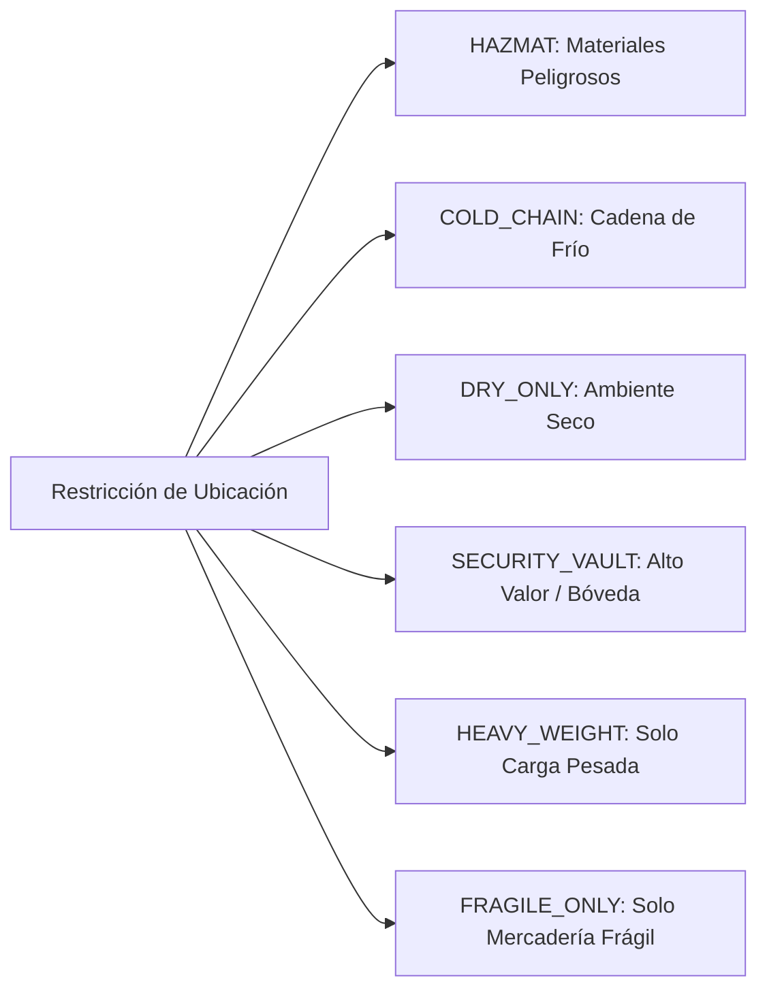

# 07. Restricciones Físicas, Ambientales y Normativas de Ubicación

## Modelo `WarehouseLocationRestrictionModel`

El modelo `WarehouseLocationRestrictionModel` mapea la tabla `warehouse_location_restrictions`. Permite asociar múltiples condiciones o barreras físicas, térmicas, químicas y normativas a una ubicación física.

---

## Modelo SQLAlchemy y Esquema DDL

```python
# app/models/logistics/warehouse_location_restriction.py

from sqlalchemy import Column, String, Boolean, Numeric, ForeignKey, DateTime, Index
from sqlalchemy.dialects.postgresql import UUID, JSONB
from sqlalchemy.orm import relationship
from app.db.base import Base
import uuid
from datetime import datetime

class WarehouseLocationRestrictionModel(Base):
    __tablename__ = "warehouse_location_restrictions"

    id = Column(UUID(as_uuid=True), primary_key=True, default=uuid.uuid4)
    location_id = Column(UUID(as_uuid=True), ForeignKey("warehouse_locations.id", ondelete="CASCADE"), nullable=False)
    
    # Categorización y Severidad
    restriction_type = Column(String(64), nullable=False) # HAZMAT, COLD_CHAIN, FRAGILE_ONLY, SECURITY_VAULT, DRY_ONLY
    severity = Column(String(32), nullable=False, default="HARD_BLOCK") # HARD_BLOCK, WARNING_ONLY
    
    # Parámetros Ambientales Opcionales
    min_temperature_celsius = Column(Numeric(5, 2), nullable=True)
    max_temperature_celsius = Column(Numeric(5, 2), nullable=True)
    max_humidity_percentage = Column(Numeric(5, 2), nullable=True)
    
    # Reglas Específicas / Flags
    requires_hazmat_license = Column(Boolean, nullable=False, default=False)
    allowed_hazmat_classes = Column(JSONB, nullable=False, default=[]) # e.g. ["CLASS_3_FLAMMABLE", "CLASS_8_CORROSIVE"]
    notes = Column(String(255), nullable=True)
    
    created_at = Column(DateTime, nullable=False, default=datetime.utcnow)

    location = relationship("WarehouseLocationModel", back_populates="restrictions")
```

---

## Catálogo de Tipos de Restricción (`restriction_type`)



### Tipos Detallados

1. **`COLD_CHAIN` (Cadena de Frío):** Especifica rangos estrictos de temperatura (ej: $-20^\circ C$ a $-15^\circ C$ para congelados o $+2^\circ C$ a $+8^\circ C$ para refrigerados).
2. **`HAZMAT` (Hazardous Materials):** Requiere certificación especial del operador o montacarguista y restringe a clases químicas compatibles (`allowed_hazmat_classes`).
3. **`SECURITY_VAULT` (Bóveda de Seguridad):** Acceso restringido para productos de alto valor tecnológico o farmacéutico.
4. **`DRY_ONLY` (Control de Humedad):** Limita el porcentaje máximo de humedad relativa (ej: $< 60\%$).

---

## Niveles de Severidad y Reglas de Validación

| Severidad (`severity`) | Comportamiento del Sistema | Acción en Intento de Asignación Incumplida |
| :--- | :--- | :--- |
| **`HARD_BLOCK`** | **Inviolable (Bloqueo Duro).** Impide categóricamente la ubicación de productos que no cumplan la restricción. | Lanza excepción de validación logitudinal. Rechaza la transacción. |
| **`WARNING_ONLY`** | **Advertencia Informativa.** Permite la asignación previo registro de justificación o confirmación explícita. | Devuelve código de advertencia en API y registra evento de auditoría. |

---

## Ejemplo de Evaluación de Compatibilidad

```python
def check_location_compatibility(location_restrictions: List[Restriction], product_metadata: dict) -> Tuple[bool, List[str]]:
    errors = []
    for res in location_restrictions:
        if res.restriction_type == "COLD_CHAIN":
            prod_temp = product_metadata.get("required_temp_celsius")
            if prod_temp is not None:
                if (res.min_temperature_celsius and prod_temp < res.min_temperature_celsius) or \
                   (res.max_temperature_celsius and prod_temp > res.max_temperature_celsius):
                    errors.append(f"Temperatura requerida {prod_temp}°C fuera de rango de ubicación ({res.min_temperature_celsius}°C - {res.max_temperature_celsius}°C).")
        
        if res.restriction_type == "HAZMAT" and res.severity == "HARD_BLOCK":
            if not product_metadata.get("is_hazmat"):
                errors.append("La ubicación es exclusiva para Materiales Peligrosos (HAZMAT).")
                
    return (len(errors) == 0, errors)
```
