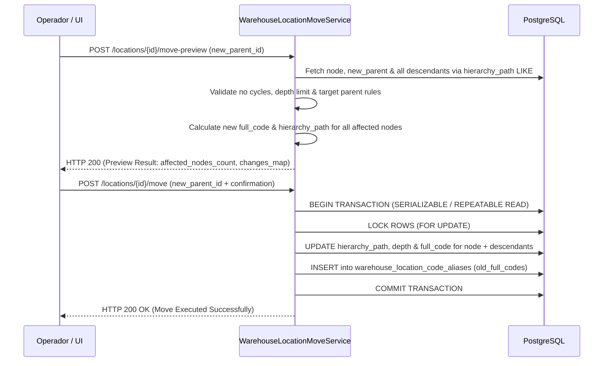

# 08. Movimiento de Subárboles y Conservación Histórica de Alias

## Arquitectura de Movimiento Jerárquico

En la reestructuración física de un almacén (por ejemplo, reubicar todo un pasillo o rack a una nueva zona), cambiar la ubicación de un nodo implica desplazar **todo su subárbol dependiente**. La Fase 022 provee un mecanismo seguro de dos pasos: `move-preview` y `move`.

---

## Flujo Operativo en Dos Fases



---

## Recalculación Transaccional en Cascación

Al reubicar un nodo raíz de subárbol $N$ de un padre $P_{viejo}$ a un padre $P_{nuevo}$:

1. **Nueva Profundidad:** $depth_{nueva} = depth(P_{nuevo}) + 1$.
2. **Delta de Profundidad:** $\Delta = depth_{nueva} - depth_{actual}(N)$.
3. **Nueva Ruta de Jerarquía:**
   $$hierarchy\_path_{nueva} = hierarchy\_path(P_{nuevo}) + "/" + id(N)$$
4. **Actualización de Descendientes:**
   Para todo nodo $D$ en el subárbol donde $hierarchy\_path(D)$ comience con $hierarchy\_path_{vieja}(N)$:
   $$hierarchy\_path_{nueva}(D) = hierarchy\_path_{nueva}(N) + \text{suffix}$$
   $$depth_{nueva}(D) = depth_{actual}(D) + \Delta$$

```sql
-- DDL de actualización atómica en PostgreSQL
UPDATE warehouse_locations
SET 
    hierarchy_path = :new_base_path || SUBSTRING(hierarchy_path FROM LENGTH(:old_base_path) + 1),
    depth = depth + :depth_delta,
    full_code = :new_parent_full_code || '-' || code,
    updated_at = NOW()
WHERE hierarchy_path LIKE :old_base_path || '%';
```

---

## Modelo Histórico `WarehouseLocationCodeAliasModel`

Para evitar romper la trazabilidad de etiquetas impresas previamente, órdenes de picking archivadas o integraciones externas cuando un `full_code` cambia tras un movimiento, el sistema guarda en la tabla `warehouse_location_code_aliases` todos los `full_code` previos.

```python
# app/models/logistics/warehouse_location_code_alias.py

class WarehouseLocationCodeAliasModel(Base):
    __tablename__ = "warehouse_location_code_aliases"

    id = Column(UUID(as_uuid=True), primary_key=True, default=uuid.uuid4)
    location_id = Column(UUID(as_uuid=True), ForeignKey("warehouse_locations.id", ondelete="CASCADE"), nullable=False)
    old_full_code = Column(String(255), nullable=False, index=True)
    moved_by_user_id = Column(UUID(as_uuid=True), nullable=False)
    created_at = Column(DateTime, nullable=False, default=datetime.utcnow)

    location = relationship("WarehouseLocationModel")
```

### Resolución Transparente de Códigos
Cualquier búsqueda o escaneo QR por `full_code` ejecuta una consulta fallback:
1. Buscar coincidencia exacta en `warehouse_locations.full_code`.
2. Si no se encuentra, buscar en `warehouse_location_code_aliases.old_full_code` y redirigir a la ubicación actual con una advertencia en el payload de respuesta (`aliased_from: "ALM01-Z01-A01-R01"`).
