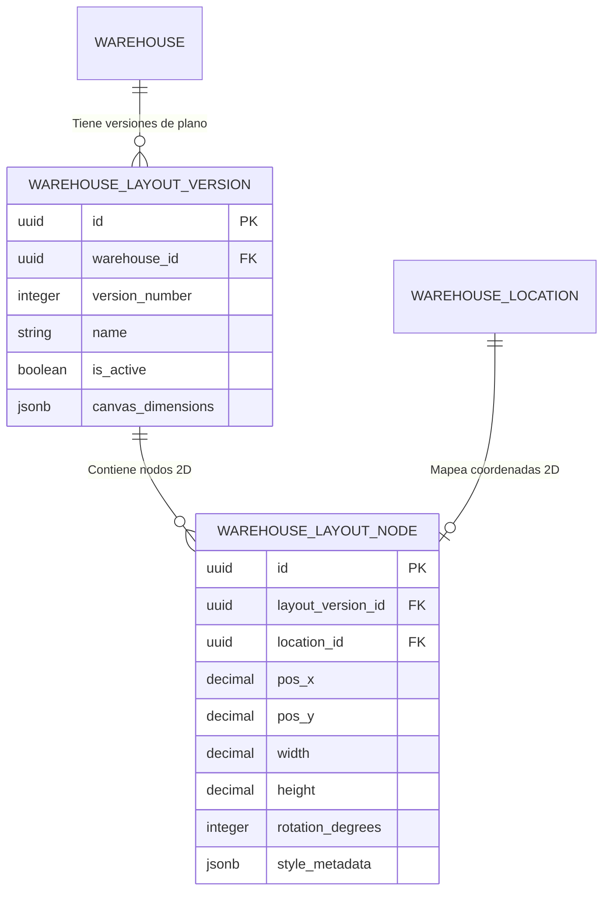

# 09. Layout 2D y Mapa Lógico de Almacén

## Arquitectura de Representación Gráfica 2D

Para posibilitar la representación interactiva del plano topológico del almacén en aplicaciones web frontend (React / HTML5 Canvas / SVG), la Fase 022 implementa un subsistema de versionado de plano 2D compuesto por `WarehouseLayoutVersionModel` y `WarehouseLayoutNodeModel`.



---

## Modelos SQLAlchemy

```python
# app/models/logistics/warehouse_layout.py

from sqlalchemy import Column, String, Boolean, Integer, Numeric, ForeignKey, DateTime, Index, UniqueConstraint
from sqlalchemy.dialects.postgresql import UUID, JSONB
from sqlalchemy.orm import relationship
from app.db.base import Base
import uuid
from datetime import datetime

class WarehouseLayoutVersionModel(Base):
    __tablename__ = "warehouse_layout_versions"

    id = Column(UUID(as_uuid=True), primary_key=True, default=uuid.uuid4)
    warehouse_id = Column(UUID(as_uuid=True), ForeignKey("warehouses.id", ondelete="CASCADE"), nullable=False)
    version_number = Column(Integer, nullable=False)
    name = Column(String(128), nullable=False)
    description = Column(String(255), nullable=True)
    is_active = Column(Boolean, nullable=False, default=False)
    canvas_dimensions = Column(JSONB, nullable=False, default={"width": 1920, "height": 1080, "unit": "px"})
    created_at = Column(DateTime, nullable=False, default=datetime.utcnow)

    nodes = relationship("WarehouseLayoutNodeModel", back_populates="layout_version", cascade="all, delete-orphan")

    __table_args__ = (
        UniqueConstraint("warehouse_id", "version_number", name="uq_layout_wh_version"),
    )


class WarehouseLayoutNodeModel(Base):
    __tablename__ = "warehouse_layout_nodes"

    id = Column(UUID(as_uuid=True), primary_key=True, default=uuid.uuid4)
    layout_version_id = Column(UUID(as_uuid=True), ForeignKey("warehouse_layout_versions.id", ondelete="CASCADE"), nullable=False)
    location_id = Column(UUID(as_uuid=True), ForeignKey("warehouse_locations.id", ondelete="CASCADE"), nullable=False)
    
    # Coordenadas y Geometría en Lienzo 2D
    pos_x = Column(Numeric(10, 2), nullable=False, default=0.0)
    pos_y = Column(Numeric(10, 2), nullable=False, default=0.0)
    width = Column(Numeric(10, 2), nullable=False, default=100.0)
    height = Column(Numeric(10, 2), nullable=False, default=100.0)
    rotation_degrees = Column(Integer, nullable=False, default=0) # 0, 90, 180, 270
    z_index = Column(Integer, nullable=False, default=0)
    
    style_metadata = Column(JSONB, nullable=False, default={"fill": "#3b82f6", "stroke": "#1d4ed8"})

    layout_version = relationship("WarehouseLayoutVersionModel", back_populates="nodes")
    location = relationship("WarehouseLocationModel")
```

---

## Endpoint `/api/logistics/warehouses/{id}/logical-map`

El backend compila la versión activa del layout junto con el estado en tiempo real de cada ubicación para ofrecer un payload listo para renderizado en React.

### Payload de Respuesta Consumible por React

```json
{
  "warehouse_id": "8f3b2a11-9c8e-4b7d-a123-456789abcdef",
  "warehouse_name": "Almacén Central Límite",
  "layout_version": 2,
  "canvas": {
    "width": 2400,
    "height": 1600,
    "unit": "px"
  },
  "nodes": [
    {
      "node_id": "e4f5a6b7-1234-5678-9abc-def012345678",
      "location_id": "c3a9d2e1-4567-89ab-cdef-0123456789ab",
      "code": "Z01",
      "full_code": "ALM01-Z01",
      "location_type": "ZONE",
      "status": "ACTIVE",
      "geometry": {
        "x": 100.0,
        "y": 150.0,
        "width": 400.0,
        "height": 600.0,
        "rotation": 0,
        "z_index": 1
      },
      "style": {
        "fill": "#1e293b",
        "stroke": "#38bdf8",
        "label": "Zona Fría A"
      },
      "stats": {
        "total_racks": 12,
        "total_positions": 288,
        "is_pickable": true
      }
    }
  ]
}
```
