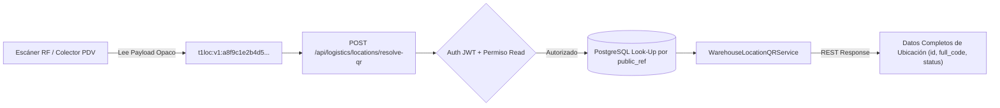

# 10. Referencias QR Opacas y Seguridad de Escaneo

## Servicio `WarehouseLocationQRService`

Para evitar ataques de adivinación o enumeración de IDs (IDOR/Enumeration) mediante la lectura física de códigos de barras o QR impresos en las etiquetas de los estantes, la Fase 022 implementa **Referencias QR Opacas Versionadas**.

---

## Formato del Payload Seguro Opaco

El código QR no almacena URLs visibles, UUIDs internos ni códigos de negocio explícitos. En su lugar, codifica una cadena compacta firmada con el esquema:

$$\text{Payload QR} = \texttt{"t1loc:v1:"} + \text{public\_ref}$$

Donde `public_ref` es un identificador aleatorio opaco alfanumérico generado con entropía criptográfica (UUID v4 desprovisto de guiones o Hash URL-Safe).



---

## Implementación del Servicio Python

```python
# app/services/logistics/qr_service.py

import io
import qrcode
from qrcode.image.pil import PilImage
from typing import Optional, Tuple
from uuid import uuid4
from sqlalchemy.orm import Session
from app.models.logistics.warehouse_location import WarehouseLocationModel

class WarehouseLocationQRService:
    PREFIX = "t1loc:v1:"

    @classmethod
    def generate_payload(cls, public_ref: str) -> str:
        """Construye el payload opaco para codificación QR."""
        return f"{cls.PREFIX}{public_ref}"

    @classmethod
    def parse_payload(cls, payload: str) -> str:
        """Valida y extrae el public_ref del payload escaneado."""
        if not payload.startswith(cls.PREFIX):
            raise ValueError("Formato de payload QR no reconocido o de versión obsoleta.")
        return payload[len(cls.PREFIX):]

    @classmethod
    def rotate_public_ref(cls, db: Session, location: WarehouseLocationModel) -> str:
        """Rota la referencia pública de una ubicación (invalida QRs antiguos impresos)."""
        new_ref = str(uuid4()).replace("-", "")
        location.public_ref = new_ref
        db.commit()
        db.refresh(location)
        return new_ref

    @classmethod
    def render_qr_png_bytes(cls, payload: str, box_size: int = 10, border: int = 2) -> bytes:
        """Renderiza una imagen PNG binaria del código QR."""
        qr = qrcode.QRCode(
            version=1,
            error_correction=qrcode.constants.ERROR_CORRECT_M,
            box_size=box_size,
            border=border,
        )
        qr.add_data(payload)
        qr.make(fit=True)

        img = qr.make_image(fill_color="black", back_color="white")
        img_byte_arr = io.BytesIO()
        img.save(img_byte_arr, format="PNG")
        return img_byte_arr.getvalue()
    
    @classmethod
    def resolve_location(cls, db: Session, payload: str, organization_id: str) -> WarehouseLocationModel:
        """Resuelve de forma segura el payload opaco verificando el tenant."""
        public_ref = cls.parse_payload(payload)
        location = db.query(WarehouseLocationModel).filter(
            WarehouseLocationModel.public_ref == public_ref,
            WarehouseLocationModel.organization_id == organization_id
        ).first()
        
        if not location:
            raise ValueError("Ubicación no encontrada o no pertenece a la organización actual.")
        return location
```

---

## Ciclo de Vida: Rotación y Revocación de QR

1. **Escaneo y Resolución Autenticada:** El cliente móvil envía el payload escaneado a `/api/logistics/locations/resolve-qr`. Requiere bearer token con permiso `logistics.warehouses.read`.
2. **Rotación Seguridad (`POST /locations/{id}/rotate-qr`):** En caso de extravío de etiquetas físicas o vulneración, un administrador con permiso `logistics.warehouses.manage` puede rotar el `public_ref`, invalidando inmediatamente cualquier etiqueta física impresa previamente.
3. **Respuesta en Imagen Directa:** El endpoint `GET /api/logistics/locations/{id}/qr-image` devuelve directamente una respuesta `image/png` con los headers de caché apropiados para previsualización directa en el frontend.
