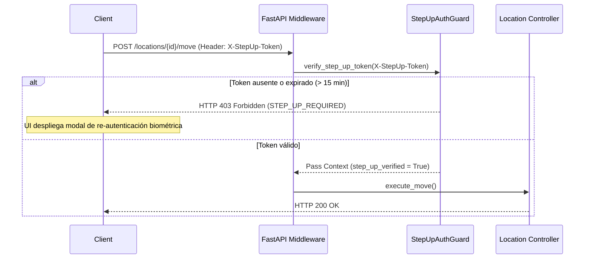

# 13. Permisos RBAC y Autenticación Elevada (Step-Up Authentication)

## Control de Acceso Basado en Roles (RBAC)

La Fase 022 aplica el modelo RBAC unificado de la plataforma para proteger las operaciones del módulo logístico. Los permisos están estructurados bajo el dominio `logistics.*`.

---

## Matriz Granular de Permisos Logísticos

| Permiso RBAC | Operaciones Autorizadas | Roles por Defecto |
| :--- | :--- | :--- |
| **`logistics.warehouses.read`** | Consulta de almacenes, árbol de ubicaciones, visualización de layout 2D, resolución de QR y descarga de etiquetas. | `LOGISTICS_VIEWER`, `OPERATOR`, `MANAGER`, `ADMIN` |
| **`logistics.warehouses.manage`** | Creación y modificación de datos generales de almacén, rotación de códigos QR opacos. | `LOGISTICS_MANAGER`, `ADMIN` |
| **`logistics.warehouse_locations.create`** | Creación individual y generación masiva (`bulk-generate`) de ubicaciones. | `LOGISTICS_PLANNER`, `LOGISTICS_MANAGER`, `ADMIN` |
| **`logistics.warehouse_locations.manage`** | Edición de propiedades, capacidades, restricciones y eliminación física de ubicaciones sin inventario. | `LOGISTICS_MANAGER`, `ADMIN` |
| **`logistics.warehouse_locations.move`** | Simulación y ejecución de movimientos de subárboles completos. | `LOGISTICS_MANAGER`, `ADMIN` |
| **`logistics.warehouse_layouts.activate`** | Creación de nuevas versiones de layout 2D y activación en producción. | `LOGISTICS_MANAGER`, `ADMIN` |

---

## Integración con Step-Up Authentication

Ciertas operaciones conllevan riesgo operativo elevado (alterar la topología del almacén, eliminar nodos jerárquicos o invalidar referencias físicas). Para ejecutar estas operaciones, el backend exige un **Token JWT de Elevación de Privilegios (Step-Up)** reciente (emitido tras re-autenticación por MFA o Biometría Continua en los últimos 15 minutos).



### Operaciones con Exigencia Mandatoria de Step-Up

1. `POST /api/logistics/warehouses` (Creación de Almacén principal).
2. `DELETE /api/logistics/warehouses/{id}/locations/{loc_id}` (Eliminación de Ubicación).
3. `POST /api/logistics/warehouses/{id}/locations/{loc_id}/move` (Movimiento de Subárbol).
4. `POST /api/logistics/warehouses/{id}/layouts` (Activación de Versión de Layout 2D).
5. `POST /api/logistics/warehouses/{id}/locations/{loc_id}/rotate-qr` (Rotación de QR Opaco).

---

## Ejemplo de Implementación en FastAPI Guard

```python
# app/api/deps.py

from fastapi import Header, HTTPException, status
from app.services.auth.step_up_service import verify_step_up_jwt

def require_step_up_auth(x_stepup_token: str = Header(..., alias="X-StepUp-Token")):
    """Dependency injection guard que exige Step-Up Token."""
    if not x_stepup_token or not verify_step_up_jwt(x_stepup_token):
        raise HTTPException(
            status_code=status.HTTP_403_FORBIDDEN,
            detail={
                "error_code": "STEP_UP_REQUIRED",
                "message": "Esta operación crítica requiere re-autenticación elevada (Step-Up)."
            }
        )
    return True
```
