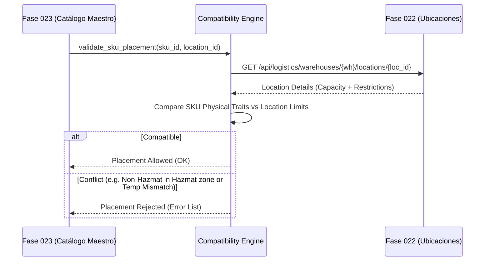

# 18. Integración Futura — Fase 023: Catálogo Maestro de Productos

## Propósito de la Integración

La **Fase 023** introducirá el Catálogo Maestro de Productos (SKUs, Familias, Categorías de Mercadería, Propiedades Físicas, Fichas de Seguridad SDS/MSDS). El modelo de restricciones configuradas en la Fase 022 (`WarehouseLocationRestrictionModel`) expone las interfaces necesarias para que el catálogo maestro pueda validar si un SKU es elegible para ser almacenado en una ubicación específica.

---

## Puntos de Contacto y Contrato de Interfaces



---

## Estructura del Payload de Validación de Compatibilidad

```json
{
  "sku_id": "sku-fase023-9999-8888",
  "sku_code": "PROD-CONGELADO-01",
  "product_category": "PERISHABLE_FOOD",
  "physical_traits": {
    "weight_kg": 2.50,
    "volume_cubic_meters": 0.008,
    "required_temperature_celsius": -18.0,
    "is_hazmat": false,
    "hazmat_class": null,
    "is_fragile": true
  },
  "target_location_id": "e4f5a6b7-1234-5678-9abc-def012345678"
}
```

---

## Reglas de Validación Futura a Enforzar

1. **Compatibilidad Térmica:**
   $$\text{min\_temp}_{loc} \le \text{req\_temp}_{sku} \le \text{max\_temp}_{loc}$$
2. **Restricción de Categorías Exclusivas:**
   Si la ubicación posee `restriction_type = "FRAGILE_ONLY"`, la categoría del producto debe tener el flag `is_fragile = true`.
3. **Control de Incompatibilidad Química (HAZMAT):**
   Ubicaciones con `restriction_type = "HAZMAT"` requerirán que el `hazmat_class` del SKU pertenezca a la lista `allowed_hazmat_classes`.
