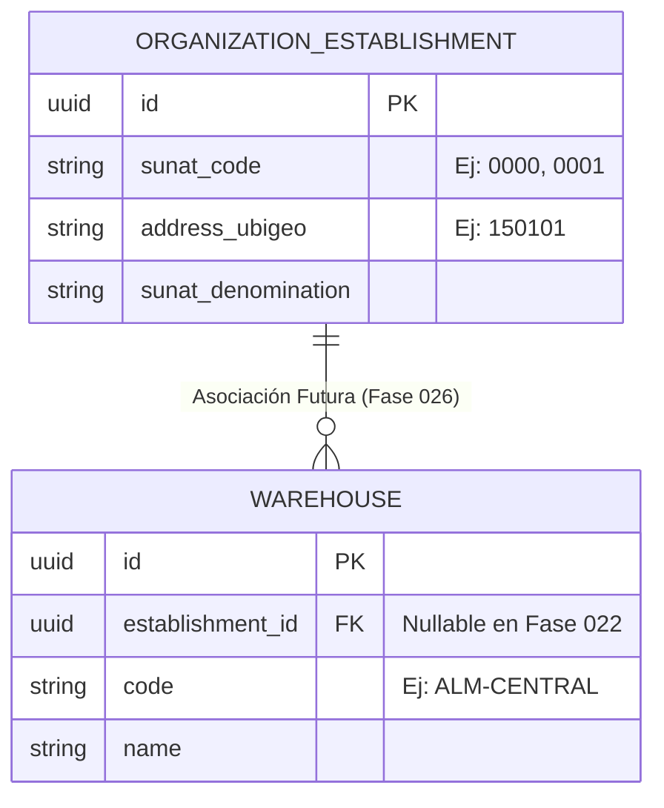

# 19. Integración Futura — Fase 026: Establecimientos Anexos y Normativa SUNAT

## Desacoplamiento Arquitectónico

La normativa tributaria peruana (SUNAT) exige la declaración y codificación de **Establecimientos Anexos** (Locales Comerciales, Plantas, Almacenes Declarados de 4 dígitos, ej: `0000`, `0001`, `0002`) para la emisión de Guías de Remisión Electrónicas (GRE - Remitente y Transportista).

Para mantener la Fase 022 enfocado exclusivamente en la **topología física y operativa del almacén**, la vinculación con la normativa tributaria SUNAT se ha desacoplado explícitamente y se resolverá formalmente en la **Fase 026** (Facturación Electrónica y Guías de Remisión SUNAT).

---

## Campo de Enlace Reservado (`establishment_id`)

En la migración DDL de la Fase 022, la tabla `warehouses` incluye la columna nullable `establishment_id`:

```sql
ALTER TABLE warehouses 
ADD COLUMN establishment_id UUID NULL REFERENCES organization_establishments(id);
```



---

## Flujo de Resolución en la Fase 026

1. En la Fase 022, los almacenes pueden operar independientemente sin estar vinculados a un código de establecimiento anexo SUNAT.
2. Al implementar la Fase 026, la emisión de Guías de Remisión tomará el `establishment_id` asignado al almacén para extraer automáticamente el Ubigeo fiscal y el código de punto de partida/llegada SUNAT de 4 dígitos.
3. Si un almacén no posee `establishment_id` asignado en el momento de generar una Guía Electrónica, el servicio de la Fase 026 emitirá una excepción de validación tributaria exigiendo la vinculación previa.
