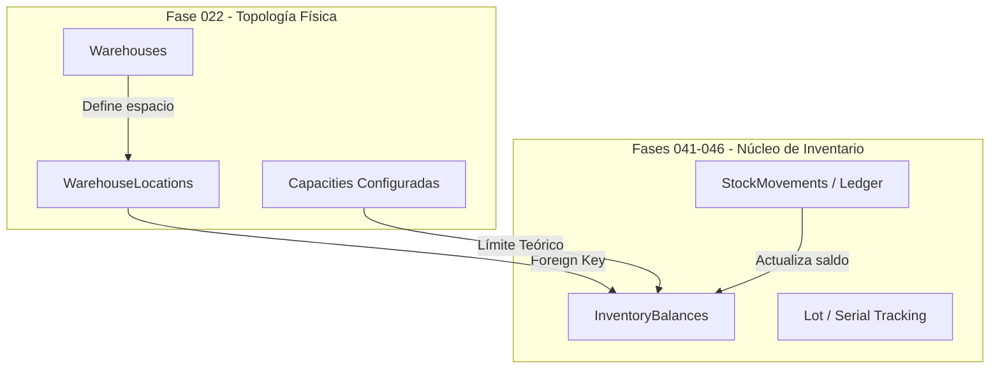

# 20. Integración Futura — Fases 041-046: Gestor de Inventarios y Saldos en Tiempo Real

## Separación Estratégica: Topología vs. Saldos Operativos

Un principio de diseño crítico en la plataforma es la separación entre la **Estructura Física** (Fase 022) y el **Control de Stock y Movimientos de Inventario** (Fases 041-046).



---

## Contrato de Integración de Tablas

### Referencia de Identificador Único (`location_id`)
Las tablas de saldos en tiempo real de las Fases 041 a 046 mantendrán llaves foráneas directas hacia `warehouse_locations.id`:

```sql
-- Ejemplo de esquema futuro (Fase 041)
CREATE TABLE inventory_balances (
    id UUID PRIMARY KEY DEFAULT gen_random_uuid(),
    organization_id UUID NOT NULL REFERENCES organizations(id),
    warehouse_id UUID NOT NULL REFERENCES warehouses(id),
    location_id UUID NOT NULL REFERENCES warehouse_locations(id),
    sku_id UUID NOT NULL,
    qty_on_hand NUMERIC(14, 4) NOT NULL DEFAULT 0,
    qty_reserved NUMERIC(14, 4) NOT NULL DEFAULT 0,
    qty_allocated NUMERIC(14, 4) NOT NULL DEFAULT 0,
    updated_at TIMESTAMP WITH TIME ZONE NOT NULL DEFAULT NOW()
);
```

---

## Reglas de Validación en Transacciones de Inventario

1. **Verificación de Banderas Operativas:**
   Antes de permitir un movimiento de stock hacia o desde una ubicación, el motor de inventario de la Fase 041 validará:
   * **Picking:** Requiere `warehouse_locations.is_pickable = TRUE` y `status = 'ACTIVE'`.
   * **Recepción (Putaway):** Requiere `warehouse_locations.is_receivable = TRUE` y `status IN ('ACTIVE', 'QUARANTINE_ONLY')`.
2. **Validación de Bloqueo por Eliminación:**
   La Fase 022 impide la eliminación de una ubicación (`DELETE /locations/{id}`) si existe al menos un registro en `inventory_balances` con `qty_on_hand > 0`.
3. **Cálculo de Ocupación Dinámica:**
   $$\text{Ocupación Actual (\%)} = \frac{\sum (\text{qty\_on\_hand}_i \times \text{volumen\_sku}_i)}{\text{max\_volume\_cubic\_meters}_{\text{location}}} \times 100$$
