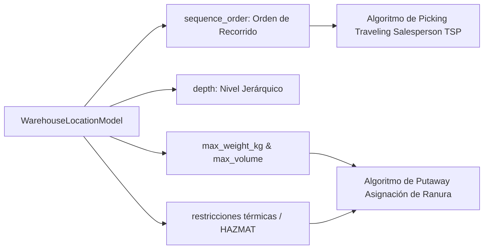

# 21. Integración Futura — Fase 044: Algoritmos de Putaway y Picking Optimizado

## Algoritmos Logísticos Intelligentes

La **Fase 044** implementará los motores de optimización de rutas de recolección (*Picking Path Optimization*) y asignación inteligente de espacio en recepción (*Smart Putaway Strategies*). La Fase 022 provee las estructuras métricas y topológicas de soporte requeridas por dichos algoritmos.

---

## Atributos de Soporte Creados en la Fase 022



---

## 1. Algoritmo de Picking Optimizado (Secuencia S-Shape / Snake)

El campo `sequence_order` (entero configurable en `warehouse_locations`) permite definir el orden exacto en el que un operador humano o un robot transelevador debe visitar las ubicaciones para minimizar la distancia total recorrida.

### Ordenación de Ruta en Consulta SQL
```sql
SELECT loc.id, loc.full_code, loc.sequence_order
FROM warehouse_locations loc
WHERE loc.id IN (:picking_target_location_ids)
ORDER BY loc.sequence_order ASC;
```

---

## 2. Estrategia de Putaway (Asignación Directa de Ranura)

Cuando un lote de mercadería ingresa al almacén, el motor de la Fase 044 evaluará las ubicaciones disponibles filtrando según la información provista por la Fase 022:

```python
def find_best_putaway_location(db: Session, warehouse_id: str, product: dict) -> Optional[Location]:
    """
    Busca la ubicación óptima aplicando filtros de la Fase 022:
    1. status == 'ACTIVE' y is_receivable == True
    2. Cumple restricciones ambientales (ej. COLD_CHAIN)
    3. Peso y Volumen no exceden el max_weight_kg y max_volume
    4. Menor depth o menor sequence_order para optimizar recorrido
    """
    # Consulta filtrada por indices de la Fase 022
    pass
```
