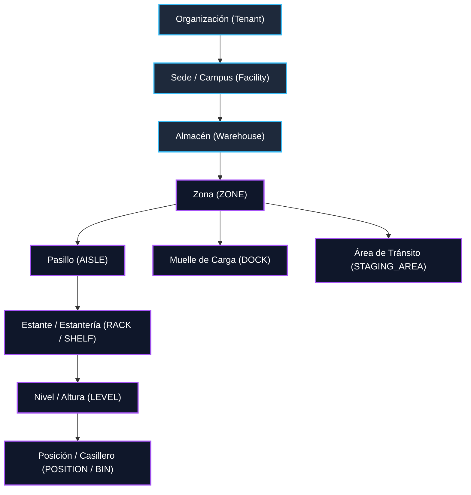
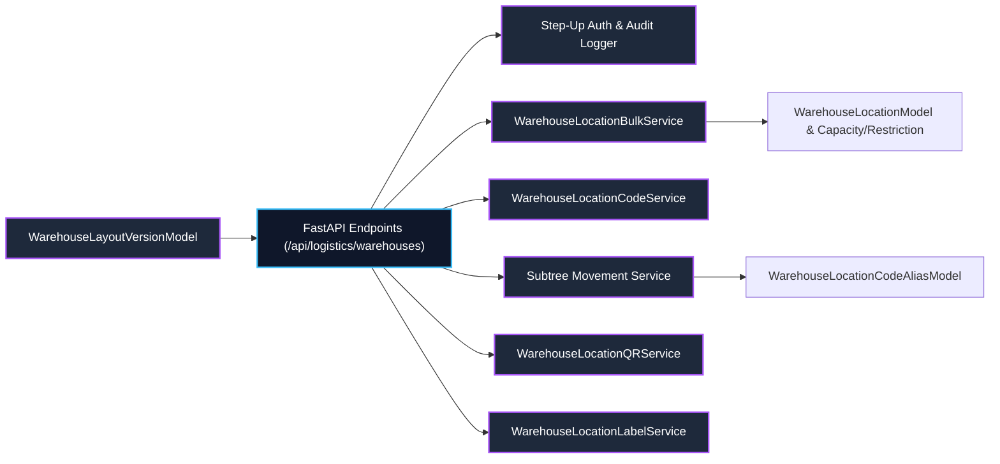

# Fase 022: Modelar Almacenes y Ubicaciones (Backend)

## Resumen Ejecutivo

La **Fase 022** implementa el sistema central de modelado jerárquico de almacenes y espacios físicos de almacenamiento dentro del ecosistema logístico de la plataforma. Establece una arquitectura modular, extensible y de alto rendimiento que extiende la entidad preexistente `Warehouse` sin romper retrocompatibilidad ni generar duplicaciones redundantes, e introduce una jerarquía canónica estricta de ubicaciones físicas y lógicas.

El motor de ubicación permite estructurar el espacio físico desde el nivel institucional hasta la posición individual en estante, incorporando validaciones de integridad referencial multi-tenant, reglas de jerarquía de padres permitidos, normalización determinística de códigos, generación masiva transaccional idempotente, configuración de capacidades físicas, restricciones ambientales/normativas, movimiento de subárboles con preservación de alias históricos, layouts gráficos 2D para renderizado en frontend (React), y servicios seguros de identificación mediante QR opacos y etiquetas PDF vectoriales.

---

## Jerarquía Canónica de Ubicaciones

La estructura organizacional y de almacenamiento sigue una jerarquía estricta de 8 niveles, donde cada nivel impone reglas de validación topológica sobre sus nodos descendientes:

### Tabla de Niveles Jerárquicos y Tipos de Ubicación

| Nivel Jerárquico | Tipo (`location_type`) | Nodos Padres Permitidos | Descripción / Propósito |
| :--- | :--- | :--- | :--- |
| **0 (Raíz)** | `ZONE`, `DOCK`, `STAGING_AREA` | `None` (Directo al Almacén) | Áreas principales del almacén (Ej: Almacenamiento General, Frío, Recepción). |
| **1** | `AISLE`, `SUB_ZONE` | `ZONE` | Pasillos de circulación o sub-zonas especializadas. |
| **2** | `RACK`, `SHELF`, `BULK_AREA` | `ZONE`, `AISLE` | Estanterías físicas, racks paletizados o áreas a piso. |
| **3** | `LEVEL` | `RACK`, `SHELF` | Niveles verticales o pisos de un rack de almacenamiento. |
| **4** | `POSITION`, `BIN`, `DRAWER` | `LEVEL`, `RACK`, `SHELF` | Celda o posición individual asignable a inventario. |

---

## Componentes Arquitectónicos Principales

---

## Logros de la Fase 022

1. **Extensión Transparente de Almacenes:** Evolución mediante migración DDL Alembic de la tabla `warehouses` agregando soporte de código único por organización, geolocalización, capacidades globales y estado operativo sin alterar entidades v1.
2. **Modelo de Jerarquía Recurrente Optimizada (`hierarchy_path`):** Búsqueda eficiente de subárboles completos mediante expresiones regulares e índices B-Tree sobre rutas `/root_id/child_id/subchild_id`.
3. **Matriz Estricta de Políticas Parentales (`WarehouseLocationHierarchyPolicy`):** Impide topologías inválidas (ej. un nivel dentro de una posición o ciclos jerárquicos) con límite de profundidad de 10 niveles.
4. **Generador Masivo Combinatorio Idempotente:** Creación transaccional de hasta 1,000 ubicaciones por lote con cálculo combinatorio pre-ejecución, hashing SHA-256 de payload y registro de idempotencia (`IdempotencyRecordModel`).
5. **Movimiento Seguro de Subárboles & Trazabilidad de Alias:** Recalculación en cascada de `hierarchy_path` y `full_code` con conservación del historial de códigos previos en `WarehouseLocationCodeAliasModel`.
6. **Lienzo de Layout 2D para Frontend:** Versionado de mapas lógicos 2D (`WarehouseLayoutVersionModel` y `WarehouseLayoutNodeModel`) exportables en JSON para renderización interactiva en React.
7. **Identificación Física Avanzada:** Tokenización de referencias QR opacas firmadas (`t1loc:v1:...`) y generación de etiquetas PDF multi-formato utilizando ReportLab.
8. **Seguridad y Auditoría Total:** Integración con Step-Up Authentication para operaciones críticas (eliminación, movimientos masivos, activaciones de layout) y registro de 17 eventos de auditoría inmutables en `logistics_audit_events`.
