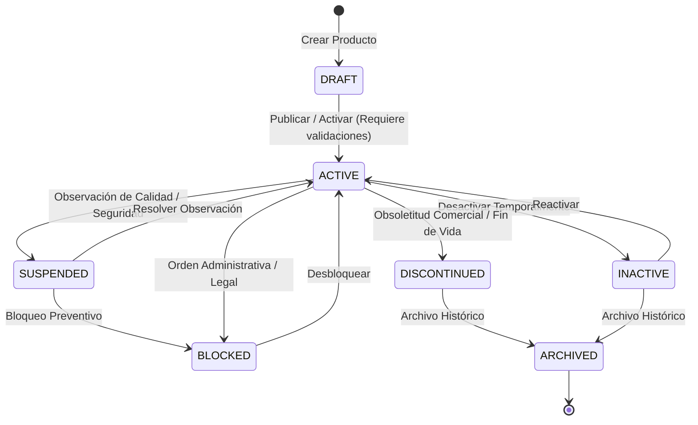

# 02 — Especificación Detallada del Modelo Principal `ProductModel`

## 1. Definición de la Entidad Principal

El modelo `ProductModel` es la entidad raíz del agregador de productos en el esquema relacional (`products`). Representa la definición lógica del artículo o producto gestionado por una organización.

---

## 2. Esquema de la Tabla `products`

```sql
CREATE TYPE product_type_enum AS ENUM (
    'RAW_MATERIAL',       -- Materia Prima
    'WORK_IN_PROGRESS',   -- Producto en Proceso
    'FINISHED_GOOD',      -- Producto Terminado
    'MERCHANDISE',        -- Mercadería / Reventa
    'SUPPLY',             -- Insumo / Suministro Operativo
    'PACKAGING',          -- Empaque / Embalaje
    'SERVICE',            -- Servicio Intangible
    'ASSET'               -- Activo Fijo
);

CREATE TYPE product_status_enum AS ENUM (
    'DRAFT',         -- Borrador en creación / incompleto
    'ACTIVE',        -- Activo y disponible para operaciones
    'INACTIVE',      -- Temporalmente inactivo
    'SUSPENDED',     -- Suspendido por calidad / auditoría
    'DISCONTINUED',  -- Descontinuado por comercial / fabricante
    'BLOCKED',       -- Bloqueado por seguridad o decisión legal
    'ARCHIVED'       -- Archivado histórico (Lectura previa)
);

CREATE TABLE products (
    id UUID PRIMARY KEY DEFAULT gen_random_uuid(),
    organization_id UUID NOT NULL REFERENCES organizations(id) ON DELETE CASCADE,
    category_id UUID NOT NULL REFERENCES product_categories(id) ON DELETE RESTRICT,
    brand_id UUID NULL REFERENCES product_brands(id) ON DELETE SET NULL,
    
    sku VARCHAR(50) NOT NULL,
    normalized_sku VARCHAR(50) NOT NULL,
    name VARCHAR(255) NOT NULL,
    description TEXT NULL,
    
    product_type product_type_enum NOT NULL DEFAULT 'FINISHED_GOOD',
    status product_status_enum NOT NULL DEFAULT 'DRAFT',
    
    base_unit_code VARCHAR(20) NOT NULL DEFAULT 'UND', -- Marca PENDING_PHASE_024
    
    is_hazmat BOOLEAN NOT NULL DEFAULT FALSE,
    requires_cold_chain BOOLEAN NOT NULL DEFAULT FALSE,
    is_fragile BOOLEAN NOT NULL DEFAULT FALSE,
    
    row_version BIGINT NOT NULL DEFAULT 1,
    
    created_at TIMESTAMP WITH TIME ZONE NOT NULL DEFAULT CURRENT_TIMESTAMP,
    updated_at TIMESTAMP WITH TIME ZONE NOT NULL DEFAULT CURRENT_TIMESTAMP,
    created_by UUID NULL,
    updated_by UUID NULL,

    CONSTRAINT uq_products_org_sku UNIQUE (organization_id, sku),
    CONSTRAINT uq_products_org_normalized_sku UNIQUE (organization_id, normalized_sku)
);

CREATE INDEX idx_products_org_status ON products(organization_id, status);
CREATE INDEX idx_products_category ON products(category_id);
CREATE INDEX idx_products_brand ON products(brand_id);
CREATE INDEX idx_products_normalized_sku ON products(organization_id, normalized_sku);
```

---

## 3. Implementación ORM SQLAlchemy (`ProductModel`)

```python
import enum
from sqlalchemy import (
    Column, String, Text, Boolean, BigInteger, Enum as SQLEnum,
    ForeignKey, UniqueConstraint, Index, DateTime, func
)
from sqlalchemy.dialects.postgresql import UUID
from sqlalchemy.orm import relationship
import uuid

from app.db.base_class import Base

class ProductType(str, enum.Enum):
    RAW_MATERIAL = "RAW_MATERIAL"
    WORK_IN_PROGRESS = "WORK_IN_PROGRESS"
    FINISHED_GOOD = "FINISHED_GOOD"
    MERCHANDISE = "MERCHANDISE"
    SUPPLY = "SUPPLY"
    PACKAGING = "PACKAGING"
    SERVICE = "SERVICE"
    ASSET = "ASSET"

class ProductStatus(str, enum.Enum):
    DRAFT = "DRAFT"
    ACTIVE = "ACTIVE"
    INACTIVE = "INACTIVE"
    SUSPENDED = "SUSPENDED"
    DISCONTINUED = "DISCONTINUED"
    BLOCKED = "BLOCKED"
    ARCHIVED = "ARCHIVED"

class ProductModel(Base):
    __tablename__ = "products"

    id = Column(UUID(as_uuid=True), primary_key=True, default=uuid.uuid4)
    organization_id = Column(UUID(as_uuid=True), ForeignKey("organizations.id", ondelete="CASCADE"), nullable=False)
    category_id = Column(UUID(as_uuid=True), ForeignKey("product_categories.id", ondelete="RESTRICT"), nullable=False)
    brand_id = Column(UUID(as_uuid=True), ForeignKey("product_brands.id", ondelete="SET NULL"), nullable=True)

    sku = Column(String(50), nullable=False)
    normalized_sku = Column(String(50), nullable=False)
    name = Column(String(255), nullable=False)
    description = Column(Text, nullable=True)

    product_type = Column(SQLEnum(ProductType), nullable=False, default=ProductType.FINISHED_GOOD)
    status = Column(SQLEnum(ProductStatus), nullable=False, default=ProductStatus.DRAFT)

    base_unit_code = Column(String(20), nullable=False, default="UND") # PENDING_PHASE_024

    is_hazmat = Column(Boolean, nullable=False, default=False)
    requires_cold_chain = Column(Boolean, nullable=False, default=False)
    is_fragile = Column(Boolean, nullable=False, default=False)

    row_version = Column(BigInteger, nullable=False, default=1)

    created_at = Column(DateTime(timezone=True), server_default=func.now(), nullable=False)
    updated_at = Column(DateTime(timezone=True), server_default=func.now(), onupdate=func.now(), nullable=False)
    created_by = Column(UUID(as_uuid=True), nullable=True)
    updated_by = Column(UUID(as_uuid=True), nullable=True)

    # Relationships
    category = relationship("ProductCategoryModel", back_populates="products")
    brand = relationship("ProductBrandModel", back_populates="products")
    sku_aliases = relationship("ProductSKUAliasModel", back_populates="product", cascade="all, delete-orphan")
    versions = relationship("ProductVersionModel", back_populates="product", cascade="all, delete-orphan")
    identifiers = relationship("ProductIdentifierModel", back_populates="product", cascade="all, delete-orphan")
    physical_profile = relationship("ProductPhysicalProfileModel", uselist=False, back_populates="product", cascade="all, delete-orphan")
    tracking_policy = relationship("ProductTrackingPolicyModel", uselist=False, back_populates="product", cascade="all, delete-orphan")
    storage_condition = relationship("ProductStorageConditionModel", uselist=False, back_populates="product", cascade="all, delete-orphan")
    handling_condition = relationship("ProductHandlingConditionModel", uselist=False, back_populates="product", cascade="all, delete-orphan")

    __table_args__ = (
        UniqueConstraint("organization_id", "sku", name="uq_products_org_sku"),
        UniqueConstraint("organization_id", "normalized_sku", name="uq_products_org_normalized_sku"),
        Index("idx_products_org_status", "organization_id", "status"),
        Index("idx_products_category", "category_id"),
        Index("idx_products_brand", "brand_id"),
        Index("idx_products_normalized_sku", "organization_id", "normalized_sku"),
    )
```

---

## 4. Máquina de Estados del Ciclo de Vida del Producto

El atributo `status` se rige por transiciones explícitas de estado:



### Reglas de Transición:
1. **DRAFT -> ACTIVE:** Requiere que el producto tenga categoría asignada, `base_unit_code` válido, perfil físico registrado y políticas de lote/serie definidas.
2. **ACTIVE -> SUSPENDED/BLOCKED:** Deshabilita inmediatamente la creación de nuevas órdenes de compra y tareas de salida en el almacén.
3. **ARCHIVED:** Estado terminal inmutable. No permite modificación de ningún campo salvo por rol super-admin con Step-Up Authentication.

---

## 5. Control de Concurrencia Optimista (`row_version`)

Para prevenir la sobrescritura silenciosa (*Lost Updates*) en ediciones simultáneas, cada actualización incrementa `row_version`:

```python
def update_product(db_session, product_id: uuid.UUID, expected_version: int, update_data: dict):
    stmt = (
        update(ProductModel)
        .where(ProductModel.id == product_id)
        .where(ProductModel.row_version == expected_version)
        .values(
            **update_data,
            row_version=ProductModel.row_version + 1
        )
    )
    result = db_session.execute(stmt)
    if result.rowcount == 0:
        raise StaleObjectError("El producto ha sido modificado por otro usuario. Por favor recargue la página.")
```
