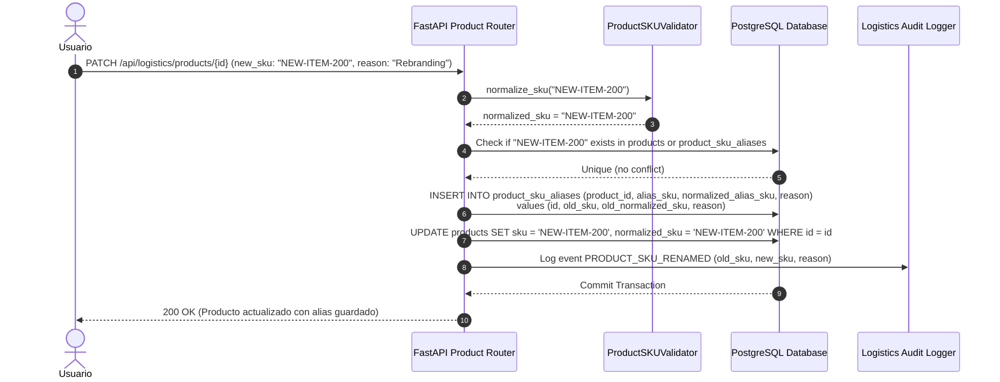

# 03 — Normalización de SKU y Gestión de Alias Históricos

## 1. Algoritmo de Normalización de SKU (`ProductSKUValidator`)

El **Stock Keeping Unit (SKU)** es el identificador alfanumérico primario utilizado por las organizaciones para identificar de forma única un ítem comercial/logístico. Debido a que los usuarios o sistemas ERP integrados pueden ingresar SKUs con espacios sobrantes, guiones, tildes o caracteres invisibles de control, la plataforma implementa una capa estricta de normalización determinística en el servicio `ProductSKUValidator`.

### Fases del Algoritmo de Normalización:
1. **Eliminación de Caracteres de Control e Invisibles:** Filtrado de espacios de no separación (`\u00A0`), retornos de carro (`\r`), saltos de línea (`\n`) y tabuladores (`\t`).
2. **Descarte de Tildes y Marcas Diacríticas (Unicode NFD):** Transformación de caracteres acentuados (ej. `Á`, `ñ`, `ü`) a sus equivalentes ASCII limpios (`A`, `n`, `u`).
3. **Conversión a Mayúsculas:** Transformación completa a `UPPERCASE`.
4. **Sustitución de Espacios:** Conversión de secuencias de espacios múltiples a un único guion `-` o eliminación de espacios según la regla organizacional.
5. **Sanitización de Caracteres Permitidos:** Limpieza mediante expresión regular permitiendo únicamente caracteres alfanuméricos ASCII `[A-Z0-9_-]`.
6. **Validación de Longitud:** Verificación estricta de longitud entre **2 y 50 caracteres**.

```python
import re
import unicodedata

class ProductSKUValidationError(ValueError):
    pass

class ProductSKUValidator:
    MIN_LENGTH = 2
    MAX_LENGTH = 50
    PATTERN = re.compile(r"^[A-Z0-9_-]+$")

    @classmethod
    def normalize_sku(cls, raw_sku: str) -> str:
        if not raw_sku or not isinstance(raw_sku, str):
            raise ProductSKUValidationError("El SKU no puede ser nulo ni vacío.")
        
        # 1. Trimear espacios extremos
        clean = raw_sku.strip()
        
        # 2. Descomponer Unicode NFD para remover tildes/diacríticos
        nfd_form = unicodedata.normalize('NFD', clean)
        only_ascii = "".join([c for c in nfd_form if unicodedata.category(c) != 'Mn'])
        
        # 3. Sustituir eñes (NFD la separa en N + ~)
        only_ascii = only_ascii.replace('ñ', 'N').replace('Ñ', 'N')
        
        # 4. Convertir a Mayúsculas
        upper_sku = only_ascii.upper()
        
        # 5. Reemplazar espacios por guiones
        normalized = re.sub(r"\s+", "-", upper_sku)
        
        # 6. Remover caracteres no permitidos (solo alfanuméricos, guion y guion bajo)
        normalized = re.sub(r"[^A-Z0-9_-]", "", normalized)
        
        # 7. Validar longitud
        if len(normalized) < cls.MIN_LENGTH or len(normalized) > cls.MAX_LENGTH:
            raise ProductSKUValidationError(
                f"El SKU normalizado '{normalized}' debe tener entre {cls.MIN_LENGTH} y {cls.MAX_LENGTH} caracteres."
            )
            
        if not cls.PATTERN.match(normalized):
            raise ProductSKUValidationError(f"El SKU '{normalized}' contiene caracteres inválidos.")

        return normalized
```

---

## 2. Histórico de Alias de SKU (`ProductSKUAliasModel`)

Cuando una organización reestructura su catálogo o migra de un sistema ERP heredado, un SKU puede ser renombrado (ej. de `SKU-OLD-100` a `PROD-NEW-100`). Para evitar que etiquetas físicas impresas previamente o búsquedas de usuarios fallen, el sistema almacena el código anterior en la tabla `product_sku_aliases`.

### Esquema Relacional de `product_sku_aliases`

```sql
CREATE TABLE product_sku_aliases (
    id UUID PRIMARY KEY DEFAULT gen_random_uuid(),
    organization_id UUID NOT NULL REFERENCES organizations(id) ON DELETE CASCADE,
    product_id UUID NOT NULL REFERENCES products(id) ON DELETE CASCADE,
    
    alias_sku VARCHAR(50) NOT NULL,
    normalized_alias_sku VARCHAR(50) NOT NULL,
    reason VARCHAR(255) NULL, -- Ej: "Migración ERP 2026", "Reestructuración Categórica"
    
    created_at TIMESTAMP WITH TIME ZONE NOT NULL DEFAULT CURRENT_TIMESTAMP,
    created_by UUID NULL,

    CONSTRAINT uq_sku_aliases_org_normalized UNIQUE (organization_id, normalized_alias_sku)
);

CREATE INDEX idx_sku_aliases_product ON product_sku_aliases(product_id);
CREATE INDEX idx_sku_aliases_lookup ON product_sku_aliases(organization_id, normalized_alias_sku);
```

---

## 3. Modelo SQLAlchemy (`ProductSKUAliasModel`)

```python
from sqlalchemy import Column, String, ForeignKey, UniqueConstraint, Index, DateTime, func
from sqlalchemy.dialects.postgresql import UUID
from sqlalchemy.orm import relationship
import uuid
from app.db.base_class import Base

class ProductSKUAliasModel(Base):
    __tablename__ = "product_sku_aliases"

    id = Column(UUID(as_uuid=True), primary_key=True, default=uuid.uuid4)
    organization_id = Column(UUID(as_uuid=True), ForeignKey("organizations.id", ondelete="CASCADE"), nullable=False)
    product_id = Column(UUID(as_uuid=True), ForeignKey("products.id", ondelete="CASCADE"), nullable=False)

    alias_sku = Column(String(50), nullable=False)
    normalized_alias_sku = Column(String(50), nullable=False)
    reason = Column(String(255), nullable=True)

    created_at = Column(DateTime(timezone=True), server_default=func.now(), nullable=False)
    created_by = Column(UUID(as_uuid=True), nullable=True)

    product = relationship("ProductModel", back_populates="sku_aliases")

    __table_args__ = (
        UniqueConstraint("organization_id", "normalized_alias_sku", name="uq_sku_aliases_org_normalized"),
        Index("idx_sku_aliases_product", "product_id"),
        Index("idx_sku_aliases_lookup", "organization_id", "normalized_alias_sku"),
    )
```

---

## 4. Flujo de Trabajo al Cambiar un SKU



### Reglas de Integridad de Alias:
1. **Unicidad de Alias:** Un alias no puede ser registrado si coincide con un SKU activo o con otro alias previamente registrado dentro de la misma organización.
2. **Búsqueda Transparente:** La resolución de búsqueda de producto (`FindProductByCode`) consulta primero `products.normalized_sku` y, de no encontrar coincidencia, consulta `product_sku_aliases.normalized_alias_sku`.
