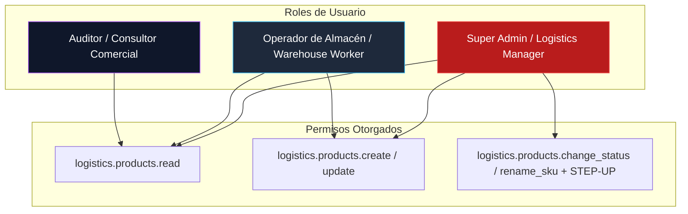

# 17 — Matriz de Permisos RBAC y Step-Up Authentication

## 1. Esquema de Seguridad y Control de Acceso (RBAC)

El módulo de Catálogo de Productos implementa un control de acceso basado en roles granular (RBAC). Cada petición enviada a las APIs bajo `/api/logistics/` es evaluada por la capa middleware de autenticación y autorización (`SecurityContext`).

---

## 2. Catálogo Estándar de Permisos (`logistics.*`)

| Código de Permiso RBAC | Operación Autorizada | Nivel de Riesgo | Requiere Step-Up |
| :--- | :--- | :--- | :--- |
| `logistics.products.read` | Consultar catálogo, buscar y ver detalles de productos. | Bajo | No |
| `logistics.products.create` | Crear nuevos productos en estado `DRAFT` o `ACTIVE`. | Medio | No |
| `logistics.products.update` | Modificar datos principales, dimensiones o perfiles físicos. | Medio | No |
| `logistics.products.change_status` | Cambiar estado del ciclo de vida (`ACTIVE`, `SUSPENDED`, `BLOCKED`). | **Alto** | **Sí** |
| `logistics.products.rename_sku` | Renombrar SKU activo de un producto y generar alias. | **Alto** | **Sí** |
| `logistics.products.delete` | Archivar o eliminar lógicamente un producto (`ARCHIVED`). | **Crítico** | **Sí** |
| `logistics.product_categories.read` | Consultar lista y árbol jerárquico de categorías. | Bajo | No |
| `logistics.product_categories.manage` | Crear, editar o desactivar categorías del catálogo. | Medio | No |
| `logistics.product_brands.read` | Consultar marcas comerciales. | Bajo | No |
| `logistics.product_brands.manage` | Crear o editar marcas comerciales. | Medio | No |
| `logistics.product_identifiers.manage` | Asignar o remover identificadores barcode (EAN/UPC/Internos). | Medio | No |
| `logistics.override_storage_warning` | Forzar ubicación en alertas cualitativas `WARNING_ONLY`. | Alto | **Sí** |

---

## 3. Mecanismo de Step-Up Authentication

Para operaciones marcadas como de **Alto Riesgo** o **Críticas** (cambio de estado a bloqueado/descontinuado, renombre de SKU y archivado de productos), la plataforma exige **Step-Up Authentication**. 

El cliente debe presentar en la cabecera HTTP un token MFA reciente (segunda autenticación vía TOTP/Passkey expedida en los últimos 5 minutos):

`X-Step-Up-Token: stepup_sec_token_9988776655`

```python
from fastapi import Header, HTTPException, status
from app.core.security import verify_step_up_token

def require_step_up_authentication(
    x_step_up_token: str = Header(..., alias="X-Step-Up-Token"),
    current_user = Depends(get_current_user)
):
    """
    Middleware / Dependencia de FastAPI para exigir autenticación de segundo factor (Step-Up).
    """
    if not x_step_up_token:
        raise HTTPException(
            status_code=status.HTTP_403_FORBIDDEN,
            detail="Esta operación requiere Step-Up Authentication (MFA). Cabecera X-Step-Up-Token no encontrada."
        )

    is_valid = verify_step_up_token(current_user.id, x_step_up_token)
    if not is_valid:
        raise HTTPException(
            status_code=status.HTTP_401_UNAUTHORIZED,
            detail="Token Step-Up inválido o expirado. Por favor re-autentíquese con su segundo factor (MFA)."
        )
```

---

## 4. Matriz de Asignación de Permisos por Rol



---

## 5. Respuestas de Error de Seguridad

1. **401 Unauthorized:** Token JWT principal ausente, inválido o expirado.
2. **403 Forbidden (RBAC):** El usuario posee un token válido pero carece del permiso RBAC requerido (ej. falta `logistics.products.rename_sku`).
3. **403 Forbidden (Step-Up Required):** El usuario posee el permiso RBAC pero no adjuntó la cabecera `X-Step-Up-Token` requerida para la acción crítica.
