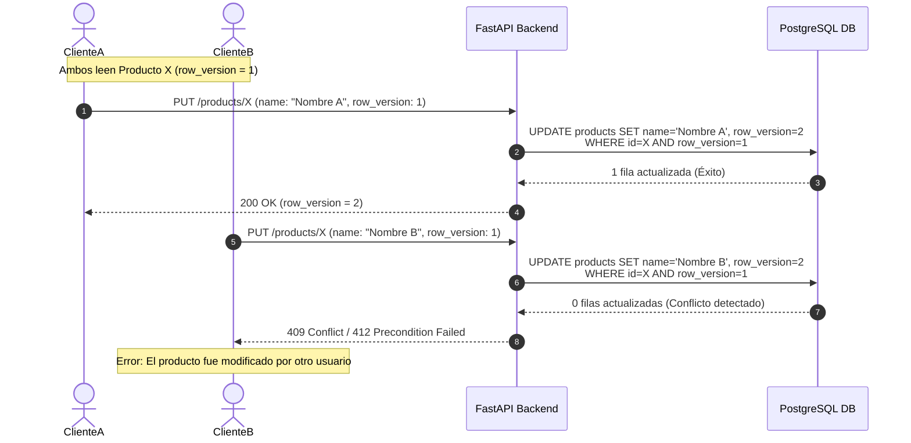

# 19 — Control de Concurrencia, Idempotencia y Locks Transaccionales

## 1. Concurrencia Optimista vs Pesimista

En un entorno multi-usuario con integraciones automáticas desde sistemas ERP y terminales de almacén, es común que dos procesos intenten actualizar el mismo producto de forma simultánea. La **Fase 023** aborda la concurrencia mediante dos estrategias complementarias:

1. **Bloqueo Optimista (Optimistic Locking):** Utilizado en peticiones REST estándar mediante el campo `row_version`.
2. **Bloqueo Pesimista (Pessimistic Locking `SELECT ... FOR UPDATE`):** Utilizado en operaciones críticas como cambios de categoría jerárquica o renombre de SKU.

---

## 2. Implementación de Bloqueo Optimista (`row_version`)

Cada entidad `ProductModel` inicia en `row_version = 1`. Cualquier operación `PUT` o `PATCH` debe enviar el campo `row_version` esperado en el payload de la solicitud.



---

## 3. Bloqueo Pesimista (`FOR UPDATE`) en Renombre de SKU

Al ejecutar un cambio de SKU o reestructuración jerárquica de categorías, se bloquea la fila mediante `with_for_update()` para evitar interbloqueos (*deadlocks*):

```python
def safe_rename_sku(db_session, product_id: uuid.UUID, new_sku: str, reason: str, user_id: str):
    # 1. Adquirir lock pesimista sobre la fila del producto
    product = (
        db_session.query(ProductModel)
        .filter(ProductModel.id == product_id)
        .with_for_update()
        .first()
    )
    if not product:
        raise NotFoundError("Producto no encontrado.")

    normalized_new_sku = ProductSKUValidator.normalize_sku(new_sku)

    # 2. Verificar que el nuevo SKU no exista (evitar condición de carrera)
    existing = (
        db_session.query(ProductModel)
        .filter(
            ProductModel.organization_id == product.organization_id,
            ProductModel.normalized_sku == normalized_new_sku
        )
        .first()
    )
    if existing and existing.id != product.id:
        raise DuplicateSKUError(f"El SKU '{normalized_new_sku}' ya está registrado en otro producto.")

    # 3. Registrar Alias del SKU anterior
    alias = ProductSKUAliasModel(
        organization_id=product.organization_id,
        product_id=product.id,
        alias_sku=product.sku,
        normalized_alias_sku=product.normalized_sku,
        reason=reason,
        created_by=user_id
    )
    db_session.add(alias)

    # 4. Actualizar el SKU del producto e incrementar la versión
    product.sku = new_sku
    product.normalized_sku = normalized_new_sku
    product.row_version += 1

    db_session.commit()
    return product
```

---

## 4. Idempotencia en Integraciones REST (`Idempotency-Key`)

Para llamadas de creación de productos (`POST /api/logistics/products`) o inserción masiva enviadas por sistemas externos que puedan sufrir reintentos de red, el middleware procesa la cabecera `Idempotency-Key`:

```python
import hashlib
from app.db.base_class import Base

class IdempotencyRecordModel(Base):
    __tablename__ = "idempotency_records"
    
    idempotency_key = Column(String(255), primary_key=True)
    organization_id = Column(UUID(as_uuid=True), nullable=False)
    request_hash = Column(String(64), nullable=False)
    response_code = Column(Integer, nullable=False)
    response_body = Column(JSONB, nullable=False)
    created_at = Column(DateTime(timezone=True), server_default=func.now())
```

### Algoritmo de Idempotencia:
1. El cliente envía `Idempotency-Key: 550e8400-e29b-41d4-a716-446655440000`.
2. El servidor calcula el digest SHA-256 del cuerpo de la petición.
3. Si la clave ya existe en `idempotency_records` para esa organización:
   - Si el hash coincide, retorna la respuesta previa almacenada inmediatamente (`HTTP 200/201`) sin re-ejecutar lógica de negocio.
   - Si el hash difiere, retorna `HTTP 422 Unprocessable Entity` por reutilización de clave con diferente payload.
