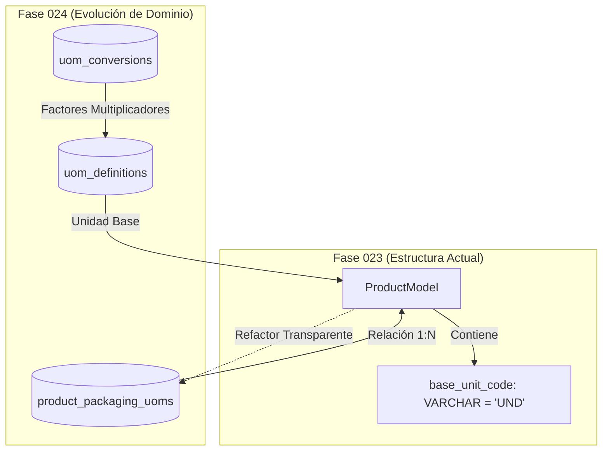

# 23 — Contrato de Integración con la Fase 024 (Maestro de Unidades UOM)

## 1. Alcance de la Integración

La **Fase 023** establece el campo `base_unit_code` soportado por una lista provisional controlada de 11 unidades (`UND`, `KG`, `G`, `L`, `ML`, `M`, `CM`, `M2`, `M3`, `CAJA`, `PAQUETE`), marcada con la etiqueta **`PENDING_PHASE_024`**.

La **Fase 024 (Maestro de Unidades y Conversiones UOM)** extenderá esta funcionalidad introduciendo el maestro completo de unidades de medida (norma ISO 80000 / SUNAT Anexo 6) y la matriz de conversiones dimensionales de empaque.

---

## 2. Puntos de Extensión de la Fase 024 sobre la Fase 023



---

## 3. Especificación de Tablas Futuras (Fase 024)

### 3.1 `product_packaging_uoms` (Empaques y Conversiones por Producto)
Permitirá definir múltiples unidades de empaque por cada producto en la Fase 024:

```sql
-- [CÓDIGO DE DISEÑO PARA LA FASE 024]
CREATE TABLE product_packaging_uoms (
    id UUID PRIMARY KEY DEFAULT gen_random_uuid(),
    organization_id UUID NOT NULL REFERENCES organizations(id) ON DELETE CASCADE,
    product_id UUID NOT NULL REFERENCES products(id) ON DELETE CASCADE,
    
    uom_code VARCHAR(20) NOT NULL, -- Ej: "CAJA_12", "PALLET"
    conversion_factor NUMERIC(14, 4) NOT NULL, -- Ej: 12.0000 (1 CAJA = 12 UND)
    
    gtin_barcode VARCHAR(100) NULL, -- Código GTIN-14 asociado al empaque máster
    is_purchasing_unit BOOLEAN NOT NULL DEFAULT FALSE,
    is_sales_unit BOOLEAN NOT NULL DEFAULT FALSE,
    
    CONSTRAINT uq_product_packaging_uom UNIQUE (product_id, uom_code)
);
```

---

## 4. Estrategia de Migración DDL para la Fase 024

1. **Preservación de Datos:** Ningún producto existente en la Fase 023 perderá su código `base_unit_code`.
2. **Migración Directa:** El valor de `base_unit_code` se vinculará con la clave primaria de la tabla `uom_definitions` creada en la Fase 024:
   ```sql
   ALTER TABLE products
       ADD COLUMN base_unit_id UUID NULL REFERENCES uom_definitions(id);

   UPDATE products p
   SET base_unit_id = u.id
   FROM uom_definitions u
   WHERE p.base_unit_code = u.code;

   ALTER TABLE products
       ALTER COLUMN base_unit_id SET NOT NULL;
   ```

---

## 5. Garantía de Retrocompatibilidad

El API de la Fase 023 continuará exponiendo el campo computado `base_unit_code` en los esquemas JSON de respuesta REST (`ProductDetailSchema`) resolviendo automáticamente `product.base_unit.code` para evitar romper clientes frontend creados en fases previas.
