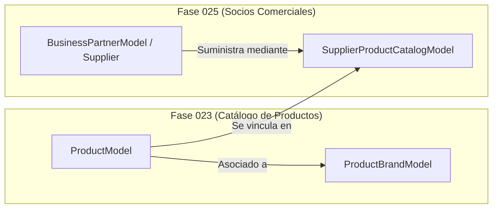

# 24 — Contrato de Integración con la Fase 025 (Socios Comerciales y Proveedores)

## 1. Alcance de la Integración

La **Fase 023** desacopla deliberadamente la identidad de las marcas comerciales (`ProductBrandModel`) de las entidades legales de los proveedores y fabricantes (*Business Partners*).

La **Fase 025 (Socios Comerciales, Clientes y Proveedores)** creará el catálogo de entidades de negocio y su vinculación comercial con los productos del catálogo mediante acuerdos de suministro, códigos SKU de proveedor y precios de lista.

---

## 2. Diagrama de Relación entre Dominio de Producto (023) y Proveedores (025)



---

## 3. Especificación del Modelo Intermedio (Fase 025)

### `supplier_product_catalogs` (Catálogo Proveedor-Producto)

```sql
-- [CÓDIGO DE DISEÑO PARA LA FASE 025]
CREATE TABLE supplier_product_catalogs (
    id UUID PRIMARY KEY DEFAULT gen_random_uuid(),
    organization_id UUID NOT NULL REFERENCES organizations(id) ON DELETE CASCADE,
    supplier_id UUID NOT NULL REFERENCES business_partners(id) ON DELETE CASCADE,
    product_id UUID NOT NULL REFERENCES products(id) ON DELETE CASCADE,
    
    supplier_sku VARCHAR(50) NOT NULL, -- Código de producto según el catálogo del proveedor
    lead_time_days INTEGER NOT NULL DEFAULT 1, -- Tiempo de entrega prometido (días)
    minimum_order_quantity NUMERIC(14, 4) NOT NULL DEFAULT 1.0000, -- Cantidad mínima de pedido (MOQ)
    
    is_preferred_supplier BOOLEAN NOT NULL DEFAULT FALSE,
    is_active BOOLEAN NOT NULL DEFAULT TRUE,
    
    CONSTRAINT uq_supplier_product UNIQUE (supplier_id, product_id)
);

CREATE INDEX idx_supplier_product_lookup ON supplier_product_catalogs(organization_id, supplier_id, supplier_sku);
```

---

## 4. Flujo de Trabajo en Procesos de Compra (Procurement)

1. **Búsqueda por SKU Proveedor:** Cuando ingresa una Factura o Guía de Remisión electrónica del proveedor con el código `SUPP-PART-99`, el motor de la Fase 025 consulta `supplier_product_catalogs` y resuelve instantáneamente el `product_id` interno del catálogo de la Fase 023.
2. **Validación de Lead Time:** Al generar órdenes de compra automatizadas en la Fase 031 (*Procurement*), el sistema utiliza el `lead_time_days` y la vida útil de recepción (`minimum_shelf_life_days` de la Fase 023) para calcular la fecha requerida de entrega.

---

## 5. Garantía de Aislamiento

El modelo de producto de la Fase 023 **no almacena ni requiere** campos como `supplier_id`, `vendor_code` ni costos de adquisición. Esto garantiza que la eliminación o suspensión de un proveedor en la Fase 025 no afecte la integridad del catálogo de productos del almacén.
