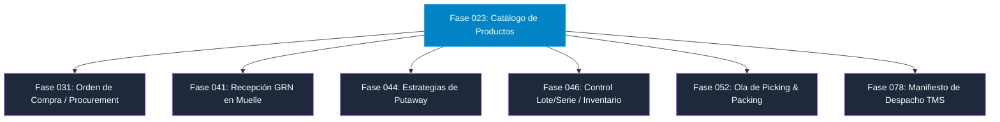

# 25 — Contrato de Integración con Fases Futuras (Fases 031 a 078)

## 1. Mapa General de Dependencias Logísticas Downstream

El **Catálogo de Productos (Fase 023)** sirve como la fuente primaria de verdad (*Master Data Source*) para la totalidad de los módulos operativos de la plataforma WMS/TMS. Las fases posteriores consumen el catálogo mediante contratos de integración bien definidos.

---

## 2. Contrato de Integración por Módulo Operativo

### 2.1 Fase 031 — Gestión de Órdenes de Compra (*Procurement*)
- **Datos Consumidos de Fase 023:** `product_id`, `sku`, `base_unit_code`, `status`.
- **Regla de Validación:** Una orden de compra solo puede incluir líneas de productos en estado `ACTIVE`. Si el producto está en `DRAFT`, `SUSPENDED` o `BLOCKED`, el servicio de órdenes de compra arrojará `400 Bad Request`.

---

### 2.2 Fase 041 — Recepción de Mercadería (*Goods Receipt Note - GRN*)
- **Datos Consumidos de Fase 023:** `product_identifiers` (EAN/UPC), `ProductTrackingPolicyModel` (`expiration_control`, `minimum_shelf_life_days`).
- **Regla de Validación:** Al escanear un código de barras en muelle, la app móvil invoca `GET /products/by-code/{barcode}`. Si `requires_serial_on_receipt = TRUE`, exige la lectura individual de cada serie previo al registro del GRN.

---

### 2.3 Fase 044 — Estrategias de Putaway (Ubicación de Inventario)
- **Datos Consumidos de Fase 023:** `ProductStorageConditionModel`, `ProductPhysicalProfileModel`.
- **Regla de Validación:** Invoca el evaluador `EvaluateProductLocationCompatibility` (Fase 023) contra las ubicaciones vacantes de la Fase 022 para seleccionar automáticamente los casilleros aptos (ej. asignando productos Hazmat a zonas APQ y productos fríos a cámaras frigoríficas).

---

### 2.4 Fase 046 — Gestión de Saldos, Lotes y Series de Inventario
- **Datos Consumidos de Fase 023:** `tracking_mode` (`NONE`, `LOT`, `SERIAL`, `LOT_AND_SERIAL`).
- **Regla de Validación:** Las instancias reales de inventario (`inventory_lots` y `inventory_serials`) heredan y hacen cumplir la máscara de formato (`lot_number_mask` / `serial_number_mask`) configurada en el producto.

---

### 2.5 Fase 052 — Olas de Picking, Packing y Despacho
- **Datos Consumidos de Fase 023:** `ProductHandlingConditionModel` (`requires_two_persons`, `required_ppe`), `is_fragile`.
- **Regla de Validación:** Ordena la secuencia de ruta de picking en almacén ubicando los productos pesados o voluminosos al inicio del recorrido (*Heavy Bottom rule*) y los frágiles al final.

---

### 2.6 Fase 078 — Manifiesto de Carga y Gestión de Transporte (TMS)
- **Datos Consumidos de Fase 023:** `calculated_volume_m3`, `gross_weight_kg`, `is_hazmat`, `un_number`.
- **Regla de Validación:** Computa el peso bruto total y el volumen ocupado ($m^3$) en la tolva del camión repartidor para prevenir la sobrecarga de ejes y generar la Declaración de Carga Peligrosa (Naciones Unidas UN).
