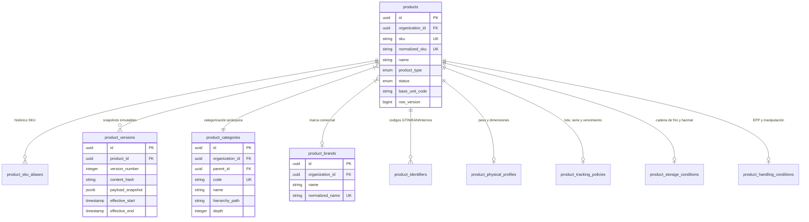

# Fase 023: Catálogo de Productos — Arquitectura Backend

## Resumen Ejecutivo

La **Fase 023** establece el núcleo del **Catálogo de Productos Logístico (Master Data Management)** del sistema WMS/TMS de la plataforma. Diseñado bajo principios de **Domain-Driven Design (DDD)**, **Clean Architecture** y **Multi-Tenancy por Organización**, proporciona la estructura de datos inmutable, versionable y auditable necesaria para gobernar los elementos físicos y lógicos que circulan por los almacenes, centros de distribución y redes de transporte.

El catálogo abarca un modelo relacional de **10 tablas especializadas** que desacoplan la identidad del producto (`ProductModel`), su árbol categórico (`ProductCategoryModel`), sus marcas (`ProductBrandModel`), sus identificadores barcode e internacionales (`ProductIdentifierModel`), su historial de alias y renombres de SKU (`ProductSKUAliasModel`), sus snapshots de versión inmutables (`ProductVersionModel`), su perfil físico con volúmenes calculados (`ProductPhysicalProfileModel`), sus políticas de seguimiento y lote/serie (`ProductTrackingPolicyModel`), sus condiciones térmicas/ambientales (`ProductStorageConditionModel`) y sus reglas de manipulación/seguridad (`ProductHandlingConditionModel`).

---

## Arquitectura General del Sistema

```mermaid
graph TD
    subgraph "API Layer (FastAPI / REST)"
        PROD_API["Product API Router (/api/logistics/products)"]
        CAT_API["Category API Router (/api/logistics/product-categories)"]
        BRAND_API["Brand API Router (/api/logistics/product-brands)"]
        ID_API["Identifier API Router (/api/logistics/product-identifiers)"]
    end

    subgraph "Security & Audit Cross-Cutting"
        AUTH["Step-Up Auth & RBAC Evaluator"]
        AUDIT["Logistics Audit Logger (logistics_audit_events)"]
    end

    subgraph "Domain Services & Core Engine"
        SKU_VAL["ProductSKUValidator & Normalizer"]
        VER_SVC["ProductVersioningService (SHA-256 Content Hash)"]
        CAT_TREE["ProductCategoryTreeEngine (Prevent Cycles, Depth <= 5)"]
        BARCODE_VAL["ProductIdentifierValidator (Mod 10 Check Digit & PNG)"]
        VOL_CALC["ProductVolumeCalculator (Decimal Numeric 14,4)"]
        COMPAT_EVAL["EvaluateProductLocationCompatibility Engine"]
    end

    subgraph "Persistence Layer (SQLAlchemy ORM / PostgreSQL)"
        P1["products"]
        P2["product_sku_aliases"]
        P3["product_versions"]
        P4["product_categories"]
        P5["product_brands"]
        P6["product_identifiers"]
        P7["product_physical_profiles"]
        P8["product_tracking_policies"]
        P9["product_storage_conditions"]
        P10["product_handling_conditions"]
    end

    PROD_API --> AUTH
    CAT_API --> AUTH
    BRAND_API --> AUTH
    ID_API --> AUTH

    PROD_API --> SKU_VAL
    PROD_API --> VER_SVC
    PROD_API --> VOL_CALC
    PROD_API --> COMPAT_EVAL
    CAT_API --> CAT_TREE
    ID_API --> BARCODE_VAL

    SKU_VAL --> AUDIT
    VER_SVC --> AUDIT
    CAT_TREE --> AUDIT

    PROD_API --> P1
    PROD_API --> P2
    PROD_API --> P3
    CAT_API --> P4
    BRAND_API --> P5
    ID_API --> P6
    PROD_API --> P7
    PROD_API --> P8
    PROD_API --> P9
    PROD_API --> P10

    classDef apiStyle fill:#0f172a,stroke:#38bdf8,stroke-width:2px,color:#fff;
    classDef secStyle fill:#1e293b,stroke:#f59e0b,stroke-width:2px,color:#fff;
    classDef svcStyle fill:#1e293b,stroke:#a855f7,stroke-width:2px,color:#fff;
    classDef dbStyle fill:#0284c7,stroke:#0ea5e9,stroke-width:2px,color:#fff;

    class PROD_API,CAT_API,BRAND_API,ID_API apiStyle;
    class AUTH,AUDIT secStyle;
    class SKU_VAL,VER_SVC,CAT_TREE,BARCODE_VAL,VOL_CALC,COMPAT_EVAL svcStyle;
    class P1,P2,P3,P4,P5,P6,P7,P8,P9,P10 dbStyle;
```

---

## Modelo de Dominio y Tablas (10 Tablas Específicas)

---

## Resumen de Funcionalidades Principales

1. **Gestión de Producto Centrada en SKU:** Normalización estricta (mayúsculas, descarte de acentos/espacios superfluos), aliases históricos para preservar trazabilidad comercial al renombrar SKUs.
2. **Jerarquía Categórica Anti-Ciclos:** Árbol de categorías con soporte de `hierarchy_path` (ej. `/cat-01/cat-05/cat-12/`), límite máximo de profundidad de 5 niveles y prevención determinística de referencias circulares.
3. **Identificadores y Código de Barras (Mod 10):** Validación de checksum de identificadores GTIN-8, GTIN-12 (UPC-A), GTIN-13 (EAN-13), GTIN-14 y generación automática de códigos de barras internos con prefijo `T1P-` y renderizado de imágenes PNG.
4. **Control Optimista de Concurrencia:** Campo incremental `row_version` para mitigar condiciones de carrera en ediciones concurrentes.
5. **Versionado Inmutable:** Generación de snapshots en `product_versions` con firma digital hash SHA-256 (`content_hash`) en cada actualización relevante.
6. **Perfiles Físicos y Métricas Volumétricas:** Almacenamiento con precisión decimal exacta (`Numeric 14,4`) y cálculo en tiempo real de volumen reportado vs volumétrico.
7. **Políticas Logísticas de Lote, Serie y Temperatura:** Especificación cualitativa de condiciones de almacenamiento, banderas Hazmat, frágil, cadena de frío y evaluador cualitativo de compatibilidad con ubicaciones del almacén (Fase 022).
8. **Unidad Base Provisional:** Uso controlado de `base_unit_code` estandarizado con la marca explícita `PENDING_PHASE_024` preparando el terreno para el maestro de conversiones UOM.

---

## Estructura del Módulo de Documentación

| Archivo | Tema Principal |
| :--- | :--- |
| `01_auditoria_catalogo_productos.md` | Auditoría de código/DB previo y justificación de 10 tablas. |
| `02_modelo_product.md` | Detalle del modelo principal `ProductModel` y estados de ciclo de vida. |
| `03_SKU_aliases.md` | Algoritmo de normalización de SKU y tabla `ProductSKUAliasModel`. |
| `04_versionado_producto.md` | Motor de snapshotting SHA-256 `ProductVersionModel`. |
| `05_categorias.md` | Arbol jerárquico anti-ciclos `ProductCategoryModel`. |
| `06_marcas.md` | Maestro multi-tenant de marcas `ProductBrandModel`. |
| `07_identificadores_codigos_barras.md` | Identificadores barcode GTIN/EAN/UPC, algoritmo Módulo 10 y PNG. |
| `08_unidad_base_provisional.md` | Estrategia provisional de `base_unit_code` (`PENDING_PHASE_024`). |
| `09_perfil_fisico.md` | Perfil de masa, dimensiones y cálculo volumétrico `Numeric(14,4)`. |
| `10_control_lote_serie.md` | Políticas de lote y serie (`PENDING_PHASE_046`). |
| `11_control_vencimiento.md` | Configuración de vida útil en días y alertas de obsolescencia. |
| `12_condiciones_almacenamiento.md` | Matriz de almacenamiento, rangos térmicos y Hazmat. |
| `13_condiciones_manipulacion.md` | Reglas de seguridad, EPP y manipulación dual. |
| `14_compatibilidad_ubicaciones.md` | Evaluador cualitativo `EvaluateProductLocationCompatibility`. |
| `15_busqueda_filtros.md` | Engine de búsqueda por sku, barcode, marca, estado con paginación. |
| `16_endpoints.md` | Especificación completa OpenAPI/REST de todos los endpoints. |
| `17_permisos_step_up.md` | Permisos RBAC y Step-Up Authentication requerida. |
| `18_auditoria.md` | Registro de eventos inmutables en `logistics_audit_events`. |
| `19_concurrencia_idempotencia.md` | Control optimista (`row_version`), locks transaccionales e idempotencia. |
| `20_migracion.md` | Script DDL Alembic completo `n250110023dc_phase_023_product_catalog.py`. |
| `21_pruebas.md` | Cobertura de tests unitarios e integración (33/33 tests). |
| `22_rendimiento.md` | Plan de índices B-Tree, tiempos de consulta < 20ms y benchmarks. |
| `23_integracion_fase_024.md` | Contrato de integración con Maestro UOM (Fase 024). |
| `24_integracion_fase_025.md` | Contrato de integración con Proveedores y Socios (Fase 025). |
| `25_integracion_fases_031_078.md` | Contrato con fases futuras de Compras, Recepción, Inventario y Picking. |
| `26_decisiones_pendientes.md` | Registro de Decisiones de Arquitectura (ADR 023-01 a ADR 023-05). |
| `phase_023_backend_manifest.json` | Manifiesto estructurado JSON de entregables de la Fase 023. |
