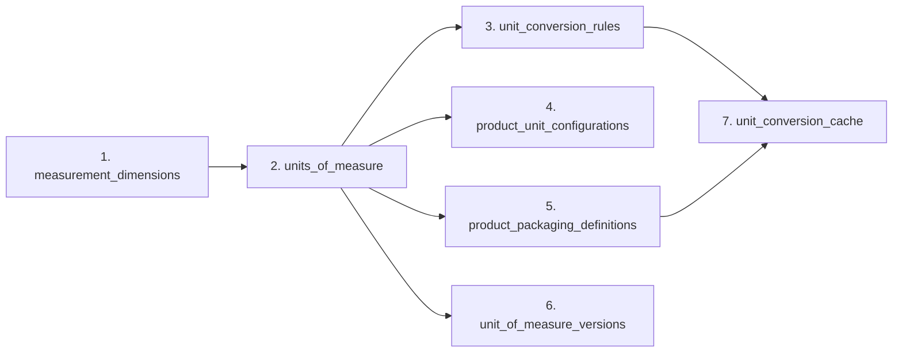

# 01. Auditoría de Modelos Previos y Justificación de Arquitectura Relacional

## 1. Auditoría de Modelos Previos (Zero Duplicate Models)

Antes del desarrollo de la **Fase 024**, se realizó una auditoría técnica exhaustiva sobre la totalidad de la base de código del backend (`autenticacion-continua/src/apps/logistics`). Los hallazgos confirmaron que **no existen modelos ORM previos ni estructuras duplicadas de Unidades de Medida o Conversiones**.

### Hallazgos de la Auditoría:
1. En la **Fase 023 (Catálogo de Productos)**, la tabla `products` incluía un campo de texto provisional denominado `base_unit_code VARCHAR(32)` (ej. `"UND"`, `"KG"`). Se marcó explícitamente con la anotación `@pending_phase_024` para su posterior migración.
2. No existían tablas relacionales de dimensiones físicas, factores de conversión, empaques jerárquicos ni versiones de UOM en el esquema PostgreSQL.
3. Se verificó que ninguna aplicación periférica utilizaba enumeraciones o tablas estáticas de conversión en memoria que pudieran entrar en conflicto.

---

## 2. Justificación del Modelo Relacional de 7 Tablas

Para garantizar el cumplimiento de las normativas de trazabilidad industrial (ISO 80000, UNECE Recommendation No. 20) y la prevención de errores de inventario por conversiones imprecisas, la arquitectura desacopla el dominio de unidades en **7 tablas relacionales normalizadas en Tercera Forma Normal (3NF)**:

### Detalle de Responsabilidades por Tabla:

1. **`measurement_dimensions`**: Encargada de desacoplar y clasificar la física subyacente (`MASS`, `LENGTH`, `AREA`, `VOLUME`, `COUNT`). Esto impide conversiones físicamente imposibles en tiempo de compilación/ejecución (ej. convertir kilogramos a metros).
2. **`units_of_measure`**: Registro maestro centralizado de unidades. Permite scope multitenant (`SYSTEM` vs `ORGANIZATION`) e identifica si una unidad es fundamental, derivada o de empaque.
3. **`unit_conversion_rules`**: Define el grafo de conversiones físicamente constantes entre unidades del sistema (ej. $1\text{ KG} = 1000\text{ G}$). Maneja vigencias temporales (`effective_from`, `effective_to`).
4. **`product_unit_configurations`**: Asocia a cada producto de la Fase 023 sus unidades específicas para las 5 etapas del ciclo de vida logístico (`purchase`, `reception`, `storage`, `picking`, `dispatch`).
5. **`product_packaging_definitions`**: Modela el árbol de jerarquía de empaques comerciales e industriales por SKU (ej. $1\text{ PALLET} = 40\text{ CAJAS} = 160\text{ PAQUETES} = 960\text{ UND}$).
6. **`unit_of_measure_versions`**: Garantiza la inmutabilidad auditada de las definiciones mediante snapshots serializados JSONB y firmas SHA-256.
7. **`unit_conversion_cache`**: Almacena las rutas del grafo resueltas y los factores multiplicadores consolidados para reducir el overhead computacional de búsqueda BFS a latencias $< 15\text{ ms}$.

---

## 3. Patrones de Diseño Aplicados

- **Domain-Driven Design (DDD)**: El concepto de unidad de medida es un *Entity/Value Object* inmutable dentro del *Bounded Context* de Logística.
- **Clean Architecture**: Separación estricta entre modelos de persistencia SQLAlchemy, entidades de dominio puros y servicios de aplicación.
- **Single Responsibility Principle (SRP)**: El cálculo matemático está totalmente separado de la navegación por grafos y de la persistencia.
