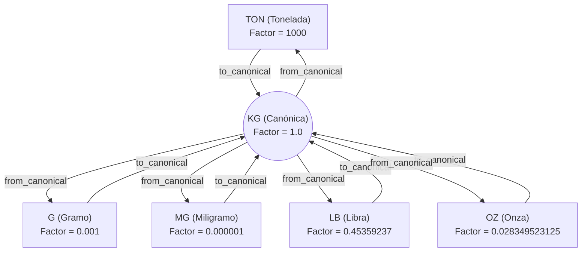

# 04. Unidades Canónicas por Dimensión y Normalización Global

## 1. Definición y Selección de Unidades Canónicas

Para optimizar el grafo de conversiones y evitar la proliferación cuadrática de reglas de conversión directas ($O(N^2)$), la arquitectura define **exactamente una Unidad Canónica de Referencia por cada Dimensión Física**.

Toda conversión entre dos unidades $A$ y $B$ de la misma dimensión se realiza **normalizando primero hacia la unidad canónica $C$**:

$$Factor(A \rightarrow B) = \frac{Factor(A \rightarrow C)}{Factor(B \rightarrow C)}$$

### Matriz de Unidades Canónicas del Sistema:

| Dimensión | Código Canónico | Nombre | Justificación Estándar |
| :--- | :--- | :--- | :--- |
| `COUNT` | `UND` | Unidad | Unidad discreta fundamental e indivisible. |
| `MASS` | `KG` | Kilogramo | Unidad base del Sistema Internacional de Unidades (SI). |
| `LENGTH` | `M` | Metro | Unidad base SI de longitud. |
| `AREA` | `M2` | Metro Cuadrado | Unidad derivada SI de área ($m^2$). |
| `VOLUME` | `M3` | Metro Cúbico | Unidad derivada SI de volumen ($m^3$). |

---

## 2. Demostración Matemática de la Normalización en Grafo Estella (Star Topology)

En un esquema de conversión sin unidad canónica, convertir entre 10 unidades de masa requiere definir hasta $\frac{10 \times 9}{2} = 45$ reglas directas.

Con la **Topología en Estrella Canónica**, solo se requieren **9 reglas** (la relación de cada unidad derivada contra `KG`).

---

## 3. Algoritmo de Normalización a Canónica en el Engine

Dado un valor $Q_A$ en unidad $A$, la conversión a unidad $B$ de la misma dimensión sigue los siguientes pasos con precisión `NUMERIC(38,18)`:

1. **Paso 1: Convertir $A$ a Canónica $C$**:
   $$Q_C = Q_A \times Factor(A \rightarrow C)$$
2. **Paso 2: Convertir Canónica $C$ a $B$**:
   $$Q_B = \frac{Q_C}{Factor(B \rightarrow C)} = Q_A \times \left( \frac{Factor(A \rightarrow C)}{Factor(B \rightarrow C)} \right)$$

Este enfoque reduce drásticamente los errores de mantenimiento y garantiza que agregar una nueva unidad solo requiera 1 regla respecto a la canónica.
