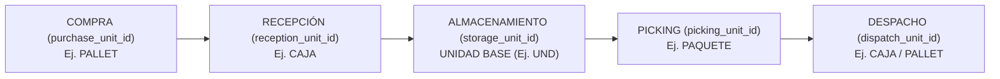

# 06. Configuración de Unidades por Producto (`ProductUnitConfigurationModel`)

## 1. Especificación del Modelo `ProductUnitConfigurationModel`

En la operativa logística industrial, un mismo producto puede ser comprado, recibido, almacenado, preparado (picking) y despachado en distintas unidades de medida. 

El modelo `ProductUnitConfigurationModel` establece las unidades por defecto asociadas a cada uno de estos 5 procesos clave para cada producto del catálogo (Fase 023).

### DDL / Esquema de Base de Datos (`product_unit_configurations`)

```sql
CREATE TABLE product_unit_configurations (
    id UUID PRIMARY KEY DEFAULT gen_random_uuid(),
    product_id UUID NOT NULL UNIQUE REFERENCES products(id) ON DELETE CASCADE,
    purchase_unit_id UUID NOT NULL REFERENCES units_of_measure(id) ON DELETE RESTRICT,
    reception_unit_id UUID NOT NULL REFERENCES units_of_measure(id) ON DELETE RESTRICT,
    storage_unit_id UUID NOT NULL REFERENCES units_of_measure(id) ON DELETE RESTRICT,
    picking_unit_id UUID NOT NULL REFERENCES units_of_measure(id) ON DELETE RESTRICT,
    dispatch_unit_id UUID NOT NULL REFERENCES units_of_measure(id) ON DELETE RESTRICT,
    row_version INTEGER NOT NULL DEFAULT 1,
    created_at TIMESTAMP WITH TIME ZONE NOT NULL DEFAULT CURRENT_TIMESTAMP,
    updated_at TIMESTAMP WITH TIME ZONE NOT NULL DEFAULT CURRENT_TIMESTAMP
);

CREATE UNIQUE INDEX uq_product_unit_config_product ON product_unit_configurations(product_id);
```

---

## 2. Los 5 Procesos Logísticos y sus Roles



1. **`storage_unit_id` (Unidad Base / Control de Inventario)**:
   - Es la **Unidad de Valoración e Inventario Real**. Todos los saldos de inventario de la Fase 040 se persisten en esta unidad.
   - **Restricción**: Es inalterable una vez que el producto registra movimientos de stock.
2. **`purchase_unit_id` (Unidad de Compra)**:
   - Unidad utilizada por defecto en las Órdenes de Compra de la Fase 031.
3. **`reception_unit_id` (Unidad de Recepción)**:
   - Unidad en la que el proveedor entrega en el muelle de recepción (Fase 035).
4. **`picking_unit_id` (Unidad de Preparación)**:
   - Unidad sugerida por la estrategia de picking en la Fase 050.
5. **`dispatch_unit_id` (Unidad de Despacho)**:
   - Unidad por defecto utilizada en Guías de Remisión y Órdenes de Salida (Fase 060).

---

## 3. Validaciones de Dominio

1. **Pertenencia a la Misma Dimensión o Empaque Válido**:
   - Todas las unidades configuradas deben pertenecer a la misma dimensión que la unidad de almacenamiento (`storage_unit_id`) O poseer una definición de empaque jerárquico válida en `product_packaging_definitions`.
2. **Impedimento de Transacción sin Conversión**:
   - El sistema rechaza guardar una configuración de producto si alguna de las 5 unidades no tiene una ruta de conversión válida hacia `storage_unit_id`.
