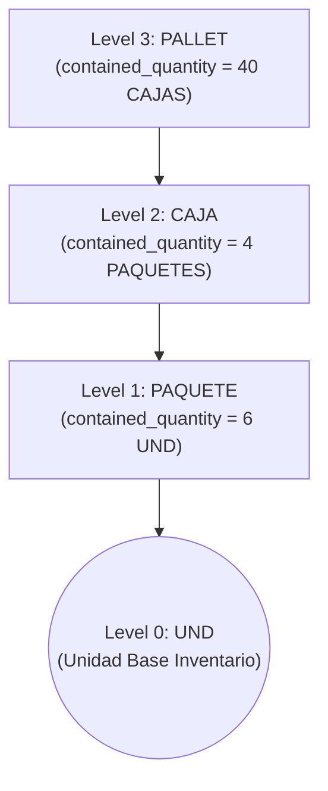

# 07. Definición de Empaques Jerárquicos por Producto (`ProductPackagingDefinitionModel`)

## 1. Especificación del Modelo `ProductPackagingDefinitionModel`

El modelo `ProductPackagingDefinitionModel` modela las estructuras de empaque multinivel asociadas a un SKU específico. Permite definir árboles de empaquetamiento donde contenedores superiores alojan unidades inferiores.

### DDL / Esquema de Base de Datos (`product_packaging_definitions`)

```sql
CREATE TABLE product_packaging_definitions (
    id UUID PRIMARY KEY DEFAULT gen_random_uuid(),
    product_id UUID NOT NULL REFERENCES products(id) ON DELETE CASCADE,
    parent_packaging_id UUID NULL REFERENCES product_packaging_definitions(id) ON DELETE RESTRICT,
    packaging_unit_id UUID NOT NULL REFERENCES units_of_measure(id) ON DELETE RESTRICT,
    contained_quantity NUMERIC(38, 18) NOT NULL,
    contained_unit_id UUID NOT NULL REFERENCES units_of_measure(id) ON DELETE RESTRICT,
    hierarchy_level INTEGER NOT NULL CHECK (hierarchy_level >= 1 AND hierarchy_level <= 5),
    is_active BOOLEAN NOT NULL DEFAULT TRUE,
    barcode_identifier VARCHAR(64) NULL,
    row_version INTEGER NOT NULL DEFAULT 1,
    created_at TIMESTAMP WITH TIME ZONE NOT NULL DEFAULT CURRENT_TIMESTAMP,
    updated_at TIMESTAMP WITH TIME ZONE NOT NULL DEFAULT CURRENT_TIMESTAMP,
    CONSTRAINT uq_pkg_product_unit UNIQUE (product_id, packaging_unit_id),
    CONSTRAINT chk_positive_contained CHECK (contained_quantity > 0)
);

CREATE INDEX idx_pkg_product ON product_packaging_definitions(product_id);
CREATE INDEX idx_pkg_parent ON product_packaging_definitions(parent_packaging_id);
```

---

## 2. Ejemplo de Jerarquía Multinivel Reales

Considere el producto `SKU-BEBIDA-500ML` con su unidad base `UND` en inventario:



### Factores Multiplicadores Acumulados a Unidad Base:

1. **1 PAQUETE** = $6\text{ UND}$ (Factor = 6)
2. **1 CAJA** = $4\text{ PAQUETES} \times 6\text{ UND} = 24\text{ UND}$ (Factor = 24)
3. **1 PALLET** = $40\text{ CAJAS} \times 24\text{ UND} = 960\text{ UND}$ (Factor = 960)

---

## 3. Reglas de Validación de Estructura de Empaque

1. **Validación de Aciclicidad**:
   - No pueden existir ciclos en la relación `parent_packaging_id` (ej. una caja no puede contener el pallet que la contiene).
2. **Límite de Profundidad Jerárquica**:
   - `hierarchy_level` soporta un nivel máximo de **5 niveles de profundidad**.
3. **Unicidad de Nivel Base**:
   - El nodo de menor nivel de la jerarquía debe tener como `contained_unit_id` la `storage_unit_id` del producto.
4. **Barcode Asociado al Empaque**:
   - `barcode_identifier` permite registrar códigos GTIN-14 / ITF-14 específicos para cajas y pallets.
