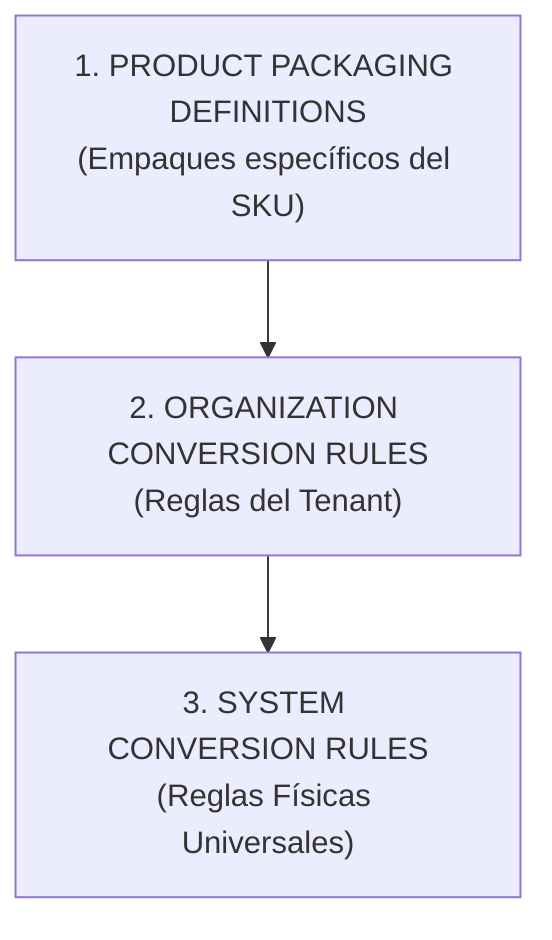

# 09. Resolutor de Rutas en Grafo (`ConversionPathResolver`)

## 1. Especificación del Servicio `ConversionPathResolver`

Cuando dos unidades no tienen una regla directa de conversión registrada, el servicio `ConversionPathResolver` modela las unidades como **vértices** y las reglas/empaques como **aristas dirigidas ponderadas** de un grafo. 

Ejecuta una búsqueda en anchura (**Breadth-First Search - BFS**) para hallar la ruta de conversión óptima hasta un máximo de **5 saltos (max_hops = 5)**.

### Grafo de Conversión Multi-Salto:

---

## 2. Jerarquía de Priorización de Reglas (`PRODUCT` > `ORGANIZATION` > `SYSTEM`)

Si existen múltiples aristas disponibles entre dos unidades en el grafo, el resolutor prioriza según el siguiente orden estricto de precedencia:

### Algoritmo de Selección de Arista:
1. Si se especifica `product_id`, busca primero en `product_packaging_definitions`. Si existe una arista válida, la selecciona con prioridad máxima.
2. Si no hay regla de empaque de producto, busca en `unit_conversion_rules` filtrando por `organization_id`.
3. Si no existe regla de organización, utiliza las reglas universales `is_system_rule = true`.

---

## 3. Acumulación del Factor Multiplicador Efectivo

Dada una ruta de conversión compuesta por $k$ saltos ($1 \le k \le 5$) con factores $f_1, f_2, \dots, f_k$:

$$F_{eff} = \prod_{i=1}^{k} f_i = f_1 \times f_2 \times \dots \times f_k$$

### Ejemplo Multi-Salto:
Convertir de **PALLET a UND** de una bebida (1 PALLET = 40 CAJAS, 1 CAJA = 4 PAQUETES, 1 PAQUETE = 6 UND):
- Salto 1 (PALLET $\rightarrow$ CAJA): $f_1 = 40$
- Salto 2 (CAJA $\rightarrow$ PAQUETE): $f_2 = 4$
- Salto 3 (PAQUETE $\rightarrow$ UND): $f_3 = 6$
- **Factor Efectivo**: $F_{eff} = 40 \times 4 \times 6 = 960$

Si la búsqueda excede los 5 saltos sin encontrar destino, el resolutor levanta un error `400 CONVERSION_PATH_NOT_FOUND`.
