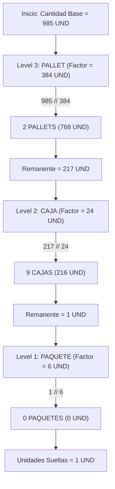

# 13. Servicio de Descomposición de Cantidades (`QuantityDecompositionService`)

## 1. Especificación del Servicio `QuantityDecompositionService`

Cuando se solicita preparar o despachar una cantidad masiva expresada en unidades base (ej. $985\text{ UND}$), el almacén necesita saber exactamente **cuántos contenedores mayores (Pallets, Cajas, Paquetes) y unidades sueltas** se deben tomar.

El servicio `QuantityDecompositionService` implementa el algoritmo voraz (**`LARGEST_FIRST Strategy`**) para descomponer una cantidad dada en su estructura jerárquica óptima de empaques.

---

## 2. Estrategia Algorítmica `LARGEST_FIRST` (Greedy Packaging Decomposition)

### Algoritmo Paso a Paso:
1. Obtener la lista ordenada descendentemente de empaques activos para el producto según su `hierarchy_level` (ej. Level 3: PALLET, Level 2: CAJA, Level 1: PAQUETE).
2. Calcular el factor multiplicador equivalente de cada nivel hacia la unidad base.
3. Iterar desde el empaque mayor hacia el menor:
   - $CantidadEmpaque = \lfloor \frac{RemanenteActual}{FactorMultiplicador} \rfloor$
   - $RemanenteActual = RemanenteActual - (CantidadEmpaque \times FactorMultiplicador)$
4. El saldo final no divisible constituye el residuo o unidades sueltas (`loose_base_units`).



---

## 3. Ejemplo Práctico de Ejecución

### Configuración del SKU: `BEBIDA-GASEOSA-500`
- 1 PALLET = 384 UND
- 1 CAJA = 24 UND
- 1 PAQUETE = 6 UND
- Unidad Base = UND

### Entrada: `985 UND`
### Salida del Servicio:

```json
{
  "product_id": "8f3b2a11-0000-4000-8000-000000000001",
  "input_quantity": "985.000000000000000000",
  "base_unit_code": "UND",
  "decomposition": [
    {
      "hierarchy_level": 3,
      "packaging_unit_code": "PALLET",
      "package_count": 2,
      "equivalent_base_quantity": "768.000000000000000000"
    },
    {
      "hierarchy_level": 2,
      "packaging_unit_code": "CAJA",
      "package_count": 9,
      "equivalent_base_quantity": "216.000000000000000000"
    },
    {
      "hierarchy_level": 1,
      "packaging_unit_code": "PAQUETE",
      "package_count": 0,
      "equivalent_base_quantity": "0.000000000000000000"
    }
  ],
  "loose_base_units": "1.000000000000000000",
  "total_decomposed_base_units": "985.000000000000000000"
}
```
