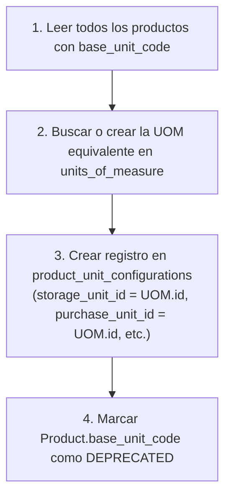

# 15. Estrategia de Migración del Campo Provisional `Product.base_unit_code`

## 1. Contexto de Deuda Técnica Heredada de la Fase 023

En la **Fase 023 (Catálogo de Productos)**, la tabla `products` incluía una columna temporal de tipo texto denominada `base_unit_code VARCHAR(32)` (ej. `"UND"`, `"KG"`, `"M"`). 

Esta columna sirvió como placeholder provisional previo a la creación del catálogo maestro de UOMs de la Fase 024.

---

## 2. Estrategia ETL y Migración de Datos (Alembic Migration)

La migración Alembic `o260110024dc_phase_024_units_and_conversions.py` ejecuta la siguiente secuencia de transformación de datos para todos los productos existentes:



### Script de Conversión SQL de la Migración:

```sql
-- Insertar configuraciones por defecto para productos existentes que carecen de ellas
INSERT INTO product_unit_configurations (
    id,
    product_id,
    purchase_unit_id,
    reception_unit_id,
    storage_unit_id,
    picking_unit_id,
    dispatch_unit_id,
    row_version,
    created_at,
    updated_at
)
SELECT 
    gen_random_uuid(),
    p.id,
    u.id, -- purchase_unit
    u.id, -- reception_unit
    u.id, -- storage_unit (Base)
    u.id, -- picking_unit
    u.id, -- dispatch_unit
    1,
    CURRENT_TIMESTAMP,
    CURRENT_TIMESTAMP
FROM products p
JOIN units_of_measure u ON u.code = COALESCE(p.base_unit_code, 'UND') AND u.scope = 'SYSTEM'
ON CONFLICT (product_id) DO NOTHING;
```

---

## 3. Compatibilidad Hacia Atrás (Backward Compatibility Property)

Para no romper código de otros módulos que lean `product.base_unit_code`, el modelo ORM `ProductModel` en Python mantiene una propiedad calculada (getter/setter virtual):

```python
class ProductModel(Base):
    __tablename__ = "products"

    # ... campos existentes ...
    # Columna física marcada como obsoleta
    _base_unit_code_legacy = Column("base_unit_code", String(32), nullable=True)

    @property
    def base_unit_code((self) -> str:
        """
        Property de compatibilidad hacia atrás.
        Retorna el código de la unidad de almacenamiento desde la configuración formal.
        """
        if self.unit_configuration and self.unit_configuration.storage_unit:
            return self.unit_configuration.storage_unit.code
        return self._base_unit_code_legacy or "UND"
```
