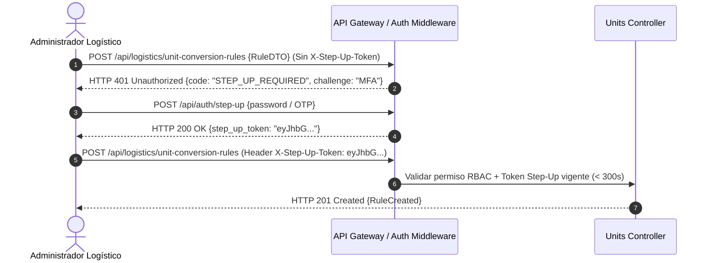

# 17. Matriz de Permisos RBAC y Autenticación Elevada (Step-Up Auth)

## 1. Matriz de Permisos RBAC (`logistics.*`)

El módulo implementa un control de acceso basado en roles granular para evitar modificaciones no autorizadas en reglas físicas o estructuras de empaque.

| Permiso RBAC | Descripción de Control | Roles Asignados por Defecto |
| :--- | :--- | :--- |
| `logistics.units.read` | Lectura del catálogo de dimensiones y UOMs. | `WarehouseOperator`, `InventoryManager`, `LogisticsAdmin`, `SystemAuditor` |
| `logistics.units.manage` | Crear, modificar y desactivar unidades de medida personalizadas. | `LogisticsAdmin`, `SystemAdmin` |
| `logistics.unit_conversions.read` | Consultar reglas de conversión y evaluar API de conversión. | `WarehouseOperator`, `InventoryManager`, `LogisticsAdmin` |
| `logistics.unit_conversions.manage` | Crear, editar o invalidar reglas de conversión del sistema/tenant. | `LogisticsAdmin` |
| `logistics.product_units.read` | Leer configuración de unidades y empaques de productos. | `WarehouseOperator`, `InventoryManager`, `LogisticsAdmin` |
| `logistics.product_units.manage` | Modificar unidades de proceso y estructuras de empaque por SKU. | `InventoryManager`, `LogisticsAdmin` |

---

## 2. Requerimiento de Step-Up Authentication (Autenticación Elevada)

Dado que alterar una regla de conversión o la estructura de un empaque puede alterar de forma catastrófica la valoración contable y el conteo de existencias del inventario, las operaciones de modificación sensible (**`POST /units`**, **`POST /unit-conversion-rules`**, **`POST /packaging-definitions`**) **requieren obligatoriamente Step-Up Authentication**.

### Mecanismo de Step-Up Auth:
El usuario debe proveer en la cabecera HTTP un token corto de re-autenticación fresca (`X-Step-Up-Token`) obtenido tras validar su MFA o contraseña en los últimos 5 minutos.

