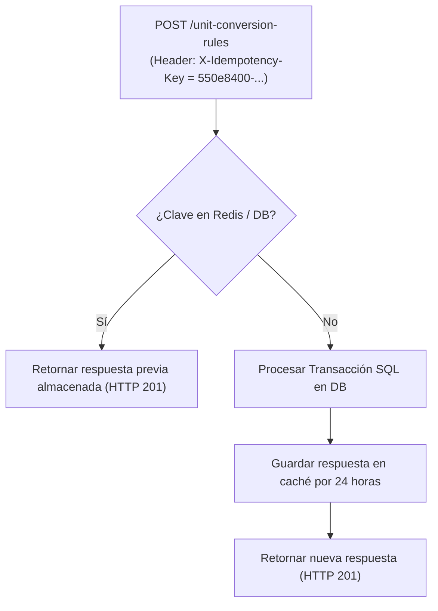

# 19. Control de Concurrencia Optimista e Idempotencia

## 1. Control de Concurrencia Optimista (`row_version`)

Para prevenir modificaciones concurrentes no coordinadas (ej. dos administradores editando la estructura de empaques de un producto simultáneamente), todas las tablas del módulo heredan el campo entero de versión `row_version`.

### Algoritmo de Actualización Optimista:
Al realizar un `UPDATE` en SQL, la sentencia incluye la cláusula `WHERE row_version = :expected_version`:

```sql
UPDATE product_packaging_definitions
SET 
    contained_quantity = :new_quantity,
    row_version = row_version + 1,
    updated_at = CURRENT_TIMESTAMP
WHERE id = :id AND row_version = :expected_version;
```

Si el número de filas afectadas es `0`, el servicio aborta la operación y levanta una excepción `StaleObjectStateException` mapeada a HTTP 409 Conflict:

```json
{
  "error_code": "OPTIMISTIC_CONCURRENCY_CONFLICT",
  "message": "El recurso ha sido modificado por otro usuario. Por favor recargue y vuelva a intentarlo.",
  "details": {
    "resource_id": "8f3b2a11-0000-4000-8000-000000000001",
    "expected_version": 3,
    "current_db_version": 4
  }
}
```

---

## 2. Idempotencia en Endpoints de Creación y Conversión (`X-Idempotency-Key`)

Los endpoints de modificación (**`POST /units`**, **`POST /unit-conversion-rules`**, **`POST /packaging-definitions`**) soportan la cabecera opcional/obligatoria **`X-Idempotency-Key`** (UUID v4).



Si una solicitud se reintenta por falla de red con la misma clave de idempotencia en un intervalo de 24 horas, el sistema devuelve la respuesta previamente calculada sin duplicar registros en la base de datos.
