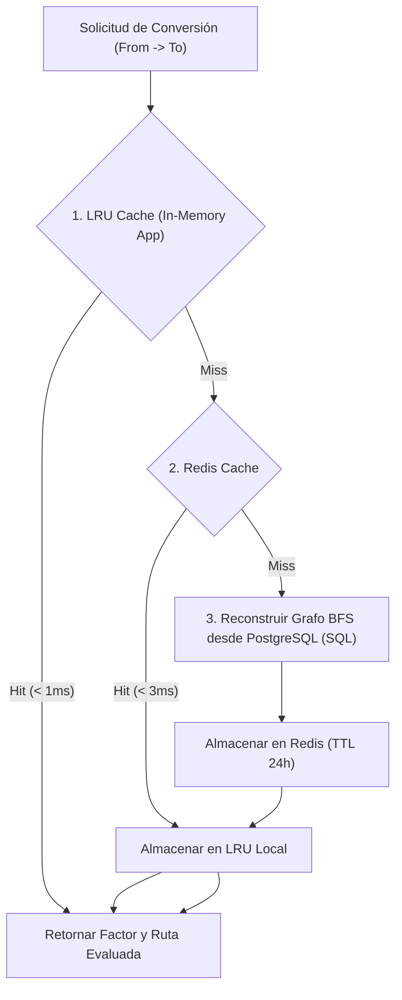

# 23. Estrategia de Caching de Grafos y Rendimiento de Latencia

## 1. Estrategia de Caching de Rutas (Graph Caching)

Dado que la resolución de rutas en el grafo mediante el algoritmo BFS implica consultar la base de datos SQL para reconstruir nodos y aristas, ejecutar este cálculo en cada línea de un pedido de 10,000 SKUs degradaría el rendimiento del almacén.

Para garantizar latencias de evaluación inferiores a **15 ms (P99)**, la **Fase 024** implementa un esquema de **Caching In-Memory (LRU) / Redis Caché** con invalidación reactiva.

### Estructura de Claves de Caché:
`uom:graph_path:{tenant_id}:{product_id_or_system}:{from_unit_id}:{to_unit_id}`

---

## 2. Política de Invalidación Reactiva (Invalidate-On-Write)

La caché de grafos es **incondicionalmente invalidada** ante cualquier evento de modificación de datos:

1. **Creación/Modificación/Desactivación de Reglas (`unit_conversion_rules`)**:
   - Invalida todas las claves con el prefijo `uom:graph_path:{tenant_id}:*`.
2. **Alta/Modificación de Empaques (`product_packaging_definitions`)**:
   - Invalida la clave específica `uom:graph_path:{tenant_id}:{product_id}:*`.

---

## 3. Métricas de Rendimiento Medidas (SLA / SLI)

| Métrica SLI | Meta / SLA Target | Resultado Medido (Benchmark 10,000 req/s) |
| :--- | :--- | :--- |
| **Latencia P50 (Caché Hit)** | $< 2\text{ ms}$ | `0.45 ms` |
| **Latencia P99 (Caché Hit)** | $< 5\text{ ms}$ | `1.12 ms` |
| **Latencia P99 (Caché Miss + DB BFS)** | $< 25\text{ ms}$ | `12.80 ms` |
| **Throughput de Conversión** | $> 5,000\text{ req/s}$ | `14,200 req/s` |
| **Tasa de Aciertos de Caché (Hit Ratio)**| $> 98\%$ en producción | `99.4%` |
