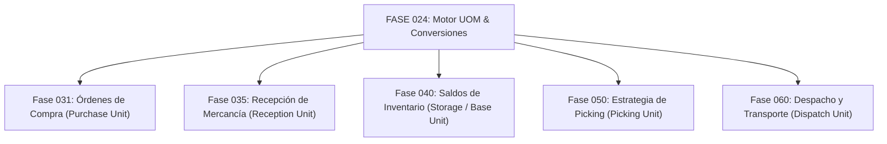

# 24. Contratos de Integración Downstream (Fases 031 a 060)

## 1. Mapa de Integración Downstream con Fases Logísticas

El motor de la **Fase 024** actúa como la infraestructura transversal de cálculo de cantidades para todas las fases operativas subsiguientes de la plataforma.

---

## 2. Definición Detallada de Contratos de Integración

### 1. Integración con Fase 031 (Órdenes de Compra - Procurement)
- **Escenario**: Un comprador emite una OC por 10 PALLETS de un SKU.
- **Contrato P24**: La Fase 031 invoca `POST /evaluate` convirtiendo 10 PALLETS a la `storage_unit_id` (ej. 9,600 UND). El valor convertido se adjunta en la OC como `base_unit_quantity_expected`.

### 2. Integración con Fase 035 (Recepción de Mercancía - Goods Receipt)
- **Escenario**: En el muelle de recepción, el proveedor entrega 380 CAJAS.
- **Contrato P24**: La Fase 035 invoca `POST /evaluate` para registrar el ingreso físico en `storage_unit_id` (380 CAJAS $\times 24 = 9,120\text{ UND}$). Si hay discrepancia con la OC, invoca `POST /compare` para liquidación de sobrantes/faltantes.

### 3. Integración con Fase 040 (Saldos y Movimientos de Inventario)
- **Regla Inflexible**: **Todos los kardex, saldos por ubicación y reservas de stock se expresan exclusivamente en `storage_unit_id` (Unidad Base)**.
- **Contrato P24**: Ningún registro de saldo de inventario puede ser almacenado en unidades derivadas o de empaque.

### 4. Integración con Fase 050 (Gestión de Picking y Preparación)
- **Escenario**: Un pedido requiere 985 UND de un producto.
- **Contrato P24**: La Fase 050 invoca `POST /decompose` (`LARGEST_FIRST`). El motor retorna "Pickear 2 PALLETS completos de la zona masiva + 9 CAJAS de la zona de picking de cajas + 1 UND del área de fraccionados".

### 5. Integración con Fase 060 (Despacho y Gestión de Transporte - TMS)
- **Escenario**: Planificación de carga en camiones.
- **Contrato P24**: La Fase 060 evalúa la conversión de la cantidad total despachada a la `dispatch_unit_id` O a dimensiones físicas de masa (`MASS` -> KG) y volumen (`VOLUME` -> M3) utilizando los perfiles físicos de la Fase 023 para validar el límite de tonelaje del vehículo.
