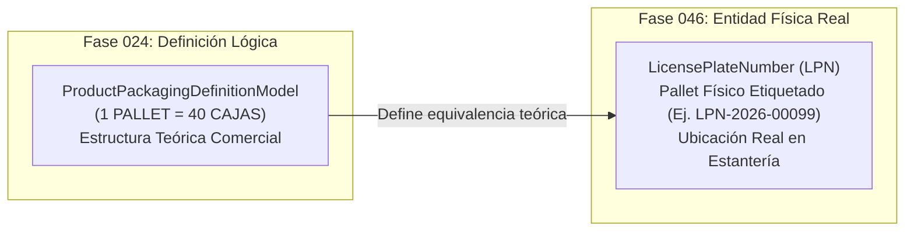

# 25. Contrato de Integración con la Fase 046 (LPN y Pallets Físicos)

## 1. Desacoplamiento entre Empaques Lógicos y Pallets Físicos (LPN)

Es fundamental distinguir la responsabilidad de la **Fase 024 (Empaques Lógicos Comercial/Operativos)** de la futura **Fase 046 (Gestión de Contenedores Físicos y LPN - License Plate Numbers)**.

---

## 2. Puntos de Contacto del Contrato de Interfaz

1. **Relación LPN a Empaque Lógico**:
   - Cuando la Fase 046 crea un LPN físico (ej. pallet de recepción), este se vincula a una `packaging_unit_id` de la Fase 024 (ej. `PALLET`).
2. **Validación de Capacidad Nominal**:
   - La Fase 046 consulta a la Fase 024 la `contained_quantity` nominal del empaque para determinar si un LPN físico se encuentra completo, incompleto (pallet mixto) o sobre-dimensionado.
3. **Escaneo de Código Barcode ITF-14 / GTIN-14**:
   - Cuando el operador escanea el código de barras de una caja o pallet en radiofrecuencia (Fase 046), el resolvedor de barcode consulta `product_packaging_definitions.barcode_identifier` de la Fase 024 para identificar automáticamente el producto y su cantidad equivalente.
