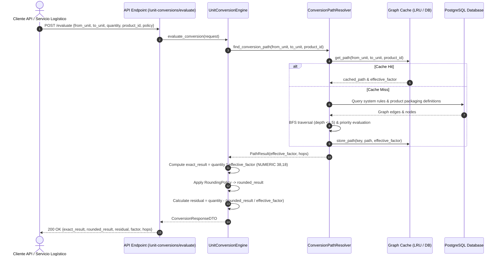

# Fase 024: Motor de Unidades de Medida y Conversiones — Arquitectura Backend

## Resumen Ejecutivo

La **Fase 024** implementa la arquitectura integral del **Motor de Unidades de Medida (UOM), Conversiones Físicas y Empaques Jerárquicos por Producto** para el núcleo logístico WMS/TMS del sistema. Diseñada bajo principios de **Clean Architecture**, **Domain-Driven Design (DDD)** y **Aritmética Estricta Decimal de Coma Fija**, esta fase elimina definitivamente cualquier ambigüedad en el cálculo de cantidades, conversiones de inventario y empaquetamiento comercial/operativo.

El motor administra un modelo relacional robusto compuesto por **7 tablas especializadas**:
1. `measurement_dimensions`: Catálogo maestro de dimensiones físicas (`COUNT`, `MASS`, `LENGTH`, `AREA`, `VOLUME`).
2. `units_of_measure`: Maestro de unidades de medida con scope (`SYSTEM`, `ORGANIZATION`) y tipo (`BASE`, `DERIVED`, `PACKAGING`, `CUSTOM`).
3. `unit_conversion_rules`: Reglas de conversión física del sistema (ej. $1\text{ KG} = 1000\text{ G}$).
4. `product_unit_configurations`: Configuración de unidades de proceso por producto (`purchase`, `reception`, `storage`, `picking`, `dispatch`).
5. `product_packaging_definitions`: Definición de empaques jerárquicos por producto (ej. $1\text{ PALLET} = 40\text{ CAJAS}$, $1\text{ CAJA} = 4\text{ PAQUETES}$, $1\text{ PAQUETE} = 6\text{ UND}$).
6. `unit_of_measure_versions`: Snapshots inmutables de versionado para auditoría histórica de unidades y reglas.
7. `unit_conversion_cache`: Tabla/Caché de grafos de rutas de conversión evaluadas para garantizar tiempos de respuesta $< 15\text{ ms}$.

---

## Arquitectura General del Motor

```mermaid
graph TD
    subgraph "API Layer (FastAPI / REST)"
        DIM_API["Dimension Router (/api/logistics/measurement-dimensions)"]
        UOM_API["Unit Router (/api/logistics/units)"]
        RULE_API["Conversion Rule Router (/api/logistics/unit-conversion-rules)"]
        PROD_UOM_API["Product Units Router (/api/logistics/products/{id}/unit-configuration)"]
        PKG_API["Packaging Router (/api/logistics/products/{id}/packaging-definitions)"]
        EVAL_API["Evaluation & Decompose Router (/api/logistics/unit-conversions/*)"]
    end

    subgraph "Security & Audit Cross-Cutting"
        AUTH["Step-Up Auth & RBAC Evaluator"]
        AUDIT["Logistics Audit Logger (logistics_audit_events)"]
    end

    subgraph "Domain Services & Core Engine"
        GRAPH_RESOLVER["ConversionPathResolver (BFS Graph Traverser, Depth <= 5)"]
        CONV_ENGINE["UnitConversionEngine (Decimal NUMERIC 38,18)"]
        CYCLE_DETECTOR["Cycle & Ambiguity Detector (Tarjan / Conflicting Paths)"]
        DECOMP_SVC["QuantityDecompositionService (LARGEST_FIRST Strategy)"]
        VER_SVC["UnitVersioningService (SHA-256 Version Snapshots)"]
    end

    subgraph "Persistence & Cache Layer (PostgreSQL & LRU)"
        CACHE["Conversion Graph Cache (LRU / unit_conversion_cache)"]
        T1["measurement_dimensions"]
        T2["units_of_measure"]
        T3["unit_conversion_rules"]
        T4["product_unit_configurations"]
        T5["product_packaging_definitions"]
        T6["unit_of_measure_versions"]
    end

    EVAL_API --> AUTH
    RULE_API --> AUTH
    PROD_UOM_API --> AUTH
    PKG_API --> AUTH

    EVAL_API --> CONV_ENGINE
    EVAL_API --> DECOMP_SVC
    CONV_ENGINE --> GRAPH_RESOLVER
    GRAPH_RESOLVER --> CYCLE_DETECTOR
    GRAPH_RESOLVER --> CACHE

    CONV_ENGINE --> AUDIT
    PKG_API --> AUDIT
    RULE_API --> VER_SVC

    GRAPH_RESOLVER --> T2
    GRAPH_RESOLVER --> T3
    GRAPH_RESOLVER --> T5
    PROD_UOM_API --> T4
    DIM_API --> T1
    VER_SVC --> T6

    classDef apiStyle fill:#0f172a,stroke:#38bdf8,stroke-width:2px,color:#fff;
    classDef secStyle fill:#1e293b,stroke:#f59e0b,stroke-width:2px,color:#fff;
    classDef svcStyle fill:#1e293b,stroke:#a855f7,stroke-width:2px,color:#fff;
    classDef dbStyle fill:#0284c7,stroke:#0ea5e9,stroke-width:2px,color:#fff;

    class DIM_API,UOM_API,RULE_API,PROD_UOM_API,PKG_API,EVAL_API apiStyle;
    class AUTH,AUDIT secStyle;
    class GRAPH_RESOLVER,CONV_ENGINE,CYCLE_DETECTOR,DECOMP_SVC,VER_SVC svcStyle;
    class CACHE,T1,T2,T3,T4,T5,T6 dbStyle;
```



---

## Modelo de Dominio y Tablas (7 Tablas)

```mermaid
erDiagram
    measurement_dimensions ||--o{ units_of_measure : "contiene"
    units_of_measure ||--o{ unit_conversion_rules : "from_unit"
    units_of_measure ||--o{ unit_conversion_rules : "to_unit"
    units_of_measure ||--o{ product_unit_configurations : "unidades de proceso"
    units_of_measure ||--o{ product_packaging_definitions : "packaging_unit"
    units_of_measure ||--o{ unit_of_measure_versions : "snapshots"
    product_unit_configurations }|--|| products : "configuración por producto"
    product_packaging_definitions }|--|| products : "empaques por producto"
    product_packaging_definitions ||--o| product_packaging_definitions : "padre jerárquico"

    measurement_dimensions {
        uuid id PK
        string code UK "COUNT, MASS, LENGTH, AREA, VOLUME"
        string name
        string canonical_unit_code "UND, KG, M, M2, M3"
        integer default_precision
        boolean is_system_defined
    }

    units_of_measure {
        uuid id PK
        uuid organization_id FK "Null para SYSTEM"
        uuid dimension_id FK
        string code UK
        string name
        string symbol
        string scope "SYSTEM, ORGANIZATION"
        string kind "BASE, DERIVED, PACKAGING, CUSTOM"
        boolean is_active
    }

    unit_conversion_rules {
        uuid id PK
        uuid organization_id FK
        uuid from_unit_id FK
        uuid to_unit_id FK
        numeric conversion_factor "NUMERIC(38,18)"
        numeric inverse_factor "NUMERIC(38,18)"
        timestamp effective_from
        timestamp effective_to
        boolean is_system_rule
    }

    product_unit_configurations {
        uuid id PK
        uuid product_id FK UK
        uuid purchase_unit_id FK
        uuid reception_unit_id FK
        uuid storage_unit_id FK "Base Unit"
        uuid picking_unit_id FK
        uuid dispatch_unit_id FK
    }

    product_packaging_definitions {
        uuid id PK
        uuid product_id FK
        uuid parent_packaging_id FK "Null para nivel superior"
        uuid packaging_unit_id FK
        numeric contained_quantity "NUMERIC(38,18)"
        uuid contained_unit_id FK
        integer hierarchy_level
        string barcode_identifier
    }

    unit_of_measure_versions {
        uuid id PK
        uuid unit_id FK
        integer version_number
        jsonb snapshot_data
        string checksum_sha256
    }
```

---

## Flujo de Evaluación de Conversión



---

## Matriz de Entregables de la Fase 024

| Archivo | Descripción Téćnica |
| :--- | :--- |
| `01_auditoria_unidades_conversiones.md` | Auditoría de cero duplicados UOM en Fase 023 y justificación de 7 tablas. |
| `02_dimensiones.md` | Catálogo de dimensiones físicas `MeasurementDimensionModel` y reglas de inmutabilidad. |
| `03_catalogo_unidades.md` | Maestro `UnitOfMeasureModel`, scopes, kinds y política de eliminación lógica. |
| `04_unidades_canonicas.md` | Definición de unidades canónicas por dimensión (`UND`, `KG`, `M`, `M2`, `M3`). |
| `05_conversiones_fisicas.md` | Reglas del sistema `UnitConversionRuleModel` con aritmética decimal. |
| `06_configuracion_unidades_producto.md` | Configuración de unidades de proceso por producto `ProductUnitConfigurationModel`. |
| `07_empaques_producto.md` | Empaques jerárquicos `ProductPackagingDefinitionModel` (Pallet -> Caja -> Paquete -> UND). |
| `08_motor_conversion.md` | Especificación del motor `UnitConversionEngine` y eliminación de coma flotante. |
| `09_resolucion_rutas.md` | Resolutor en grafo `ConversionPathResolver`, BFS multi-salto y prioridades. |
| `10_ciclos_ambiguedades.md` | Detección de ciclos y rutas ambiguas (`409 CONVERSION_PATH_AMBIGUOUS`). |
| `11_precision_decimal.md` | Especificación matemática `NUMERIC(38,18)` y serialización string JSON. |
| `12_redondeo.md` | Políticas de redondeo explícito (`HALF_UP`, `HALF_EVEN`, `FLOOR`, etc.). |
| `13_descomposicion.md` | Servicio `QuantityDecompositionService` y estrategia `LARGEST_FIRST`. |
| `14_vigencia_versionado.md` | Control de vigencias temporales y versionado inmutable SHA-256. |
| `15_migracion_base_unit_code.md` | Estrategia de migración del campo provisional `base_unit_code` de Fase 023. |
| `16_endpoints.md` | Especificación OpenAPI 3.0 completa de endpoints REST. |
| `17_permisos_step_up.md` | Matriz RBAC (`logistics.units.*`) y requerimiento de Step-Up Auth. |
| `18_auditoria.md` | Registro de eventos de auditoría inmutables en `logistics_audit_events`. |
| `19_concurrencia_idempotencia.md` | Concurrencia optimista `row_version` y cabeceras de idempotencia. |
| `20_migracion_seed.md` | Script DDL Alembic y script de semilla de datos `seed.py`. |
| `21_pruebas_matematicas.md` | Cobertura de pruebas unitarias y precisión matemática de coma fija. |
| `22_pruebas_integracion.md` | Cobertura de pruebas de integración de empaques, API y multi-tenancy. |
| `23_rendimiento_cache.md` | Caching de grafos en memoria/DB y métricas de latencia $< 15\text{ ms}$. |
| `24_integracion_fases_031_060.md` | Contrato de integración downstream con Compras, Inventario y Despacho. |
| `25_integracion_fase_046.md` | Contrato de integración con la Fase 046 (LPN y Pallets físicos). |
| `26_decisiones_pendientes.md` | Registro de Decisiones de Arquitectura (ADRs 024-01 a 024-05). |
| `phase_024_backend_manifest.json` | Manifiesto estructurado JSON del estado final de la Fase 024. |
