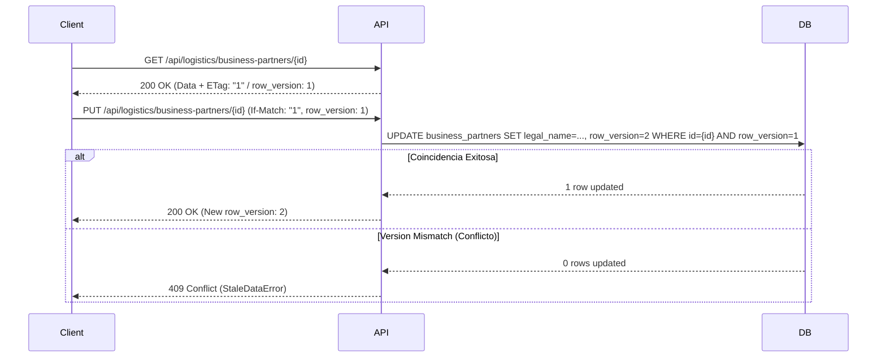

# 02. Modelo de Entidad Principal: BusinessPartnerModel

## Especificación General

La entidad `BusinessPartnerModel` (tabla `business_partners`) representa la cabecera central del socio de negocio. Contiene la información de identidad jurídica, denominación comercial, estatus global y versionado de concurrencia optimista.

---

## Definición del Esquema (SQL / SQLAlchemy)

```python
class PersonType(str, Enum):
    NATURAL_PERSON = "NATURAL_PERSON"
    LEGAL_ENTITY = "LEGAL_ENTITY"

class PartnerStatus(str, Enum):
    DRAFT = "DRAFT"
    ACTIVE = "ACTIVE"
    SUSPENDED = "SUSPENDED"
    BLOCKED = "BLOCKED"
    ARCHIVED = "ARCHIVED"

class BusinessPartnerModel(Base):
    __tablename__ = "business_partners"

    id = Column(UUID(as_uuid=True), primary_key=True, default=uuid.uuid4)
    organization_id = Column(UUID(as_uuid=True), ForeignKey("organizations.id"), nullable=False, index=True)
    partner_code = Column(String(20), nullable=False)
    
    legal_name = Column(String(255), nullable=False)
    trade_name = Column(String(255), nullable=True)
    person_type = Column(SQLEnum(PersonType), nullable=False, default=PersonType.LEGAL_ENTITY)
    country_code = Column(String(2), nullable=False, default="PE") # ISO 3166-1 alpha-2
    
    tax_id_type = Column(String(10), nullable=False, default="RUC") # RUC, DNI, CE, PASSPORT
    tax_id_value = Column(String(20), nullable=False)
    
    status = Column(SQLEnum(PartnerStatus), nullable=False, default=PartnerStatus.ACTIVE)
    compliance_status = Column(String(20), nullable=False, default="COMPLIANT") # COMPLIANT, NON_COMPLIANT, UNDER_REVIEW
    
    notes = Column(Text, nullable=True)
    row_version = Column(Integer, nullable=False, default=1)
    
    created_at = Column(DateTime(timezone=True), nullable=False, server_default=func.now())
    updated_at = Column(DateTime(timezone=True), nullable=False, server_default=func.now(), onupdate=func.now())
    created_by = Column(UUID(as_uuid=True), nullable=False)
    updated_by = Column(UUID(as_uuid=True), nullable=False)

    __table_args__ = (
        UniqueConstraint("organization_id", "partner_code", name="uq_bp_org_code"),
        UniqueConstraint("organization_id", "tax_id_type", "tax_id_value", name="uq_bp_org_tax_id"),
        Index("ix_bp_tax_lookup", "organization_id", "tax_id_value"),
        Index("ix_bp_legal_name_trgm", "legal_name", postgresql_ops={"legal_name": "gin_trgm_ops"}),
    )
```

---

## Descripción Detallada de Campos Clave

### 1. `partner_code` (Código Correlativo Inmutable)
* **Formato:** `BP-XXXXXX` (ej. `BP-000001`).
* **Propiedades:** Generado automáticamente en la creación por `BusinessPartnerCodeService`. Inmutable tras su asignación.
* **Scope:** Único por `organization_id`.

### 2. `legal_name` vs `trade_name`
* **`legal_name` (Razón Social):** Nombre oficial registrado ante la administración tributaria (SUNAT o entidad equivalente). Requerido.
* **`trade_name` (Nombre Comercial):** Denominación con la que opera comercialmente. Opcional.

### 3. `person_type`
* **`LEGAL_ENTITY` (Persona Jurídica):** Aplica a RUCs iniciados en `20` en Perú. Exige razón social completa.
* **`NATURAL_PERSON` (Persona Natural):** Aplica a RUCs iniciados en `10`, `15`, `16`, `17` o identificadores tipo DNI/CE.

### 4. `country_code`
* Código de país en formato **ISO 3166-1 alpha-2** (`PE`, `CL`, `US`, `CN`). Determina la estrategia de validación de identificador fiscal.

### 5. `status` (Estado Global de Cabecera)
* `DRAFT`: Registro preliminar incompleto.
* `ACTIVE`: Socio plenamente operativo para transacciones logísticas y comerciales.
* `SUSPENDED`: Suspensión temporal administrativa.
* `BLOCKED`: Bloqueo preventivo de seguridad o cumplimiento legal (impide cualquier transacción).
* `ARCHIVED`: Desactivado lógicamente por inactividad.

---

## Control de Concurrencia Optimista (`row_version`)

Para prevenir la sobrescritura silenciosa de datos cuando múltiples usuarios u operaciones asíncronas editan simultáneamente un socio de negocio, el modelo implementa **Optimistic Locking**:



### Regla de Negocio
Toda modificación HTTP (`PUT`, `PATCH`) debe incluir el campo `row_version` en el body o la cabecera `If-Match`. Si la versión enviada difiere de la almacenada en base de datos, el servicio aborta inmediatamente la transacción arrojando una excepción `BusinessPartnerStateConflictException`.
