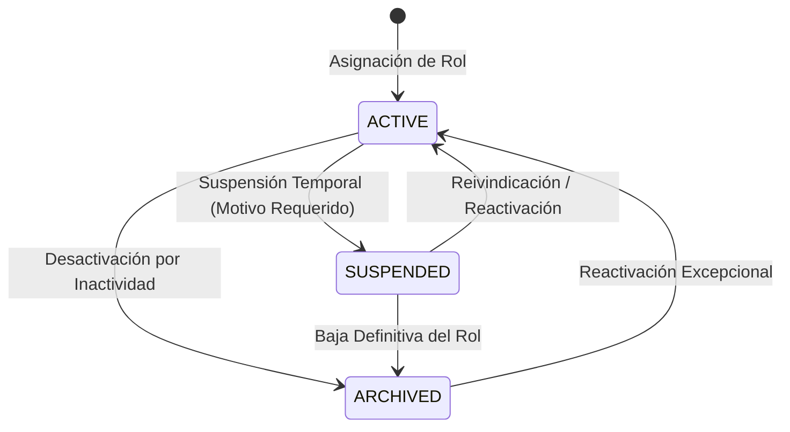

# 03. Roles Multipropósito y Gestión de Estatus

## Concepto de Rol Multipropósito

Un **Socio de Negocio** en el sistema representa una entidad legal única, pero su relación comercial con la organización puede ser polimórfica y dinámica. La entidad `BusinessPartnerRoleModel` (tabla `business_partner_roles`) gestiona la asignación y el ciclo de vida operativo de cada rol asumido por el socio.

---

## Definición del Esquema `BusinessPartnerRoleModel`

```python
class PartnerRoleType(str, Enum):
    SUPPLIER = "SUPPLIER"
    CUSTOMER = "CUSTOMER"
    CARRIER = "CARRIER"

class RoleStatus(str, Enum):
    ACTIVE = "ACTIVE"
    SUSPENDED = "SUSPENDED"
    ARCHIVED = "ARCHIVED"

class BusinessPartnerRoleModel(Base):
    __tablename__ = "business_partner_roles"

    id = Column(UUID(as_uuid=True), primary_key=True, default=uuid.uuid4)
    business_partner_id = Column(UUID(as_uuid=True), ForeignKey("business_partners.id", ondelete="CASCADE"), nullable=False, index=True)
    role_type = Column(SQLEnum(PartnerRoleType), nullable=False)
    
    status = Column(SQLEnum(RoleStatus), nullable=False, default=RoleStatus.ACTIVE)
    suspension_reason = Column(Text, nullable=True)
    suspended_at = Column(DateTime(timezone=True), nullable=True)
    suspended_by = Column(UUID(as_uuid=True), nullable=True)

    created_at = Column(DateTime(timezone=True), nullable=False, server_default=func.now())
    updated_at = Column(DateTime(timezone=True), nullable=False, server_default=func.now(), onupdate=func.now())

    __table_args__ = (
        UniqueConstraint("business_partner_id", "role_type", name="uq_bp_role_type"),
    )
```

---

## Matriz de Roles Soportados

| Rol (`role_type`) | Función en el ERP / Logística | Perfil Vinculado 1:1 |
|-------------------|--------------------------------|----------------------|
| `SUPPLIER` | Emite ordenes de compra, provee insumos/mercadería, emite facturas a favor de la empresa. | `SupplierProfileModel` |
| `CUSTOMER` | Recibe cotizaciones, órdenes de venta, facturación emitida por la empresa, envíos logísticos. | `CustomerProfileModel` |
| `CARRIER` | Ejecuta servicios de transporte de carga, asignación de choferes, vehículos y guías de remisión transportista. | `CarrierProfileModel` |

---

## Regla de Independencia Extrema de Estados por Rol

Una premisa de diseño fundamental de la Fase 025 es que los estados de los roles operan con **aislamiento de contexto**:

```
+-----------------------------------------------------------------------+
|                       BUSINESS PARTNER: BP-001042                     |
|                   (Global Status: ACTIVE, Tax ID: 20554433221)        |
+-----------------------------------------------------------------------+
|                                                                       |
|  +------------------------+                +------------------------+ |
|  | Role: SUPPLIER         |                | Role: CUSTOMER         | |
|  | Status: SUSPENDED      |                | Status: ACTIVE         | |
|  | Reason: INCUMPLIMIENTO |                | Credit Line: $50,000   | |
|  | DE LEAD TIME           |                |                        | |
|  +------------------------+                +------------------------+ |
|             |                                           |             |
|             v                                           v             |
|  [Bloqueado en Compras]                     [Permitido en Ventas]     |
|  Imposible emitir Orden                      Puede comprar productos  |
|  de Compra (PO)                              con su línea disponible  |
+-----------------------------------------------------------------------+
```

### Reglas de Negocio Aislamiento de Estado

1. **Suspensión Específica:** Si un socio comete una falta grave como proveedor (ej. entrega de material defectuoso o retrasos sistemáticos), el usuario administrador suspende el rol `SUPPLIER` mediante `POST /api/logistics/business-partners/{id}/roles/SUPPLIER/suspend`.
2. **Operatividad Residual:** La suspensión del rol `SUPPLIER` **NO altera** ni inhabilita el rol `CUSTOMER` del mismo socio. El socio puede seguir recibiendo facturas y comprando productos en el módulo de ventas.
3. **Jerarquía del Estatus Global `BLOCKED`:** La única excepción a la independencia es el estado global `BLOCKED` en `BusinessPartnerModel.status`. Si la cabecera principal es bloqueada (ej. por hallazgo de lavado de activos, RUC Habido/No Habido por SUNAT o fraude), **todos los roles quedan inhabilitados de inmediato**, anulando la operatividad de `SUPPLIER`, `CUSTOMER` y `CARRIER`.

---

## Transiciones de Estado en Roles


