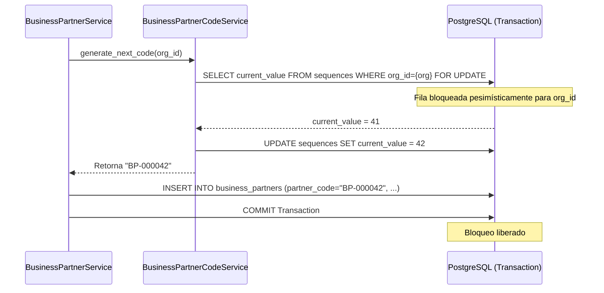

# 05. Normalización y Generación Determinística de Códigos

## Reglas del Código de Socio (`partner_code`)

El código de socio de negocio (`partner_code`) es la clave de negocio primaria utilizada para la búsqueda rápida, representación visual en documentos (impresos, facturas, guías) e integración con sistemas legados o externos.

### Estándar de Formato

* **Patrón:** `BP-{SEQ:06d}` (Prefijo fijo `BP-` seguido de un correlativo numérico de 6 dígitos rellenado con ceros a la izquierda).
* **Ejemplos Válidos:** `BP-000001`, `BP-000042`, `BP-001042`, `BP-999999`.
* **Restricciones:**
  1. **Caracteres Permitidos:** Exclusivamente caracteres ASCII en mayúsculas (`BP-`) y dígitos decimales (`0-9`).
  2. **Inmutabilidad Absoluta:** Una vez que un registro `BusinessPartnerModel` se guarda en la base de datos, el campo `partner_code` queda bloqueado contra cualquier actualización o mutación.
  3. **Unicidad Multi-Tenant:** El código es estricto y único por `organization_id`. Organizaciones distintas pueden tener secuencias independientes.

---

## Mecanismo de Secuencia Atómica por Organización

Para evitar colisiones de códigos bajo accesos concurrentes masivos, la asignación de secuencias no utiliza búsquedas `MAX(partner_code)` en la tabla principal (que sufren de race conditions). En su lugar, se utiliza una tabla de control de secuencias dedicadas con bloqueo pesimista `SELECT ... FOR UPDATE`:

### Modelo de Secuencia (`BusinessPartnerSequenceModel`)

```python
class BusinessPartnerSequenceModel(Base):
    __tablename__ = "business_partner_sequences"

    organization_id = Column(UUID(as_uuid=True), ForeignKey("organizations.id"), primary_key=True)
    current_value = Column(Integer, nullable=False, default=0)
    updated_at = Column(DateTime(timezone=True), nullable=False, server_default=func.now(), onupdate=func.now())
```

---

## Implementación del servicio `BusinessPartnerCodeService`

```python
class BusinessPartnerCodeService:
    def __init__(self, db_session: AsyncSession):
        self.db = db_session

    async def generate_next_code(self, organization_id: uuid.UUID) -> str:
        """
        Incrementa atómicamente el contador de la organización y retorna el código normalizado BP-XXXXXX.
        """
        # Intentar obtener el registro de secuencia con FOR UPDATE
        stmt = (
            select(BusinessPartnerSequenceModel)
            .filter(BusinessPartnerSequenceModel.organization_id == organization_id)
            .with_for_update()
        )
        result = await self.db.execute(stmt)
        seq_record = result.scalar_one_or_none()

        if not seq_record:
            # Inicializar secuencia para una nueva organización
            seq_record = BusinessPartnerSequenceModel(
                organization_id=organization_id,
                current_value=1
            )
            self.db.add(seq_record)
            next_val = 1
        else:
            seq_record.current_value += 1
            next_val = seq_record.current_value

        await self.db.flush()
        
        # Formatear a BP-XXXXXX
        formatted_code = f"BP-{next_val:06d}"
        return formatted_code
```

---

## Diagrama de Secuencia de Asignación Atómica


