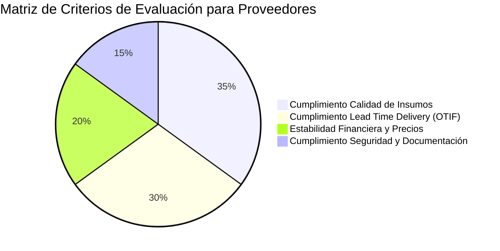

# 09. Sistema de Evaluación Ponderada de Cumplimiento

## Arquitectura de Evaluación de Desempeño y Riesgo

Para garantizar que los proveedores y transportistas cumplan con los estándares de calidad, seguridad y legalidad exige la organización, la Fase 025 incluye el motor `BusinessPartnerComplianceResolver` respaldado por las entidades `BusinessPartnerEvaluationModel` y `BusinessPartnerEvaluationDetailModel`.

---

## Esquema Relacional de Evaluaciones

```python
class RiskLevel(str, Enum):
    LOW = "LOW"          # Puntaje >= 85.00 (Apto preferente)
    MEDIUM = "MEDIUM"    # 70.00 <= Puntaje < 85.00 (Apto con supervisión)
    HIGH = "HIGH"        # Puntaje < 70.00 (No Apto / Suspensión preventiva)

class BusinessPartnerEvaluationModel(Base):
    __tablename__ = "business_partner_evaluations"

    id = Column(UUID(as_uuid=True), primary_key=True, default=uuid.uuid4)
    business_partner_id = Column(UUID(as_uuid=True), ForeignKey("business_partners.id", ondelete="CASCADE"), nullable=False, index=True)
    
    evaluation_code = Column(String(30), nullable=False) # EV-2026-0001
    evaluation_date = Column(Date, nullable=False)
    evaluated_by = Column(UUID(as_uuid=True), nullable=False)
    
    total_score = Column(Numeric(5, 2), nullable=False, default=0.00) # 0.00 a 100.00
    risk_level = Column(SQLEnum(RiskLevel), nullable=False, default=RiskLevel.MEDIUM)
    is_approved = Column(Boolean, nullable=False, default=True)
    
    comments = Column(Text, nullable=True)
    created_at = Column(DateTime(timezone=True), nullable=False, server_default=func.now())

class BusinessPartnerEvaluationDetailModel(Base):
    __tablename__ = "business_partner_evaluation_details"

    id = Column(UUID(as_uuid=True), primary_key=True, default=uuid.uuid4)
    evaluation_id = Column(UUID(as_uuid=True), ForeignKey("business_partner_evaluations.id", ondelete="CASCADE"), nullable=False, index=True)
    
    criterion_name = Column(String(100), nullable=False) # Ej. "Quality Compliance", "On-Time Delivery"
    weight_percentage = Column(Numeric(5, 2), nullable=False) # Suma total de pesos = 100.00%
    score_assigned = Column(Numeric(5, 2), nullable=False)    # Escala 0.00 a 100.00
    weighted_score = Column(Numeric(5, 2), nullable=False)    # (score * weight) / 100
```

---

## Motor de Cálculo de Puntaje y Clasificación (`BusinessPartnerComplianceResolver`)

El resolver procesa la ponderación matemática exacta mediante tipos `Decimal` de alta precisión:

$$\text{Total Score} = \sum_{i=1}^{n} \left( \text{Score}_i \times \frac{\text{Weight}_i}{100} \right)$$

```python
from decimal import Decimal

class BusinessPartnerComplianceResolver:
    @staticmethod
    def calculate_evaluation(details: list[dict]) -> tuple[Decimal, RiskLevel, bool]:
        """
        Calcula el puntaje total ponderado, clasifica el nivel de riesgo y determina la aprobación.
        """
        total_weight = Decimal("0.00")
        total_score = Decimal("0.00")

        for item in details:
            weight = Decimal(str(item["weight_percentage"]))
            score = Decimal(str(item["score_assigned"]))
            
            total_weight += weight
            weighted = (score * weight) / Decimal("100.00")
            total_score += weighted

        # Invariante: La suma de pesos de los criterios debe ser exactamente 100%
        if abs(total_weight - Decimal("100.00")) > Decimal("0.01"):
            raise ValueError(f"La suma de los pesos debe ser 100.00%. Suma recibida: {total_weight}%")

        total_score = total_score.quantize(Decimal("0.01"))

        # Determinar nivel de riesgo y estatus de aprobación
        if total_score >= Decimal("85.00"):
            risk = RiskLevel.LOW
            approved = True
        elif total_score >= Decimal("70.00"):
            risk = RiskLevel.MEDIUM
            approved = True
        else:
            risk = RiskLevel.HIGH
            approved = False

        return total_score, risk, approved
```

---

## Matriz Estándar de Criterios por Rol



### Regla Automática de Suspensión por Evaluación Rechazada
Si una evaluación periódica genera un `total_score < 70.00` (`risk_level == HIGH`), el `BusinessPartnerComplianceResolver` ejecuta automáticamente la actualización del campo `compliance_status = "NON_COMPLIANT"` en `BusinessPartnerModel` y marca el rol `SUPPLIER` en estado `SUSPENDED`, enviando una alerta al área de homologación de proveedores.
